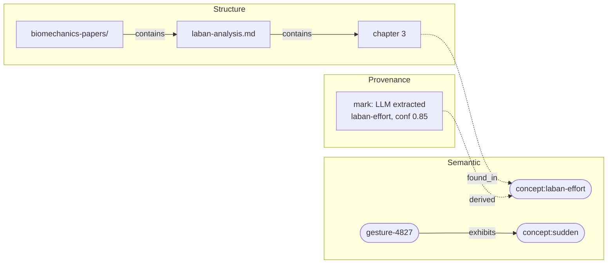

# Semantic Adapters: System Design

Technical design for the adapter layer. See [adapters.md](./adapters.md) for conceptual overview.

---

## Terminology

Three distinct concepts describe how "sure" the system is. They are not interchangeable.

| Term | Lives on | Meaning |
|---|---|---|
| **Weight** (raw) | Edge | Accumulated Hebbian reinforcement strength. Stored. Increases when any source reinforces the edge. Ground truth — never decays on a clock. |
| **Normalized weight** | Edge (computed) | Relative importance, computed at query time via `NormalizationStrategy`. Not stored. Different consumers can apply different strategies to the same raw weights. |
| **Annotation confidence** | `Annotation` (provenance) | A single adapter's certainty about a single extraction. Lives in provenance, not on the edge. Range 0.0–1.0. |

**Evidence diversity** — "how corroborated is this edge?" — is derived by querying provenance (count distinct adapter IDs, source types, and contexts that contributed to an edge). It is not a stored field.

---

## System Overview


---

## Adapter Trait

```mermaid
classDiagram
    class SemanticAdapter {
        <<trait>>
        +id() str
        +name() str
        +dimensions() Vec~str~
        +input_kind() str
        +schedule() Option~Schedule~
        +process(AdapterInput, AdapterSink, CancellationToken)
    }

    class AdapterSink {
        <<async trait>>
        +emit(AdapterOutput) Result
    }

    class ProposalSink {
        <<wraps AdapterSink>>
        +weight_cap: f32
        +emit(AdapterOutput) Result
    }

    class AdapterInput {
        +context_id: ContextId
        +data: Box~dyn Any + Send + Sync~
        +trigger: AdapterTrigger
        +previous: Option~AdapterSnapshot~
    }

    class AdapterOutput {
        +nodes: Vec~AnnotatedNode~
        +edges: Vec~AnnotatedEdge~
        +removals: Vec~NodeId~
    }

    class AnnotatedNode {
        +node: Node
        +annotation: Option~Annotation~
    }

    class AnnotatedEdge {
        +edge: Edge
        +annotation: Option~Annotation~
    }

    class Annotation {
        +confidence: Option~f32~
        +method: Option~String~
        +source_location: Option~SourceLocation~
        +detail: Option~String~
    }

    class Schedule {
        <<enum>>
        Periodic
        MutationThreshold
        Condition
    }

    class AdapterTrigger {
        <<enum>>
        FileChanged
        FragmentReceived
        GestureSegmented
        Scheduled
        Manual
    }

    class NormalizationStrategy {
        <<trait>>
        +normalize(Edge, GraphView) f32
    }

    class GraphEvent {
        <<enum>>
        NodesAdded
        EdgesAdded
        NodesRemoved
        EdgesRemoved
        WeightsChanged
    }

    class ProvenanceEntry {
        +adapter_id: String
        +timestamp: DateTime
        +context_id: ContextId
        +input_summary: String
        +annotation: Option~Annotation~
        +node_id: NodeId
    }

    SemanticAdapter ..> AdapterInput : receives
    SemanticAdapter ..> AdapterSink : emits through
    ProposalSink ..|> AdapterSink : implements
    AdapterSink ..> AdapterOutput : receives
    AdapterSink ..> GraphEvent : triggers
    AdapterInput *-- AdapterTrigger
    AdapterOutput *-- AnnotatedNode
    AdapterOutput *-- AnnotatedEdge
    AnnotatedNode *-- Annotation
    AnnotatedEdge *-- Annotation
    SemanticAdapter *-- Schedule

    Note for AdapterInput "data is opaque to framework.\nAdapter downcasts internally.\nRouter matches by input_kind()."
    Note for ProvenanceEntry "Constructed by engine,\nnot by adapters.\nCombines framework context\nwith adapter annotations."
    Note for NormalizationStrategy "Query-time concern.\nRaw weights stored.\nStrategy applied on access."
    Note for ProposalSink "Given to reflexive adapters.\nClamps weight, rejects non-\nmay_be_related edges,\nrejects node removals."
```

### Bootstrap Trait (Rust)

Minimal code to start implementation. The class diagram above is the source of truth for the full model.

```rust
#[async_trait]
pub trait SemanticAdapter: Send + Sync {
    fn id(&self) -> &str;
    fn name(&self) -> &str;
    fn dimensions(&self) -> Vec<&str>;
    fn input_kind(&self) -> &str;
    fn schedule(&self) -> Option<Schedule> { None }

    async fn process(
        &self,
        input: &AdapterInput,
        sink: &dyn AdapterSink,
        cancel: &CancellationToken,
    ) -> Result<(), AdapterError>;
}

/// Input envelope. The framework manages context, trigger, and snapshot.
/// The data payload is opaque — the adapter downcasts to its expected type.
pub struct AdapterInput {
    pub context_id: ContextId,
    pub data: Box<dyn Any + Send + Sync>,
    pub trigger: AdapterTrigger,
    pub previous: Option<AdapterSnapshot>,
}

/// Async sink. The adapter awaits each emission and receives validation
/// feedback (e.g., rejected edges). The adapter layer spawns `process()`
/// as a background task — async emit does not block other adapters.
/// Adapters wrapping synchronous sources can bridge internally via a channel.
#[async_trait]
pub trait AdapterSink: Send + Sync {
    async fn emit(&self, output: AdapterOutput) -> Result<(), AdapterError>;
}

/// Constrained sink given to reflexive adapters. Enforces the
/// propose-don't-merge invariant: clamps edge weights, rejects
/// non-may_be_related edges, rejects node removals.
/// Implements AdapterSink — the adapter's process() signature is unchanged.
pub struct ProposalSink {
    inner: Box<dyn AdapterSink>,
    weight_cap: f32, // configurable per adapter registration
}

pub enum Schedule {
    Periodic { interval_secs: u64 },
    MutationThreshold { count: usize },
    Condition(Box<dyn Fn(&GraphSummary) -> bool + Send + Sync>),
}

/// Adapter-provided annotation on a node or edge.
/// The adapter knows *how* it extracted something — confidence, method, source.
/// The engine wraps this with *who* and *when* to build full provenance.
pub struct Annotation {
    pub confidence: Option<f32>,
    pub method: Option<String>,
    pub source_location: Option<SourceLocation>,
    pub detail: Option<String>,
}

pub struct AnnotatedNode {
    pub node: Node,
    pub annotation: Option<Annotation>,
}

pub struct AnnotatedEdge {
    pub edge: Edge,
    pub annotation: Option<Annotation>,
}

pub struct AdapterOutput {
    pub nodes: Vec<AnnotatedNode>,
    pub edges: Vec<AnnotatedEdge>,
    pub removals: Vec<NodeId>,
}

/// Query-time normalization. Raw weights are stored; normalized weights
/// are computed on access. Different consumers can use different strategies.
pub trait NormalizationStrategy: Send + Sync {
    fn normalize(&self, edge: &Edge, graph: &GraphView) -> f32;
}
```

### Relationship to ContentAnalyzer

`ContentAnalyzer` becomes an internal implementation detail. The recommended path: a single DocumentAdapter that wraps existing analyzers as internal phases, emitting through the sink as each completes.

---

## Concrete Adapters


---

## Progressive Emission Sequence

How a file change flows through one adapter's internal phases.


---

## Provenance Construction

Provenance is split across two layers. The adapter provides epistemological detail (how it knows). The engine provides structural context (who said it, when, from what input).


- Annotations are **per-node/edge** — confidence varies per extraction
- Engine context is **per-emission** — same adapter, timestamp, and input for everything in one `sink.emit()` call
- Nodes emitted without annotation still receive a provenance mark (structural context only)
- Adapters never construct `ProvenanceEntry` directly

---

## Weight Normalization

Raw edge weights are stored as accumulated reinforcement strength. Normalized weights are computed at query time via a pluggable strategy. This separation means the graph stores ground truth (what happened) and normalization is an interpretive lens.


**Default strategy: per-node outgoing divisive normalization.**

```
w_normalized(i→j) = w_raw(i→j) / Σ_k w_raw(i→k)
```

For any node, outgoing normalized weights sum to 1.0. This answers "given this concept, what's most strongly related?" — the natural question for graph exploration.

Hebbian weakening emerges naturally: when a new edge from node A is reinforced, every other outgoing edge from A becomes relatively weaker in the normalized view without anyone touching those edges.

**Alternative strategies** (swappable via the trait):

| Strategy | Formula | Use case |
|---|---|---|
| Outgoing divisive | `w_ij / Σ_k w_ik` | Exploration, traversal |
| Incoming divisive | `w_ij / Σ_k w_kj` | Authority, importance |
| Softmax | `exp(w_ij) / Σ_k exp(w_ik)` | Sharper contrast |
| Raw | `w_ij` | Debugging, absolute comparison |

---

## Event Catalog

Every `sink.emit()` produces graph mutations. The engine fires events for each mutation type. These are low-level graph events — higher-level events (topology shifts, cross-modal bridges) are modeled as nodes/edges emitted by reflexive adapters, not as special event types.


| Event | Trigger | Payload |
|---|---|---|
| `NodesAdded` | Nodes committed from emission | node IDs, adapter ID, context ID |
| `EdgesAdded` | Edges committed (after validation) | edge IDs, adapter ID, context ID |
| `NodesRemoved` | Removals committed from emission | node IDs, adapter ID, context ID |
| `EdgesRemoved` | Cascade from node removal, or cleanup | edge IDs, reason |
| `WeightsChanged` | Reinforcement applied | affected edge IDs |

`EdgesRemoved` fires on two paths: cascading removal when a node is deleted (its edges go with it), and cleanup when negligible edges are pruned. The `reason` field distinguishes these.

---

## Sink Semantics

The sink validates and commits each emission atomically. Emissions within one `sink.emit()` call succeed or fail as a unit.

**Validation rules:**

| Condition | Behavior |
|---|---|
| Edge references missing endpoint | **Reject** — endpoints must exist in graph or in the same emission |
| Duplicate node ID (already in graph) | **Upsert** — update properties, merge |
| Removal of non-existent node | **No-op** |
| Empty emission (no nodes, edges, or removals) | **No-op** |
| Self-referencing edge (source == target) | **Allow** |

**Cancellation:** checked between `emit()` calls, not during. Each emission is atomic — if the cancel token fires mid-processing, the adapter sees it on its next check and stops. Already-committed emissions remain valid.

**Error path:** `emit()` returns `Err(AdapterError)` only on validation failure (e.g., edge with missing endpoint not present in the same emission). Infrastructure errors (storage failure) propagate as `AdapterError::Internal`.

---

## Multi-Dimensional Graph



---

## Adapter Layer Orchestration


**Input-triggered path:** Route by `input_kind` → spawn adapter with sink + cancel token → each `sink.emit()` commits mutations, creates provenance marks, fires events.

**Scheduled path:** Monitor trigger conditions → when met, invoke `process()` with GraphState input → same commit/event pipeline.

**Cancellation:** When new input supersedes in-flight work, cancel the token. Already-emitted mutations remain valid.

---

## Edge Lifecycle


---

## Design Decisions

1. **Adapters are coarse-grained.** One adapter owns its full pipeline. Internal phase ordering, file-type branching, and llm-orc delegation are the adapter's business.

2. **Sink-based progressive emission (async).** `await sink.emit()` commits immediately and fires events. The graph is always partially built — that's correct, not an error state.

3. **Two trigger modes.** Input-triggered (run on matching input) and scheduled (run on timer/threshold/condition). Same `process(input, sink, cancel)` interface.

4. **Cancellation via token.** Long-running adapters check a cancel token periodically. Already-emitted mutations remain valid.

5. **Two-layer provenance.** Adapters annotate per-node/edge (confidence, method, source location). The engine wraps each emission with structural context (adapter ID, timestamp, input context) to construct full `ProvenanceEntry` records. Adapters never build provenance entries directly — they annotate what they know, the framework supplies the rest. Nodes emitted without annotation still receive provenance marks (just without epistemological detail).

6. **Edge validation.** Edges whose endpoints don't exist in the graph are rejected by the sink. Adapters must emit nodes before (or in the same output as) edges that reference them.

7. **Semantic dimension is shared.** All domains contribute concept nodes to the same namespace. `ContentType` disambiguates origin. This enables cross-modal bridging.

8. **Labels bridge modalities.** Shared vocabulary in the semantic dimension — no special unification logic.

9. **No temporal decay.** Edge weights weaken through normalization as the graph grows, not through clock-based half-lives. A quiet graph stays stable — silence isn't evidence against previous observations. Cleanup of negligible edges is a separate concern (threshold or distribution analysis).

10. **Raw weights stored, normalization at query time.** The graph stores accumulated reinforcement strength. Normalized weights are computed on access via a pluggable `NormalizationStrategy`. Different consumers can interpret the same graph differently. Default: per-node outgoing divisive normalization.

11. **Adapter data is opaque.** The framework routes by `input_kind()` string match but never inspects the payload. Adapters downcast `Box<dyn Any>` internally. This keeps the framework decoupled from domain-specific input shapes.

12. **Sink emissions are atomic.** Each `emit()` call validates and commits as a unit. Upsert on duplicate nodes, reject edges with missing endpoints, no-op on empty emissions and missing removals.

13. **Reflexive adapters propose, don't merge — enforced by ProposalSink.** The framework gives reflexive adapters a `ProposalSink` that clamps edge weights, only allows `may_be_related` edges, and rejects node removals. Graph dynamics (Hebbian reinforcement + normalization) determine what's real.

14. **Cross-adapter dependency via graph state.** External adapters are independent. Reflexive adapters depend on accumulated graph state, not specific adapter outputs.

---

## Open Questions

### Needs spike (blocks adapter implementation)

1. **Reinforcement mechanics.** The system describes Hebbian reinforcement but never defines the operation. What happens to `edge.weight` when:
   - A second adapter emits an edge that already exists?
   - A reflexive adapter confirms a `may_be_related` edge?
   - The same adapter re-emits an edge on re-processing (e.g., file re-saved)?

   Candidates: additive increment, multiplicative boost, source-diversity-weighted increment. The spike should also resolve whether reinforcement is implicit (sink detects duplicate edge and reinforces) or explicit (adapter calls a separate reinforcement API).

### Deferred

2. **AdapterSnapshot design.** What does incremental state look like per domain? File: chunk hashes + output node IDs. Movement: cluster centroids. Graph state: timestamp of last run. Likely adapter-specific.

3. **Chunking as graph nodes.** Should chunks be structure-dimension nodes (queryable, referenceable) or adapter-internal state (looser coupling)?

4. **Canonical pointers vs pure emergence.** When `may_be_related` strengthens to high weight — designate one node as canonical, or keep both with a strong equivalence edge?

5. **Edge cleanup strategy.** Simple weight threshold (e.g., w < 0.001) or distribution-aware cutoff (reflexive adapter identifies power-law tail)? Could be both — threshold as a floor, distribution analysis as a refinement.

6. **Session boundaries (EDDI).** Separate session contexts? Same context with temporal windowing? Session metadata on nodes/edges?
