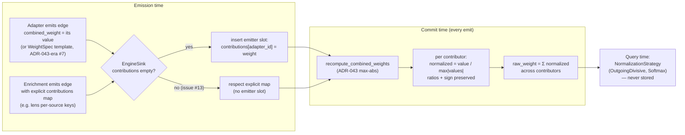
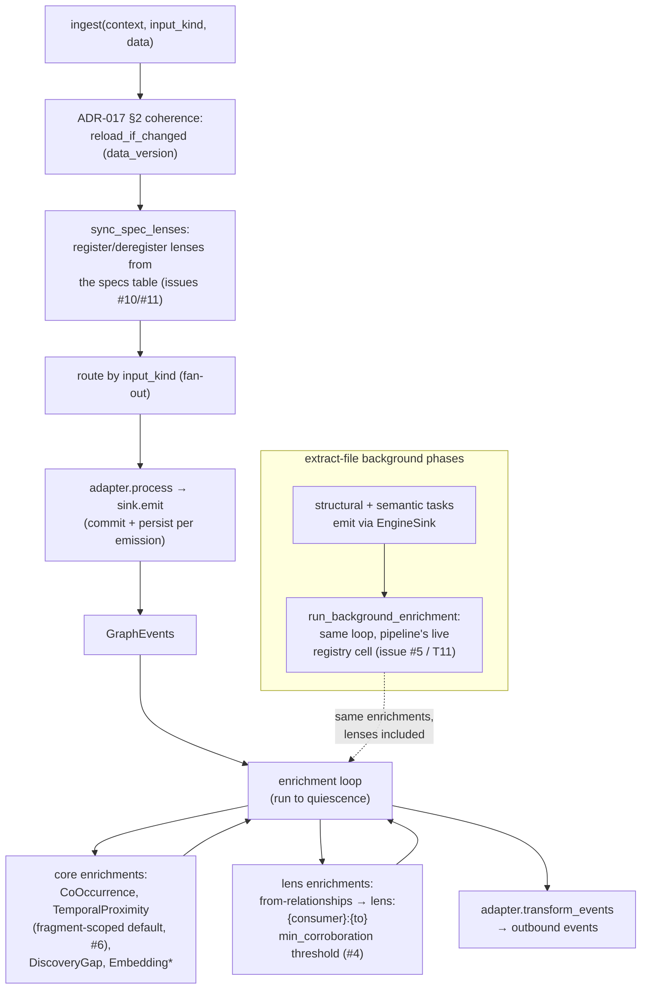
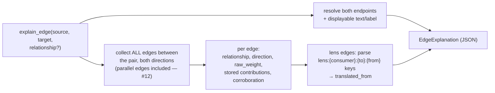

# Flow Diagrams

The three flows consumers (and the M3 probes) had to reverse-engineer,
drawn once. Each diagram names the code that implements it.

## 1. Weight pipeline — contribution → raw weight → normalized weight

Three layers (ADR-003, Invariant 8). Only the first is stored.

- Stored layer: `edge.contributions` (`src/adapter/sink/engine_sink.rs`)
- Computed layer: `Context::recompute_combined_weights` (`src/graph/context.rs`)
- Query layer: `src/query/normalize.rs`

## 2. Ingest → enrichment loop → lens translation

The write path, foreground and background (issue #5 unified them).

- Entry + sync: `IngestPipeline::ingest` / `sync_spec_lenses` (`src/adapter/pipeline/ingest.rs`)
- Loop: `run_enrichment_loop` (`src/adapter/enrichment/enrichment_loop.rs`)
- Background: `run_background_enrichment` (`src/adapter/adapters/extraction.rs`)
- Lens: `LensEnrichment::enrich` (`src/adapter/enrichments/lens.rs`)

## 3. explain_edge — "why is this connection here?"

One call replaces the three-query reverse-engineering the M3 probes did
(issue #14).

- `src/query/explain.rs` (`explain_pair`), surfaced as `PlexusApi::explain_edge`
  and the `explain_edge` MCP tool.
