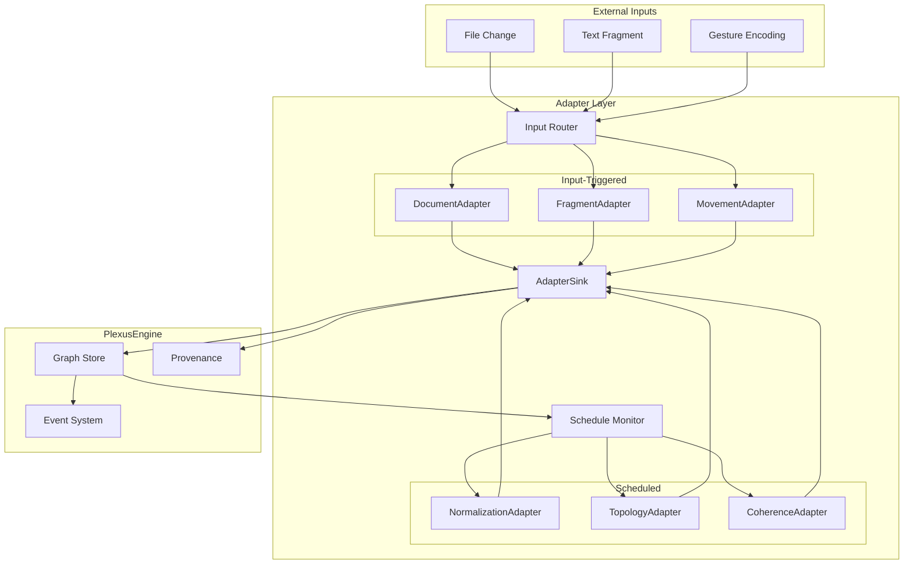
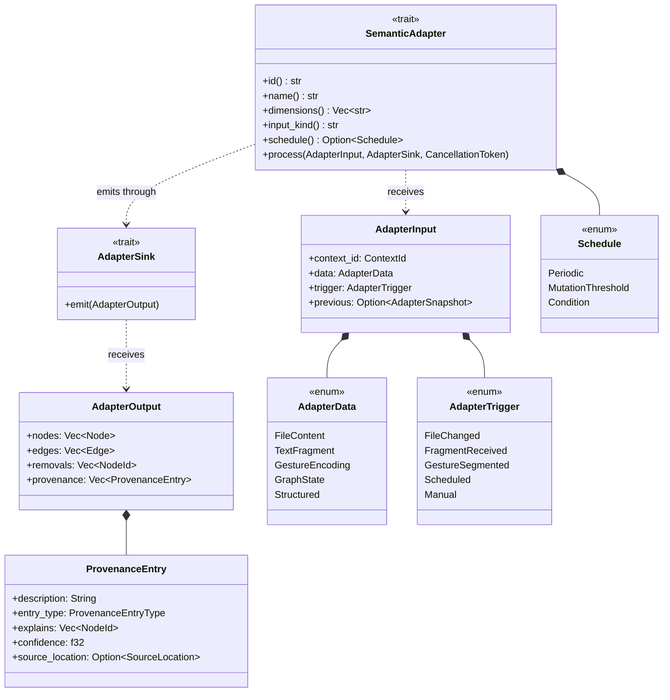
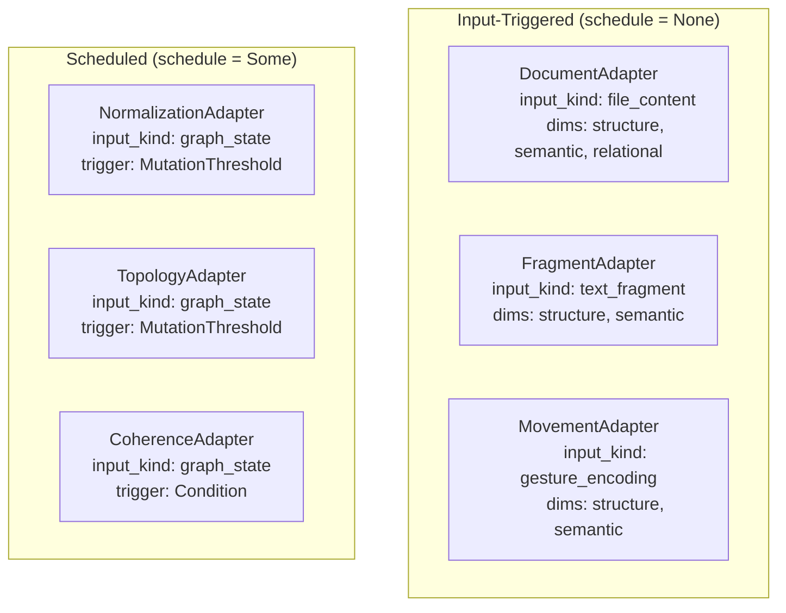
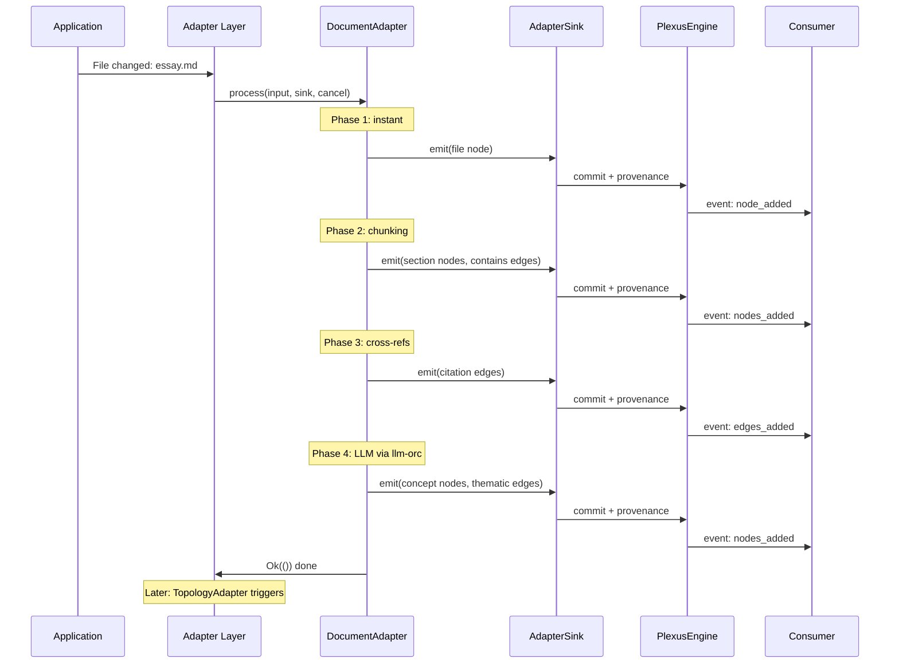
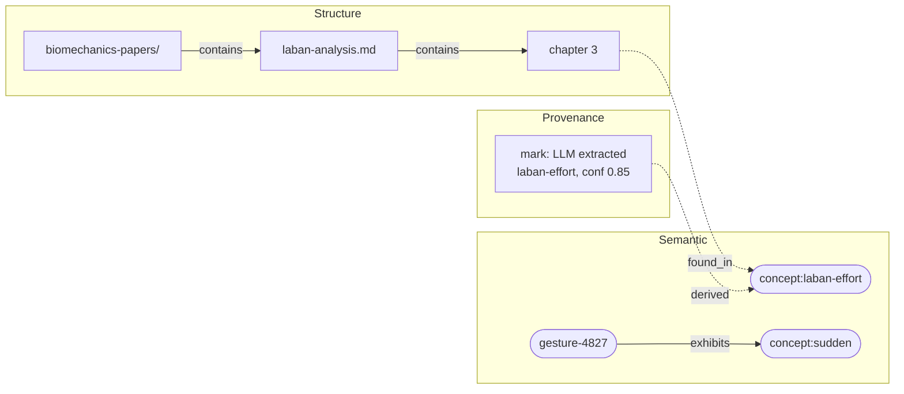
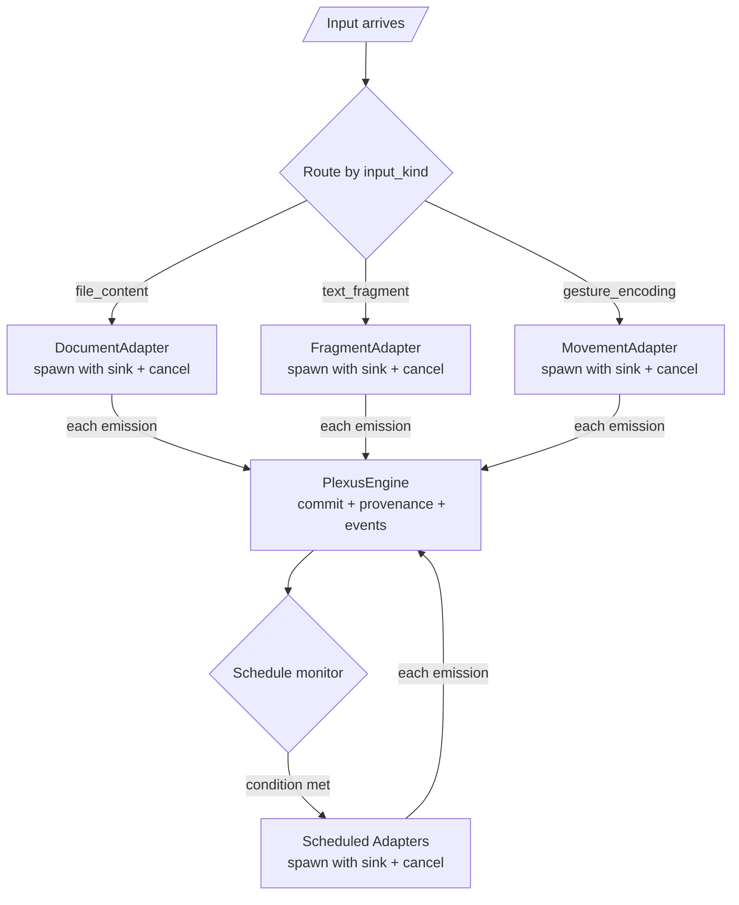
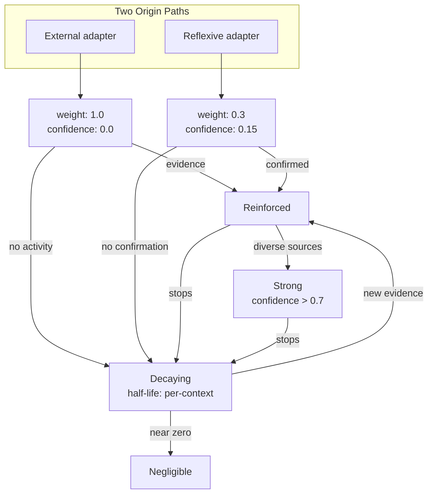

# Semantic Adapters: System Design

Technical design for the adapter layer. See [semantic-adapters.md](./semantic-adapters.md) for conceptual overview.

---

## System Overview



---

## Adapter Trait



### Bootstrap Trait (Rust)

Minimal code to start implementation. The class diagram above is the source of truth for the full model.

```rust
#[async_trait]
pub trait SemanticAdapter: Send + Sync {
    fn id(&self) -> &str;
    fn name(&self) -> &str;
    fn dimensions(&self) -> Vec<&str>;
    fn input_kind(&self) -> &str;
    fn schedule(&self) -> Option<Schedule> { None }

    async fn process(
        &self,
        input: &AdapterInput,
        sink: &dyn AdapterSink,
        cancel: &CancellationToken,
    ) -> Result<(), AdapterError>;
}

pub trait AdapterSink: Send + Sync {
    fn emit(&self, output: AdapterOutput) -> Result<(), AdapterError>;
}

pub enum Schedule {
    Periodic { interval_secs: u64 },
    MutationThreshold { count: usize },
    Condition(Box<dyn Fn(&GraphSummary) -> bool + Send + Sync>),
}
```

### Relationship to ContentAnalyzer

`ContentAnalyzer` becomes an internal implementation detail. The recommended path: a single DocumentAdapter that wraps existing analyzers as internal phases, emitting through the sink as each completes.

---

## Concrete Adapters



---

## Progressive Emission Sequence

How a file change flows through one adapter's internal phases.



---

## Multi-Dimensional Graph



---

## Adapter Layer Orchestration



**Input-triggered path:** Route by `input_kind` → spawn adapter with sink + cancel token → each `sink.emit()` commits mutations, creates provenance marks, fires events.

**Scheduled path:** Monitor trigger conditions → when met, invoke `process()` with GraphState input → same commit/event pipeline.

**Cancellation:** When new input supersedes in-flight work, cancel the token. Already-emitted mutations remain valid.

---

## Edge Lifecycle



---

## Design Decisions

1. **Adapters are coarse-grained.** One adapter owns its full pipeline. Internal phase ordering, file-type branching, and llm-orc delegation are the adapter's business.

2. **Sink-based progressive emission.** `sink.emit()` commits immediately and fires events. The graph is always partially built — that's correct, not an error state.

3. **Two trigger modes.** Input-triggered (run on matching input) and scheduled (run on timer/threshold/condition). Same `process(input, sink, cancel)` interface.

4. **Cancellation via token.** Long-running adapters check a cancel token periodically. Already-emitted mutations remain valid.

5. **Semantic dimension is shared.** All domains contribute concept nodes to the same namespace. `ContentType` disambiguates origin. This enables cross-modal bridging.

6. **Labels bridge modalities.** Shared vocabulary in the semantic dimension — no special unification logic.

7. **Decay is per-context.** Same adapter, different decay in Manza vs Trellis vs EDDI.

8. **Reflexive adapters propose, don't merge.** Weak `may_be_related` edges. Graph dynamics (Hebbian reinforcement/decay) determine what's real.

9. **Cross-adapter dependency via graph state.** External adapters are independent. Reflexive adapters depend on accumulated graph state, not specific adapter outputs.

---

## Open Questions

1. **AdapterSnapshot design.** What does incremental state look like per domain? File: chunk hashes + output node IDs. Movement: cluster centroids. Graph state: timestamp of last run. Likely adapter-specific.

2. **Chunking as graph nodes.** Should chunks be structure-dimension nodes (queryable, referenceable) or adapter-internal state (looser coupling)?

3. **Canonical pointers vs pure emergence.** When `may_be_related` strengthens to high confidence — designate one node as canonical, or keep both with a strong equivalence edge?

4. **Edge garbage collection.** Negligible edges persist indefinitely. Cleanup threshold needed, or is accumulation intentional?

5. **Session boundaries (EDDI).** Separate session contexts? Same context with temporal windowing? Session metadata on nodes/edges?
