# Semantic Adapters: System Diagrams

Companion to [semantic-adapters.md](./semantic-adapters.md). All diagrams use Mermaid syntax.

---

## 1. System Overview

The full Plexus pipeline from external input through graph building to consumer applications.

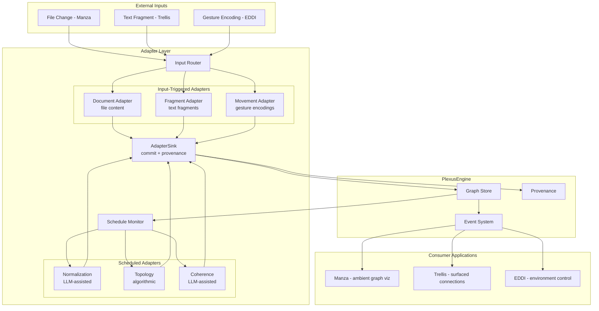

---

## 2. Multi-Dimensional Graph Structure

How nodes and edges are organized across dimensions, with cross-dimensional edges providing the connective tissue.

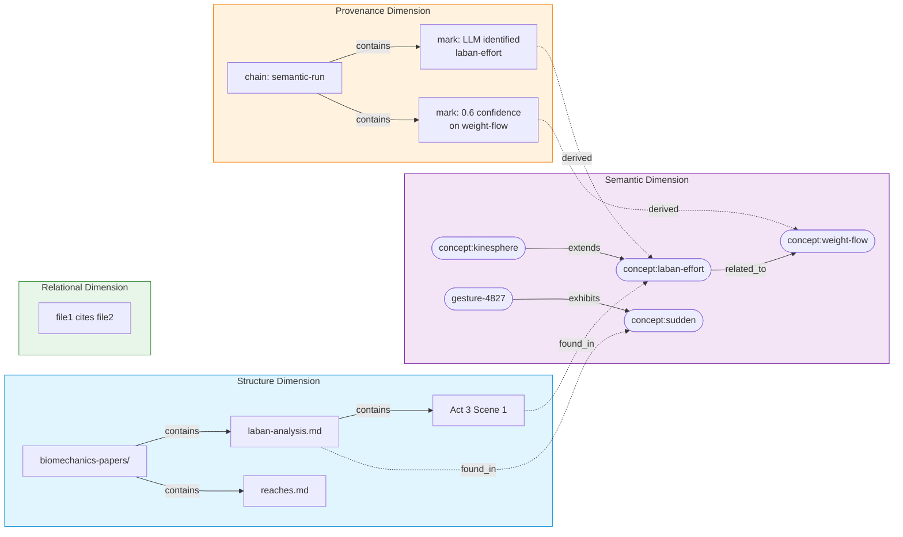

---

## 3. Progressive Emission Pipeline

How a single file change flows through one adapter's internal phases, with each phase emitting through the sink.

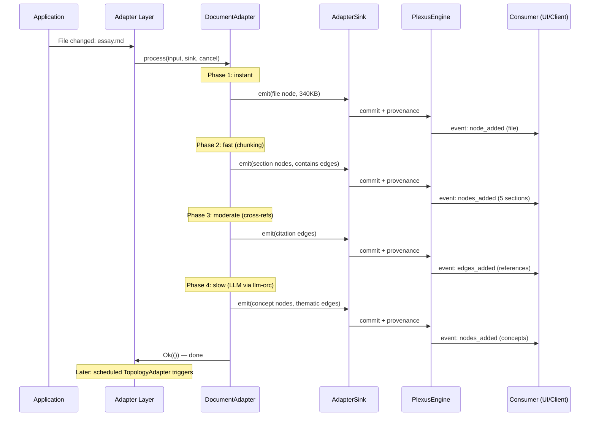

---

## 4. Cross-Modal Concept Bridging

How two independent adapters operating on different modalities converge on shared concept nodes through labels.

---

## 5. Reflexive Adapter: Propose-Don't-Merge Cycle

How the NormalizationAdapter proposes relationships and the graph's own dynamics determine their fate.

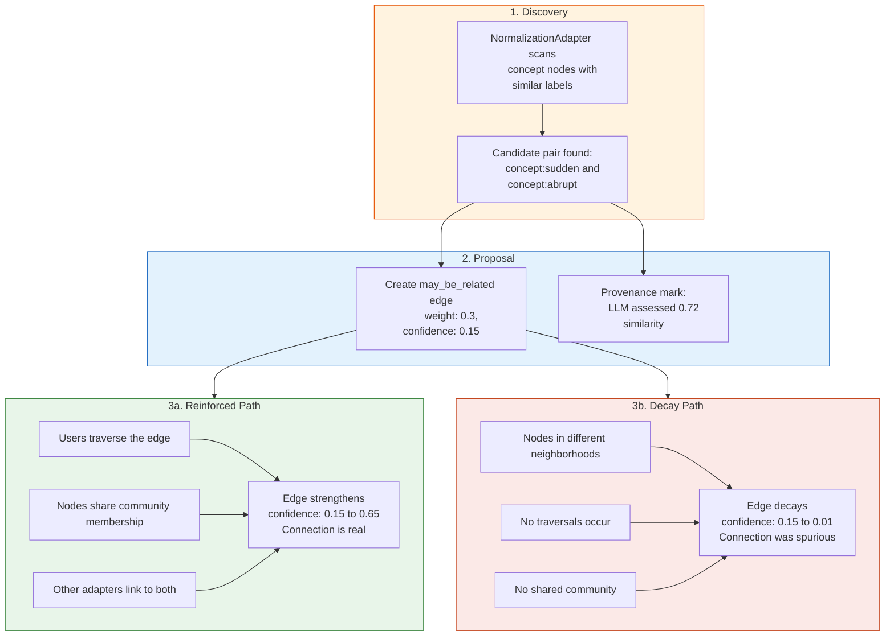

---

## 6. Three Application Scenarios: Temporal Profiles

Side-by-side comparison of how Manza, Trellis, and EDDI interact with the same underlying graph engine on different timescales.

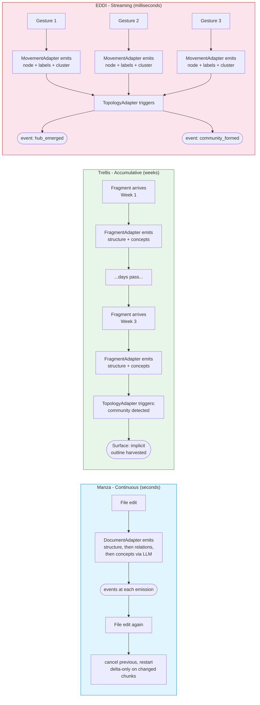

---

## 7. Adapter Trait and Data Flow

The `SemanticAdapter` trait interface and how data flows through it.

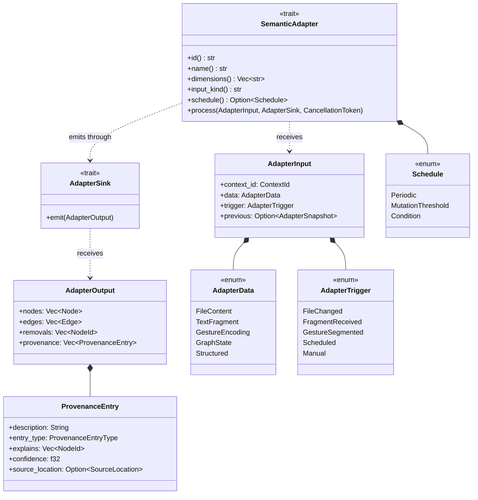

---

## 8. Concrete Adapter Implementations

How the abstract trait maps to specific adapter instances, organized by input kind and trigger mode.

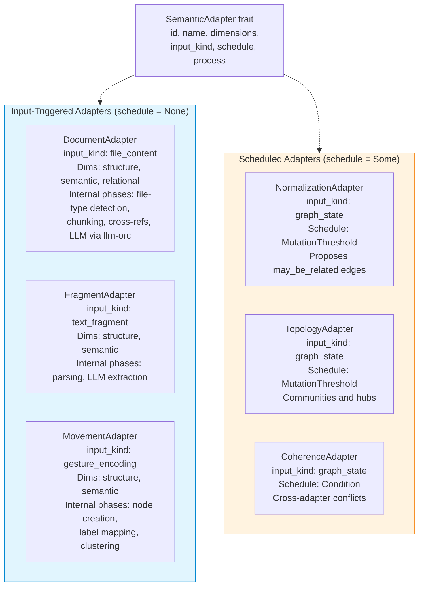

---

## 9. Ontological vs. Epistemological: Two Kinds of Knowledge

How the provenance dimension relates to the rest of the graph.

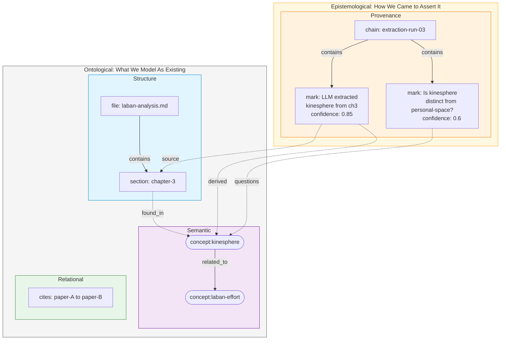

---

## 10. EDDI: Streaming Session Flow

How gesture data flows through the system during a live EDDI session, from motion capture to environmental response.

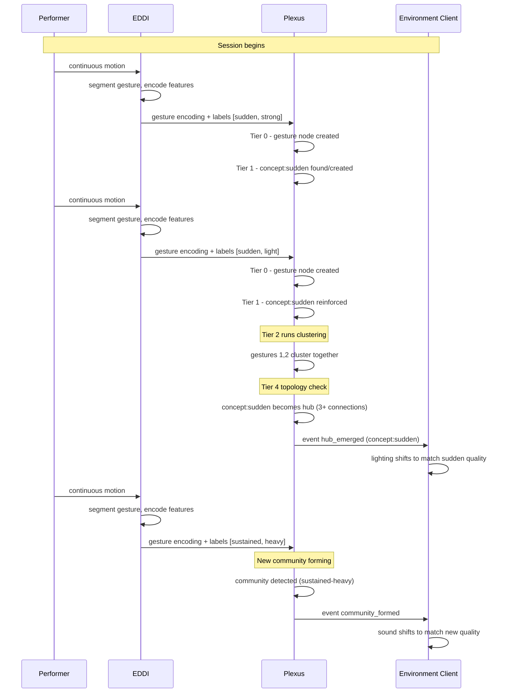

---

## 11. Trellis: Accumulative Harvesting

How fragments accumulate over weeks and emergent structure gets surfaced back to the writer.

---

## 12. Adapter Layer Orchestration

How the adapter layer routes input, manages sinks, and monitors scheduled adapters.

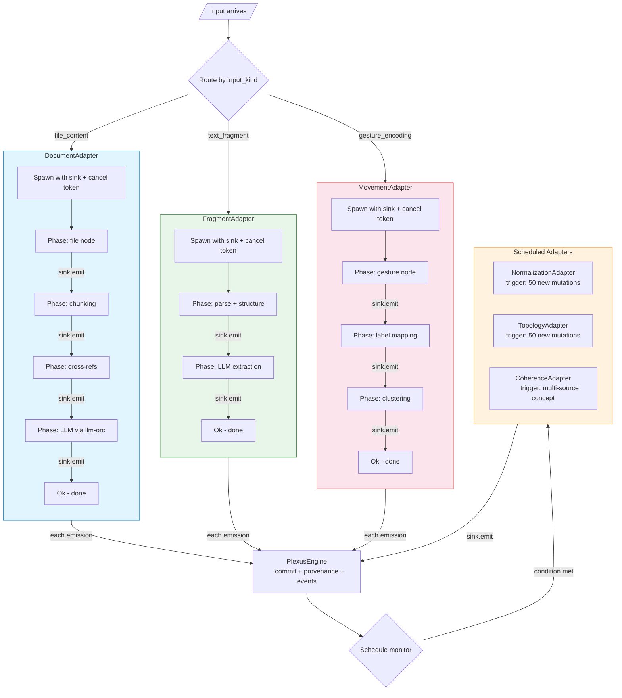

---

## 13. Edge Lifecycle: From Proposal to Reinforcement or Decay

The full lifecycle of an edge in the system, from initial creation through reinforcement dynamics.

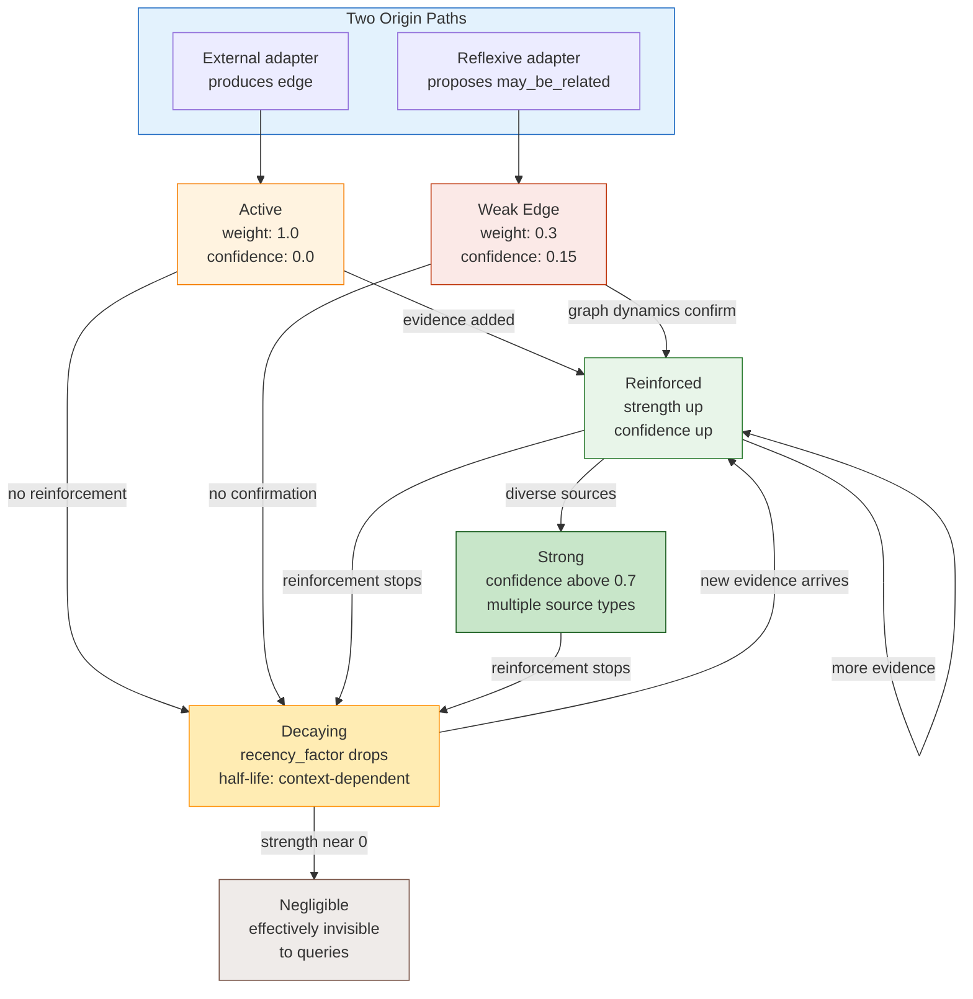
