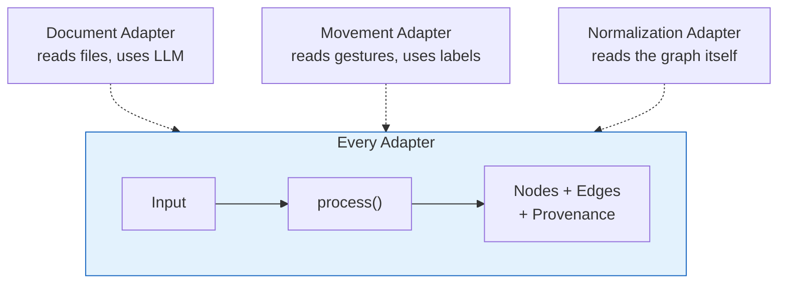
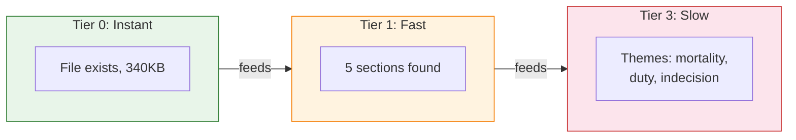

# Semantic Adapters: How It Works

A high-level walkthrough of how Plexus builds knowledge graphs from different kinds of input.

---

## The Big Picture

Plexus takes input from different domains — text documents, writing fragments, gesture data — and builds a shared knowledge graph. Different "adapters" know how to read different kinds of input. They all produce the same thing: nodes and edges in the graph.

The graph is the common currency. What goes in varies wildly. What comes out depends on the application. The graph sits in the middle, accumulating structure.

---

## Two Kinds of Knowledge

The graph tracks two distinct things:

**What we know** — concepts, documents, gestures, relationships between them. This is the substance of the graph.

**How we know it** — which adapter extracted what, from where, with what confidence. This is provenance. It lets you trace any assertion back to its source.

---

## Adapters: One Interface, Many Domains

Every adapter does the same thing: take input, produce graph mutations. They differ in what they consume and how expensive they are.

This uniformity is the point. The graph engine doesn't care whether a concept came from a research paper or a dancer's movement — it's a concept node either way.

---

## Cheap First, Expensive Later

Not all knowledge costs the same to extract. The system works in tiers, emitting what it knows as soon as it knows it.

Tier 0 is free (filesystem metadata). Tier 1 is cheap (parsing). Tier 3 is expensive (LLM calls). Each tier emits events when done, so the UI can show structure immediately and fill in semantics as they arrive.

Crucially, cheap tiers tell expensive tiers where to focus. Tier 1 identifies which sections changed, so Tier 3 only sends the delta to the LLM — not the whole file.

---

## The Bridge: Shared Vocabulary

The most interesting thing happens when independent adapters arrive at the same concept from different directions.

A text adapter reads a paper and extracts the concept "sudden." A movement adapter receives a gesture labeled "sudden." They both point to the same concept node. The system sees independent agreement across modalities — strong evidence that the concept is real and meaningful.

The labels that accompany data into the system are what make this work. A gesture labeled with Laban vocabulary connects to everything else that references Laban vocabulary. A gesture labeled only "cluster-7" connects to nothing.

---

## Edges: Use It or Lose It

Connections in the graph are not permanent assertions. They follow Hebbian dynamics — connections that get reinforced survive, connections that don't fade away.

Confidence comes from evidence diversity, not volume. An edge confirmed by four different kinds of evidence is more trustworthy than one confirmed a hundred times by the same kind.

---

## The Graph Refining Itself

External adapters build the graph from outside input. Reflexive adapters examine the graph itself and propose refinements.

The key rule: **reflexive adapters propose, they never merge.** When the normalization adapter notices "sudden" and "abrupt" might mean the same thing, it creates a weak `may_be_related` edge. If the graph's own dynamics confirm the connection (the nodes share communities, users traverse between them), the edge strengthens naturally. If not, it fades. No information is destroyed.

---

## Three Applications, One Graph

The same graph engine serves three fundamentally different interaction patterns:

**Manza** — an editor. The graph is a living companion to writing. Continuous updates, seconds-scale feedback.

**Trellis** — a writing accumulator. Fragments arrive over days and weeks. The graph finds latent connections the writer didn't consciously make. Mirror, not oracle.

**EDDI** — a gesture-driven environment controller. Movement data streams in, the graph detects when something structurally interesting happens (new cluster, hub emerged), and emits events that alter light, sound, or projection.

Different timescales. Different inputs. Different outputs. Same graph underneath.
