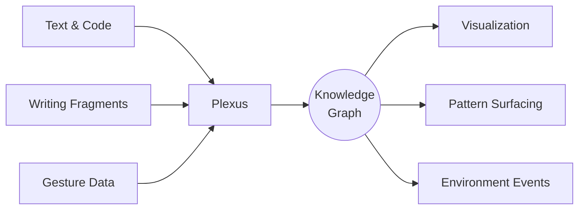
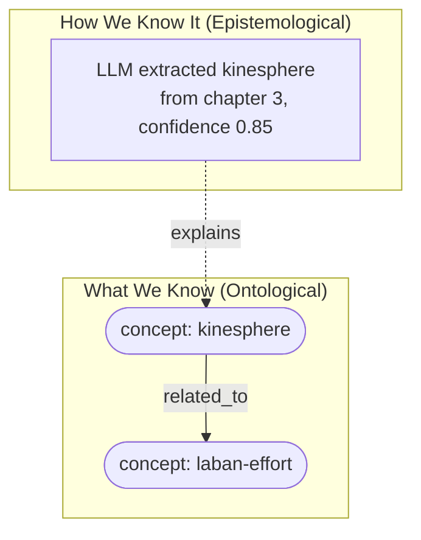
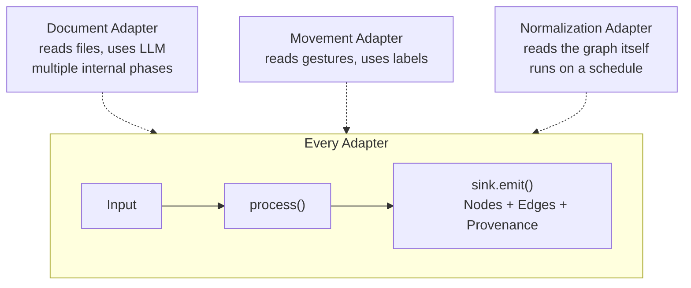
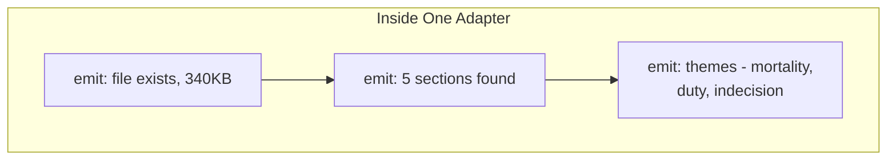
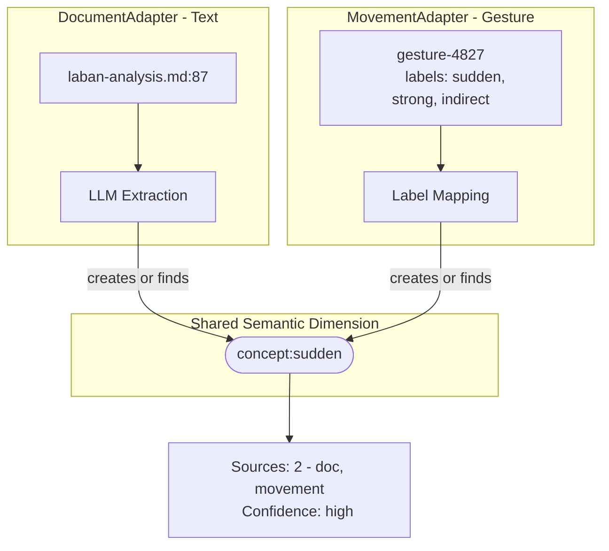
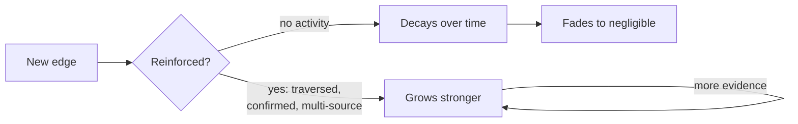
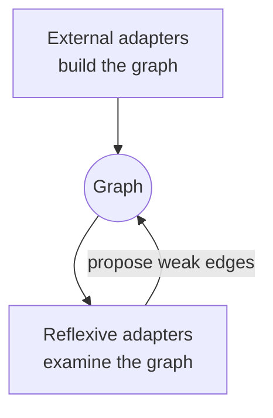
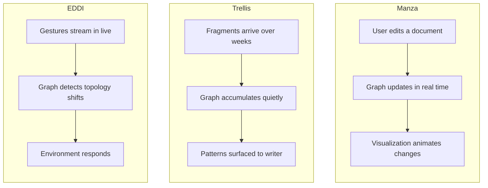

# Semantic Adapters

Plexus is a multi-dimensional knowledge graph engine. It models relationships between concepts, documents, code, movement data, and other domains — storing not just what it knows, but how it came to know it.

**Semantic adapters** are the layer that transforms domain-specific input into graph mutations. A single adapter takes one kind of input (file content, text fragments, gesture encodings, or the graph itself), processes it through however many internal phases it needs, and emits nodes, edges, and provenance into the shared graph.

This document explains the concepts. See [semantic-adapters-design.md](./semantic-adapters-design.md) for the system design and trait definitions.

---

## The Big Picture

Plexus takes input from different domains — text documents, writing fragments, gesture data — and builds a shared knowledge graph. Adapters know how to read different kinds of input. They all produce the same thing: nodes and edges in the graph.

The graph is the common currency. What goes in varies wildly. What comes out depends on the application.

---

## Two Kinds of Knowledge

The graph tracks two distinct things:

**What we know** — concepts, documents, gestures, relationships between them. These live in the structure, semantic, relational, and temporal dimensions.

**How we know it** — which adapter extracted what, from where, with what confidence. This is the provenance dimension. It lets you trace any assertion back to its source.

Both live in the same graph. A node IS a thing. A provenance mark is a Post-it note stuck inside the page of a book — recording an observation about the modeling process.

---

## The Adapter Interface

Every adapter does the same thing: take input, emit graph mutations through a sink. They differ in what they consume and how complex they are internally.

An adapter is a **coarse-grained, self-organizing unit**. It owns its entire processing pipeline internally. The framework only sees what comes out of the sink. An adapter:

- **Declares** what input it consumes (`input_kind`) and what dimensions it populates
- **Emits** mutations progressively — cheap results first, expensive results later
- **Carries provenance** with every emission so the system can record WHY each mutation happened
- **Respects cancellation** when input is superseded

An adapter does NOT know about the event system, visualization, persistence, or other adapters.

---

## Progressive Emission

Not all knowledge costs the same to extract. A single adapter works through progressively more expensive phases, emitting what it knows as soon as it knows it.

Each emission triggers events immediately. The UI can show structure while semantics are still being extracted in the background. Cheap phases inform expensive phases — structural parsing identifies which sections changed, so the LLM phase only processes the delta.

The adapter encapsulates domain complexity. A DocumentAdapter chooses different strategies by file type (markdown headers, PDF layout extraction via llm-orc, tree-sitter for code). The adapter layer doesn't know about any of this.

---

## Cross-Modal Concept Bridging

The most interesting thing happens when independent adapters arrive at the same concept from different directions.

The semantic dimension is a shared namespace. When the MovementAdapter produces `concept:sudden` and it already exists (created by the DocumentAdapter from text), the system sees independent agreement across modalities — strong evidence.

**Labels are the bridge.** A gesture labeled with Laban vocabulary (`sudden`, `strong`) connects to everything else referencing those concepts. A gesture labeled only `cluster-7` connects to nothing. The labeling that happens upstream determines the richness of cross-modal connections.

---

## Edges: Use It or Lose It

Connections follow Hebbian dynamics — connections that get reinforced survive, connections that don't fade away.

Confidence comes from evidence diversity, not volume. Four different kinds of evidence → more trustworthy than a hundred of the same kind.

Decay is configured per-context. Manza might use a weekly half-life. Trellis might use months-scale. EDDI might use no decay within a session.

---

## Reflexive Adapters

External adapters build the graph from outside input. Reflexive adapters examine the graph itself and propose refinements. Same trait, different trigger: they run on a schedule rather than on input arrival.

Three concerns:

- **Normalization** — finds near-miss labels ("sudden" vs "abrupt"), proposes weak `may_be_related` edges
- **Topology** — community detection, hub identification, topology-change events
- **Coherence** — flags when different adapters contribute inconsistently to the same concept

**Reflexive adapters propose, they never merge.** Two similarly-labeled concepts may be entirely different depending on context. The graph's own reinforcement dynamics determine which proposed connections are real. The adapter accelerates discovery; the graph disposes.

---

## Three Applications, One Graph

**Manza** — an editor. The graph is a living companion to writing. Continuous input, seconds-scale feedback, progressive emission lets the UI animate graph growth.

**Trellis** — a writing accumulator. Fragments arrive over days and weeks. The graph finds latent connections the writer didn't consciously make. Mirror, not oracle. The TopologyAdapter harvests implicit outlines when community structure emerges.

**EDDI** — a gesture-driven environment controller. Pre-segmented gesture data streams in from upstream. The graph detects topology changes (new cluster, hub emerged) and emits events that alter light, sound, or projection. EDDI owns signal processing; Plexus owns graph building.

Different timescales. Different inputs. Different outputs. Same graph underneath.
