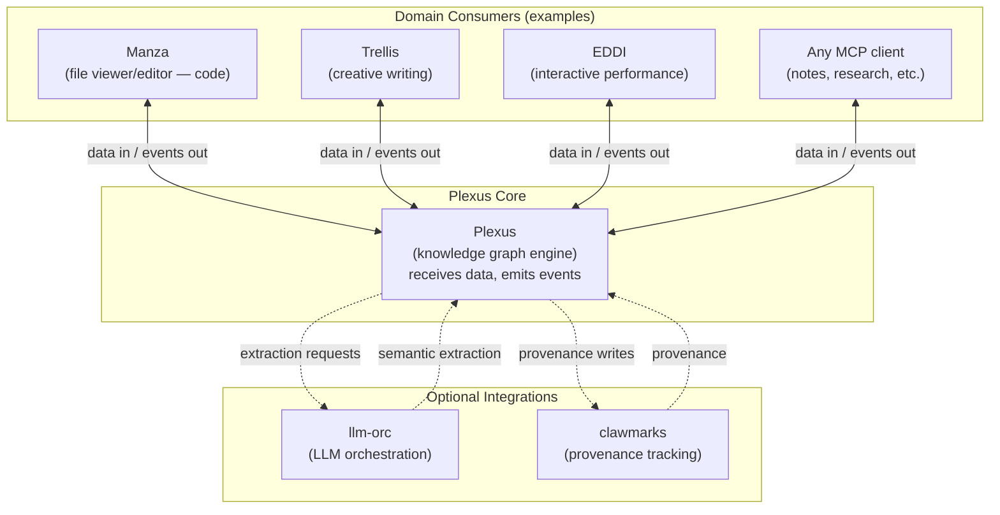

# Plexus: A Content-Agnostic Self-Reinforcing Knowledge Graph for Live Creative Composition

**Nathaniel Green**
Independent Researcher
nate@nate.green
ORCID: 0000-0003-0157-7744

*Working Paper — January 2026*

---

## Abstract

Knowledge accumulates faster than understanding across all creative domains — code grows through AI-assisted generation, research notes proliferate across tools, choreographic vocabulary develops through rehearsal — yet practitioners lose structural awareness of their own work. We propose **Plexus**, a content-agnostic knowledge graph engine designed to evolve alongside creative composition. Plexus receives data from domain-specific clients, processes it at multiple frequencies with self-reinforcing edge dynamics inspired by Hebbian learning, and emits events that clients can use to provide ambient structural awareness without interrupting the creative process. The system updates at multiple frequencies — structural changes appear in <100ms, relational clustering in <2s, semantic extraction in 10–30s, and conceptual analysis on longer timescales — creating a peripheral structural reflection of the emerging work. We ground the design in external cognition theory, flow-state research, the cognitive costs of AI-assisted work, memory-inspired learning models, and computational movement analysis. Plexus can optionally integrate with llm-orc (LLM orchestration) and clawmarks (provenance tracking), but clients can derive structure through any means appropriate to their domain. Three domain consumers demonstrate the content-agnostic claim: Manza (code and document composition), Trellis (creative writing scaffolding), and EDDI (interactive performance) — though Plexus could serve any domain where structure emerges from composition. A companion paper [Paper 1] provides experimental validation of the semantic extraction layer. This paper presents a design vision: the theoretical grounding, proposed architecture, and evaluation agenda for a system that exists in partial implementation. Core components (the graph engine, semantic extraction, event emission) are operational; others (self-reinforcing edge dynamics, the full multi-frequency update model, domain consumers beyond Manza) remain at the design stage.

**Keywords:** knowledge graphs, creative composition, self-reinforcing networks, Hebbian learning, multi-frequency updates, external cognition, ambient structural feedback, content-agnostic systems

---

## 1. Introduction

### 1.1 The Opacity Problem

Knowledge accumulates faster than understanding. A developer "vibe-coding" with an AI assistant produces working software but may not fully grasp the architectural decisions embedded in the generated code. A researcher's personal knowledge base grows to thousands of notes whose interconnections are invisible. A team's documentation sprawls across wikis, repos, and chat histories with no unified semantic map. In each case, knowledge exists but cognitive context — the awareness of what you know, how it connects, and where the gaps are — erodes.

This is not a storage problem. The documents exist. The code compiles. The notes are searchable by keyword. The problem is structural: there is no live representation of the semantic relationships within and across these artifacts. The knowledge is there but opaque to the person who ostensibly possesses it.

The problem is particularly acute in AI-assisted composition. When a developer prompts an LLM to generate a module, the resulting code has dependencies, introduces patterns, and makes architectural choices — but the developer's attention was on the prompt, not the output's structural implications. After several such exchanges, the codebase has grown in ways the developer didn't consciously design. The same dynamic applies to writing, research, and any creative process mediated by generative AI: the artifact grows, but the creator's structural awareness does not keep pace. This is not unique to AI-assisted work — any composition process that generates structure faster than the creator can track produces the same opacity — but AI makes it acute by accelerating production while adding an interruption-heavy interaction pattern.

What's missing is not a post-hoc documentation tool. What's missing is a live structural reflection of the composition as it unfolds — something that evolves alongside the creative process and enables clients to provide ambient awareness without demanding attention.

### 1.2 Plexus: A Live Knowledge Graph for Composition

Plexus is a knowledge graph engine designed to address this opacity. Rather than analyzing artifacts after they're complete, Plexus integrates with the creative environment and builds a semantic graph that evolves in real-time as content is composed. The graph is not documentation — it is a live structural reflection of the emerging work.

The core insight is that all composition — regardless of medium — produces structure, and that structure is what creators lose track of. The specific structural elements differ by domain, but the experience is the same.

In code, the nodes are functions, modules, types; the edges are imports, calls, data flow. You watch the dependency graph restructure as you refactor. In fiction, the nodes are characters, scenes, locations; the edges are appearances, dialogue, plot threads. The character relationship web thickens as the story develops. In research, concepts link to papers via citations and arguments — supports, contradicts, builds-on — and argument structure crystallizes as you synthesize. In movement and performance, poses connect via transitions, qualities cluster into vocabulary, and performer-environment couplings emerge. In free-writing, the nodes are whatever you're thinking about: fragments, questions, half-formed ideas. Associations, echoes, and tensions become edges. Clusters form from scattered notes.

In every case, the creator composes linearly — word after word, function after function — but the structure of the work is non-linear. A graph, not a sequence. Without a live structural view, the creator must hold that graph in their head. With Plexus, the graph is externalized and kept current automatically.

Consider the intended experience across three domains:

*A developer* writes a new function. Manza sends the change to Plexus; Plexus creates nodes and edges, then emits events as connections form; Manza renders these in a peripheral visualization. They prompt an AI assistant to generate a utility module — Plexus processes the new code and emits events; Manza shows what was introduced, what it depends on, how the topology changed. When they refactor, they watch clusters merge and hub nodes shift in Manza's display. The developer didn't ask "what depends on this?" The client, fed by Plexus events, already showed them.

*A novelist* has been writing for three hours. Without Plexus, she finishes a scene and wonders: have I used this motif before? Which characters know this secret? She searches, re-reads, loses her thread. With Trellis feeding her fragments to Plexus and subscribing to its events, she receives a coaching prompt: "betrayal" has thickened its connections — three scenes now, each linked to different characters. A new subplot appears as a cluster at the periphery, gradually developing edges inward toward the main narrative structure. She never left the scene she was writing — Trellis surfaced the structural insight from Plexus without interrupting her.

What does a performer experience? Not notation. Not a score. A performer in an interactive installation moves through a sequence, and EDDI sends gesture data to Plexus. The graph accumulates: pose nodes connect via transition edges, movement qualities (sustained, sudden, bound) cluster into vocabulary, performer-environment couplings strengthen as semantic edges. EDDI subscribes to Plexus events and translates edge weights into environmental response — colors warm, sounds layer, the space responds to accumulated history. Across rehearsals, the strengthening edges (communicated via Plexus events) produce a richer environmental response. The choreographic structure becomes *felt* through the environment's memory of what happened and how it connected.

Plexus behaves identically in all cases — nodes appear, edges form, clusters emerge, hubs solidify, unused connections fade. The content-type-specific clients (Manza for code, Trellis for fiction, EDDI for movement) send different data types into the same graph engine with the same self-reinforcing dynamics, and subscribe to the same event stream. Clients render those events however suits their domain: visual graphs, coaching prompts, environmental responses. Coding and choreography, fiction and research, fed through Plexus and rendered by their respective clients, are designed to feel like the same activity: *composition with live structural feedback*.

The design hypothesis is that this produces something closer to a flow state than traditional tooling offers — the creator maintains structural awareness without interrupting composition to manually trace dependencies, re-read earlier chapters, or search for related notes. Whether this hypothesis holds is an empirical question we address in §5. Plexus provides the structural data; clients render it as peripheral vision for knowledge work.

### 1.3 Design Principles

Several principles shape Plexus's architecture. First, the graph evolves in real-time: it updates as clients send data — file changes, generated code, new fragments, gesture streams — not as a batch process after the fact. Plexus emits events that clients can subscribe to for immediate feedback.

Because different semantic layers have different computational costs, updates occur at multiple frequencies. Code structure (imports, definitions, call relationships) updates on every validation cycle. Semantic structure (shared terms, topic clusters) updates on save or pause. Conceptual structure (deeper cross-document relationships) updates in the background or on explicit refresh. This tiered approach keeps the graph responsive without saturating compute.

Edges self-reinforce through domain-appropriate validation and decay without reinforcement — a form of Hebbian learning for knowledge structures. An edge validated through testing, compositional development, or deliberate repetition gains structural confidence. An unvalidated edge fades. Over time, the graph is hypothesized to converge on the relationships that actually matter to the practitioner.

Provenance runs throughout. Every concept in the graph traces back to a specific file, line, and evidence span. Click a node, open the source. The graph is not an abstraction layer on top of the work — it is a navigable index into it.

Plexus exposes its graph via MCP for any domain-specific consumer and can optionally integrate with llm-orc (LLM orchestration) and clawmarks (provenance tracking). Clients can derive structure through any means appropriate to their domain — LLM extraction, deterministic parsing, movement classification, manual annotation. Execution patterns inform graph structure and graph analysis can inform future extraction strategies, creating a bidirectional learning loop.

Finally, the engine is designed to be content-agnostic. The hypothesis is that the same graph data model, edge dynamics, and MCP protocol can serve all creative domains — with only the analyzers (parsers, extractors, classifiers) differing per domain. Whether this holds — whether domain-specific validation mechanisms and decay parameters can be cleanly separated from the shared infrastructure — is an empirical question we address in §5.3. The claim is architectural intent, not demonstrated capability.

### 1.4 This Paper

This paper presents the system design, theoretical grounding, and evaluation agenda for Plexus. A companion paper [Paper 1] reports the empirical experiments that validated the semantic extraction layer — one critical subsystem within the broader architecture. Here we address the full system: the content-agnostic graph engine, the self-reinforcing edge model, the multi-frequency update architecture, optional integrations (llm-orc for LLM-based extraction, clawmarks for provenance), and three domain consumers that demonstrate Plexus across creative domains (Manza, Trellis, EDDI) — with the understanding that Plexus could serve any domain where structure emerges from composition.

### 1.5 Scope and Status

This is a design paper, not a systems paper. We present a theoretical framework, an architectural vision, and an evaluation agenda — not a fully implemented system with empirical validation.

**What exists:** The core graph engine is operational. Semantic extraction via LLM ensembles has been validated (Paper 1). The event emission architecture is implemented and serves Manza (the code/document client). The MCP protocol for client integration is functional.

**Companion paper [Paper 1]:** The semantic extraction experiments referenced throughout this paper are documented in a separate working paper, "Semantic Extraction for Live Knowledge Graphs: An Empirical Study." That paper reports the specific experiments (file tree traversal vs. network algorithms, evidence-grounded prompting, local LLM latency measurements) that informed Plexus's design. Both papers are working papers by the same author; [Paper 1] is available upon request and will be released alongside this paper.

**What is designed but not yet built:** The self-reinforcing edge dynamics (§3.4) exist as a specification. The full multi-frequency update model (§3.3) is partially implemented — fast structural updates work; slower semantic tiers are operational but the coordination model is incomplete. Trellis and EDDI are at different stages: Trellis has a working prototype described in a companion paper [62]; EDDI remains a design specification informed by movement analysis research.

**What this paper claims:** We argue that the proposed architecture *would* address the opacity problem (§1.1) if fully implemented. We provide theoretical grounding for why the design should work, drawing on external cognition, flow research, and memory-inspired learning. The evaluation agenda (§5) specifies how to test these claims. We do not claim the system already works as described — we claim it is a coherent design worth building and testing.

This framing matters for how to read subsequent sections. When we describe how edges "strengthen through validation" (§3.4), we are describing the intended behavior of a system under development, not reporting observations of a deployed system. When we describe domain consumers (§4), we are describing how Plexus *would* serve these domains, with varying levels of implementation behind each description.

---

## 2. Related Work

Plexus integrates ideas from several research areas not previously combined: external cognition, flow theory, cognitive context in AI-assisted work, self-reinforcing memory models, computational movement analysis, multi-frequency event processing, and knowledge graph construction.

### 2.1 External Cognition and Epistemic Tools

The idea that external representations reduce cognitive burden has deep theoretical grounding. The key distinction comes from Kirsh and Maglio [15]: epistemic actions change the agent's computational state (making mental computation easier), while pragmatic actions change the world toward a goal. In their Tetris experiments, players rotate pieces physically to simplify mental pattern-matching — an action that looks "wasteful" but is computationally efficient. A knowledge graph that externalizes structural relationships serves a similar function. It makes relationships visible so the composer doesn't have to hold them in working memory.

Distributed cognition [16] pushes this further: cognitive processes are not confined to individual minds but distributed across people, artifacts, and environments. Hutchins argues that tools do not merely "amplify" cognition — they enable qualitatively different cognitive processes using different skills. This is not a metaphor. A developer with a live knowledge graph is not simply thinking harder about structure; they are engaging in a different kind of structural reasoning, one that relies on perceptual processing rather than memory retrieval.

Three specific mechanisms explain how [17]. *Computational offloading* reduces working memory demands. *Re-representation* presents information in a form better suited to the task. *Graphical constraining* limits the space of possible inferences. A client's visualization of the Plexus graph can perform all three: it offloads structural tracking, re-represents linear composition as a network topology, and constrains attention to the semantically relevant neighborhood of the current work. Plexus provides the data; clients provide the rendering that achieves these cognitive benefits.

Clark and Chalmers [18] provide philosophical grounding through the extended mind thesis: cognitive processes literally extend into the environment when external resources play the functional role that internal memory would otherwise play. The strong version of this claim — that Plexus literally *is* part of the composer's cognitive system — may overstate things. But the weaker claim is sufficient: a live knowledge graph changes the *kind* of structural reasoning available, from memory retrieval to perceptual processing. That shift is what matters.

Personal Information Management (PIM) research addresses a related challenge: how people organize, find, and re-find their information across fragmented tools and collections [64]. Jones's "keeping found things found" framework [65] identifies the core tension — information is easy to acquire but difficult to organize for future retrieval. Traditional PIM focuses on filing, tagging, and search; Plexus addresses a distinct problem upstream: maintaining structural awareness of *how* information connects as it accumulates, not just *where* it is stored. The two concerns are complementary — PIM asks "can I find this again?" while Plexus asks "what is the shape of what I know?"

However, cognitive offloading is not unambiguously beneficial. Gerlich [48] finds a significant negative correlation between frequent AI tool usage and critical thinking abilities, mediated by increased cognitive offloading — younger users show higher dependence and lower critical thinking scores. Klein and Klein [49] introduce the "extended hollowed mind" framework: when AI frictionlessly provides answers, users systematically bypass the effortful cognitive processes essential for deep learning. EEG evidence shows that LLM interaction reduces frontal theta power — a marker of working memory load — suggesting reduced engagement of the cognitive processes central to learning. Matuschak and Nielsen [50] argue that transformative tools for thought must avoid reducing the user to a passive consumer of externally generated structure.

This critique applies to tools that outsource *reasoning* — where the tool does the thinking and the user accepts the output. Plexus's design deliberately avoids this failure mode. It externalizes *structural awareness* (what connects to what) but not *interpretation* (what it means). The graph shows that three fragments share a concept; the creator decides whether that matters. It replaces memory retrieval with perceptual processing (consistent with Scaife and Rogers's computational offloading [17]) without replacing the creator's interpretive and compositional agency. The distinction between structural offloading and reasoning offloading is critical: the former expands cognitive capacity, while the latter risks eroding it.

### 2.2 Flow State and Structural Feedback

Csikszentmihalyi [19] identifies three conditions for flow: clear goals, immediate feedback, and challenge-skill balance. The second condition is directly relevant. Traditional development environments provide delayed structural feedback — the developer must actively query for dependencies, references, or call hierarchies. A client subscribed to Plexus events can provide immediate, continuous structural feedback without requiring an explicit query — the graph engine emits events as structure changes, and the client renders them in real-time.

Dietrich [20] adds a neurological constraint: flow involves transient hypofrontality — the prefrontal cortex partially deactivates, reducing self-monitoring and analytical processing. The implication for client design is strict: structural feedback must be *ambient and peripheral*. A client visualization that demands active reading would disrupt flow; one that operates at the level of peripheral awareness — shapes shifting, clusters forming, edges thickening — preserves it. Matthews et al. [21] study this design space for glanceable peripheral displays, finding that ambient information can maintain awareness without attentional capture. This is a client rendering concern, not a graph engine concern — Plexus emits events; clients decide whether to render them ambiently or demandingly.

A caveat on the flow framework is warranted. Farrokh et al. [51] argue that critiques of flow theories like transient hypofrontality have emerged within the same cognitive metatheoretical framework without challenging its underlying assumptions about the mind-body relationship. Wonders et al. [52] systematically review flow measurement protocols and find significant methodological problems: non-validated psychological instruments in the majority of studies, ambiguous reporting of verification results, and frequent failure to match task difficulty to participant skill levels — undermining the ecological validity of many flow claims. The flow-performance relationship, while positive, is moderate (r = 0.31) with unclear causal direction [52]. We retain the flow framework not because the science is settled — it is not — but because its core design implication is robust regardless: ambient, peripheral structural feedback that avoids interrupting the primary task is preferable to feedback that demands explicit queries and mode-switching. Whether this produces "flow" in Csikszentmihalyi's technical sense is an empirical question we address in §5.1 with awareness of these methodological challenges.

Digital audio workstations, 3D modeling tools, and game engines already provide this kind of live structural feedback. Waveforms evolve as musicians compose; wireframes respond as modelers sculpt; physics simulations run alongside level design. In each case, the structural representation co-evolves with the creative act. Software development has moved toward this with live linting and type checking, but these provide *correctness* feedback ("is this valid?"), not *structural* feedback ("what did this change connect to?"). A client rendering Plexus events occupies a different niche: it can show the semantic topology of the work as it emerges.

### 2.3 Cognitive Costs of AI-Assisted Composition

*This section synthesizes findings from cognitive psychology (working memory, cognitive load), HCI (interruption research, situation awareness), and software engineering (developer experience, AI-assisted coding). Readers from individual disciplines may find some terminology unfamiliar; we gloss key terms inline.*

The opacity problem (§1.1) has a cognitive mechanism that extends beyond the AI-specific case. We develop this in four steps: the interaction pattern disrupts flow, the underlying problem is domain-general, AI makes it acute, and external structural representations provide the remedy.

**The prompt→wait→evaluate cycle disrupts flow.** AI-assisted composition imposes a distinctive interaction pattern: the creator formulates a prompt, waits for generation, then evaluates output they did not write. Mark et al. [42] demonstrate that interrupted work exacts significant cognitive costs — workers compensate for interruptions by completing tasks faster but experience substantially more stress, frustration, and time pressure. Each generation forces the creator out of compositional flow into an analytical evaluation mode; the cycle is an interruption factory. Subramonyam et al. [43] identify a deeper challenge specific to LLM interaction: the "gulf of envisioning," where users struggle to formulate effective prompts because they cannot anticipate the system's behavior. What makes this costly is not just delayed feedback (§2.2) — it is that the interaction pattern alternates between two incompatible cognitive modes: generative composition and critical evaluation of unfamiliar output.

**Information density exceeding comprehension is not AI-specific.** Look past AI and the deeper issue is structural: any process that generates information faster than the creator can track produces opacity. A dance improvisation session accumulates gesture data, spatial formations, and performer-environment couplings faster than any choreographer can mentally catalog. A rapid prototyping session produces design variants whose structural differences are invisible without explicit comparison. A research sprint across dozens of papers generates conceptual connections that exceed individual working memory. Kirschner et al. [44] formalize this through collaborative cognitive load theory: when task complexity exceeds individual cognitive capacity, the load must be distributed — across collaborators, across time, or across external representations. Sweller's cognitive load theory [14] provides the mechanism: working memory is sharply limited, and information that is not organized into existing schemas imposes extraneous load. The problem is not AI. The problem is information density outpacing comprehension. AI is one instance — a particularly aggressive one.

**AI makes the problem acute.** Consider "vibe-coding": a developer prompts an AI to generate modules iteratively, accepting code that works without fully comprehending how it works. After a dozen exchanges, the codebase has architectural decisions the developer didn't make, dependency patterns they didn't design, and structural implications they never evaluated. The code compiles; the tests pass; the developer has lost structural awareness of their own project. Cito and Bork [10] describe this as "material disengagement" — developers orchestrate code generation without comprehending the output. Qiao et al. [11] measure the resulting comprehension-performance gap in brownfield development. Al Haque et al. [12] note that few empirical studies of cognitive load from AI coding assistants yet exist — the phenomenon is documented but under-measured. A 2025 industry survey [13] found 65% of developers report AI misses context during refactoring, with 60% citing similar gaps in test generation and review. The artifact grew through a process the creator didn't structurally track. The Vibe-Check Protocol [53] formalizes this phenomenon through three metrics: the Cold Start Refactor (measuring skill retention via procedural decay when AI is removed), Hallucination Trap Detection (measuring vigilance via signal detection theory), and the Explainability Gap (measuring the metacognitive disconnect between generated code complexity and the developer's understanding). This is the same opacity that affects the choreographer and the researcher — but compressed into minutes rather than weeks, and compounded by the interruption costs of the prompt→wait→evaluate cycle. Noda et al. [54] identify precisely the three dimensions at stake — feedback loops, cognitive load, and flow state — as the core drivers of developer experience, providing an independent validation of the design space Plexus addresses.

**External structural representations reclaim cognitive capacity.** Better prompting won't fix this. Slower generation won't either. The remedy is structural. Endsley [45] defines situation awareness as the perception of elements in the environment, comprehension of their meaning, and projection of their future state — precisely what erodes in information-dense composition. Creators lose perception of what has been added, comprehension of how it connects, projection of where the structure is heading. Larkin and Simon [46] demonstrate that diagrams reduce cognitive load by making information explicit that would otherwise require search and inference — a diagram is worth ten thousand words because it replaces memory retrieval with perceptual processing. Kirsh [47] extends this: external representations do not merely offload cognition but expand the cognitive system's boundaries, enabling forms of reasoning that are impossible with internal representations alone. This is where Plexus enters. A graph engine emitting structural events, rendered by a client as live feedback, provides ongoing situation awareness of the composition's structure — what was added, how it connects, where clusters are forming, which relationships are strengthening. It reclaims the cognitive capacity that information-dense processes erode, not by slowing production but by making the structural consequences of production continuously visible through client rendering of Plexus events.

### 2.4 Self-Reinforcing and Memory-Inspired Knowledge Structures

Plexus's self-reinforcing edge model — where edges strengthen through validation and decay without reinforcement — draws on Hebbian learning and memory research, though the analogy requires careful scoping. The Hebbian principle ("neurons that fire together wire together") is more precisely stated as: synapses strengthen through *successful* co-activation, not mere co-occurrence. This distinction matters. In biological LTP, a synapse that fires and produces a downstream response strengthens; one that fires without functional effect does not. We adopt this stronger version: edges strengthen through domain-appropriate *validation* (tested contracts, compositional development, deliberate repetition) rather than through access frequency alone (§3.4).

The memory-theoretic basis comes from Bjork and Bjork [28], who distinguish storage strength (permanent) from retrieval strength (decays). Periodic forgetting builds higher storage strength on re-learning — a "desirable difficulty." In our system, edge decay serves an analogous function: relationships that are re-validated after fading receive stronger reinforcement than relationships that were never forgotten. Spaced repetition systems [29, 30] apply similar principles to optimize *recall* of known facts; Plexus applies them to optimize *discovery* of emergent structure — to our knowledge, the first knowledge graph system to do so in a creative composition environment.

### 2.5 Computational Movement Analysis and Choreographic Structure

The movement/performance domain connects to three bodies of work. **Classification systems** [31, 32] use multimodal data to characterize Laban Effort qualities (Weight, Time, Space, Flow), providing the kind of structural-layer input that movement analyzers would feed to Plexus. **Dance ontologies** [33, 34] encode Labanotation semantics in OWL-2 with Description Logic reasoning — expert-authored schemas for the conceptual layer, but static rather than emergent. **Real-time performance systems** like EyesWeb [35] and DASKEL [55] (which provides bidirectional skeleton-to-Labanotation conversion) react in real-time but have no cross-session memory. Forsythe's choreographic objects [36] provide the conceptual foundation: choreographic structure as a formal system.

These three lines have developed in isolation with complementary limitations. The classification systems (Fdili Alaoui, Garcia) handle controlled studio conditions but say nothing about what the classified gestures *mean* in compositional context. The ontologies (El Raheb, Paul) are expert-authored and static — precisely the opposite of what emerges from live rehearsal. The interactive systems (EyesWeb) react in real-time but have no memory; each performance starts from zero. Plexus proposes unifying these into a single graph where performer-environment couplings strengthen through rehearsal, movement vocabulary clusters emerge from practice, and choreographic structure becomes visible not through notation but through the graph's accumulated memory of what happened and how it connected.

### 2.6 Multi-Frequency Event Processing

Our tiered update architecture (§3.3) has precedent in stream processing. The Lambda Architecture [37] processes data through parallel batch (high-latency, high-accuracy) and speed (low-latency, approximate) layers. Kreps [38] simplifies this to the Kappa Architecture where all processing is stream-based with replay for recomputation.

Luckham [39] formalizes hierarchical event abstraction in Complex Event Processing: low-level events compose into higher-level complex events across different temporal windows. This is directly analogous to our multi-frequency model where token-level structural events compose into relational patterns, semantic concepts, and conceptual structures at increasing timescales.

Baresi and Guinea [40] propose multi-layer monitoring with three processor types operating at different frequencies, the closest architectural precedent to our approach. Keskisärkkä [41] address the specific challenge of applying semantic reasoning to streaming data — traditionally semantic approaches assume static data, while our semantic layer must operate incrementally on a continuously evolving corpus.

We frame our architecture in terms of tiered event processing rather than reactive streams or actor models because the key design constraint is *heterogeneous latency* — different semantic layers have fundamentally different computational costs, and the architecture must accommodate that variance rather than abstracting it away.

### 2.7 Knowledge Graph Systems

Recent LLM-based knowledge graph systems — GraphRAG [1], LightRAG [2], Neo4j LLM Graph Builder [3], iText2KG [22] — share a batch-processing assumption: documents are finished artifacts to be indexed, not evolving compositions to be tracked. Bian [23] surveys this landscape; Agrawal et al. [24] show knowledge graphs reduce LLM hallucination; InfraNodus [4] applies network science to knowledge management. Among incremental systems, Graphiti [25] builds graphs in real-time with a bi-temporal model; Van Assche et al. [26] and Liu et al. [27] address incremental construction and embedding. None of these systems combine live composition tracking with self-reinforcing dynamics. Our companion paper [Paper 1] reports semantic extraction experiments that informed the multi-frequency architecture.

### 2.8 Gap Analysis

No existing system integrates all of these elements:

| Capability | GraphRAG | Graphiti | Spaced Repetition | InfraNodus | **Plexus** |
|------------|----------|----------|--------------------|------------|-----------|
| LLM-based extraction | ✓ | ✓ | — | — | ✓ |
| Incremental/real-time | — | ✓ | — | — | ✓ |
| Self-reinforcing edges | — | — | ✓ (recall-only) | — | ✓ |
| Evidence provenance | — | — | — | — | ✓ |
| Multi-frequency updates | — | — | — | — | ✓ |
| Event emission for clients | — | — | — | — | ✓ |
| Content-agnostic (code, text, movement) | — | — | — | — | ✓ |

Graphiti shares the real-time incremental approach but lacks self-reinforcement, provenance, and event emission for client rendering. Spaced repetition systems implement Hebbian-style dynamics but optimise recall of known facts rather than discovery of emergent structure. No existing system combines a self-reinforcing knowledge graph with event emission that enables clients to provide live structural feedback in creative composition environments.

---

## 3. System Design

### 3.1 Architecture Overview

Plexus is implemented as a Rust-based knowledge graph engine with SQLite storage, exposed via the Model Context Protocol (MCP). Clients send data to Plexus (new nodes, validation signals, etc.); Plexus processes at multiple frequencies and emits events (node created, edge strengthened, cluster formed, etc.) that clients can subscribe to. Plexus has two service dependencies and any number of domain-specific consumers:

*Figure 1: Plexus architecture. The core graph engine (center) receives data from and emits events to domain consumers (bottom) via MCP. Optional integrations (top) provide semantic extraction (llm-orc) and provenance tracking (clawmarks). Dashed lines indicate optional dependencies; solid bidirectional arrows indicate the primary data-in/events-out pattern between Plexus and its consumers.*

Plexus integrates with two services (though neither is strictly required for all use cases):
- **llm-orc** orchestrates LLM ensembles for semantic extraction — one method for populating the graph's semantic and conceptual layers. Clients that derive semantics through other means (movement classification, deterministic parsing, manual annotation) need not use llm-orc.
- **clawmarks** records provenance (file, line, evidence span) for concepts in the graph — enables "go to source" from any consuming interface. Clients that don't require source provenance (e.g., real-time performance systems) may operate without clawmarks.

Plexus does not depend on any particular interface. The domain-specific consumers described in §4 — Manza, Trellis, EDDI — are independent systems that use Plexus to gain semantic graph capabilities in their respective domains:
- **Manza** is a file viewer and editor where users collate files and folders into "contexts" to build semantic knowledge graphs of codebases and documents. Plexus originated as a subsystem of Manza but is now an independent service.
- **Trellis** is a creative writing scaffolding system (§4.2) that consumes the graph to surface fragment connections through coaching prompts rather than graph visualization.
- **EDDI** is an interactive performance system (§4.3) that consumes the graph to drive environmental responses (lighting, sound, projection) rather than visual display.

These consumers illustrate the content-agnostic claim: the same graph engine, the same self-reinforcing dynamics, and the same multi-frequency update model serve code, writing, and movement. Only the domain-specific analyzers and the interface modality differ. Plexus could serve any number of additional domains — workplace note-taking, legal document analysis, scientific research synthesis — with the same architecture. The three examples here are illustrations, not limitations.

Importantly, llm-orc is one method for deriving semantic structure, but Plexus does not require it. Clients can populate the graph using any method appropriate to their domain: EDDI uses Viewpoints movement theory and mathematical heuristics rather than LLM extraction; a code client might use purely deterministic parsing for structural edges; a future client might use other ML models, manual annotation, or domain-specific heuristics. Plexus receives nodes and edges from clients and emits events — it is agnostic to how those nodes and edges were derived.

### 3.2 Data Model

The graph consists of:

- **Nodes**: Typed entities (concept, function, character, pose, fragment) with properties and a content dimension (structural, relational, semantic, conceptual)
- **Edges**: Typed relationships with weight, decay parameters, and reinforcement history
- **Contexts**: Scoped subgraphs (a project, a chapter, a rehearsal session) that partition the graph without duplicating nodes
- **Dimensions**: The four semantic layers (structural, relational, semantic, conceptual) that organize nodes by abstraction level

Edge weights evolve over time through three mechanisms:
1. **Reinforcement**: Traversal, validation, or co-activation increases weight
2. **Decay**: Exponential decay with configurable half-life (default: 1 week)
3. **Emergence**: Co-occurring concepts across documents create new edges

### 3.3 Multi-Frequency Update Model

A live knowledge graph cannot update everything at once — LLM extraction takes ~10s per document [Paper 1, §4.6], and the user is composing continuously. The solution is tiered update frequencies:

| Layer | Trigger | Target Latency | Method |
|-------|---------|----------------|--------|
| **Structural** | Every validation cycle / keystroke debounce | <100ms | Deterministic parsing (tree-sitter, regex, format-specific), no LLM |
| **Relational** | On save or typing pause (>2s idle) | <2s | Lightweight text analysis, cached embeddings |
| **Semantic** | Background, priority-queued | 10–30s | LLM extraction (validated in [Paper 1]) |
| **Conceptual** | On explicit refresh or scheduled | Minutes | Network analysis, community detection |

*Note on latency targets:* These are design targets, not benchmarked measurements. The structural layer achieves sub-100ms updates in Manza's current implementation (tree-sitter parsing). The semantic layer's ~10s floor is validated in [Paper 1]. The full multi-frequency coordination model — particularly the handoff between layers and the priority queuing — is not yet implemented or measured. For latency-critical domains like interactive performance, these targets require validation under realistic conditions.

Each layer manifests differently depending on the creative domain:

| Layer | Code | Fiction | Research | Movement/Performance |
|-------|------|---------|----------|---------------------|
| **Structural** | Imports, calls, definitions, type relationships | Character appearances, scene boundaries, dialogue attribution | Citations, section structure, reference links | Poses, transitions, spatial formations, performer positions |
| **Relational** | Shared terms, module co-usage, naming patterns | Character co-occurrence, setting reuse, motif repetition | Term overlap, shared citations, methodological similarity | Movement quality similarity, gesture vocabulary clustering, spatial proximity |
| **Semantic** | Concepts, architectural patterns, design intent | Themes, narrative arcs, character development trajectories | Arguments, claims, evidential support/contradiction | Choreographic phrases, performer-environment coupling, trigger-response mappings |
| **Conceptual** | Module communities, hub abstractions, dependency topology | Plot thread structure, thematic communities, narrative architecture | Argument structure, knowledge gaps, synthesis opportunities | Emergent movement patterns, ensemble dynamics, performance evolution over time |

The movement/performance domain is particularly illustrative. In an interactive performance system (such as one mapping gesture to lighting and sound), the structural layer captures what the performer is doing right now — poses, transitions, spatial formations. The relational layer identifies movement vocabulary: which gestures cluster together, which transitions are practiced vs. novel. The semantic layer discovers choreographic structure: phrases that echo, develop, or contrast each other; performer-environment coupling patterns (gesture X reliably triggers lighting state Y). The conceptual layer reveals what emerges over time: how the performance vocabulary evolves across rehearsals, which multi-performer formations recur, which movement-environment couplings strengthen through use.

This is the same graph engine operating on different content-type analyzers. A tree-sitter parser and a pose tracker are structurally equivalent from Plexus's perspective: both produce nodes and edges at the structural layer, which feed upward into relational clustering, semantic extraction, and conceptual analysis. The self-reinforcing edge model works identically — a gesture-to-lighting edge that fires reliably strengthens, just as a function-call edge traversed by a developer strengthens.

Priority queuing ensures the semantic layer stays relevant: the currently active artifact (open file, active performer, focused document) gets highest priority, recently modified artifacts next, then breadth-first traversal of the rest. Content-hash caching means unchanged material is never re-extracted.

### 3.4 Self-Reinforcing Edge Dynamics

The self-reinforcing model is designed to implement three operations inspired by neuroplasticity:

| Operation | Neuroscience Analogue | Graph Behaviour |
|-----------|----------------------|----------------|
| Edge strengthening | Long-term potentiation (LTP) | Validated edges increase in weight |
| Temporal decay | Long-term depression (LTD) | Unvalidated edges lose retrieval strength over time |
| Emergent connections | Co-activation | Concepts that appear together across documents form new edges |

A critical design choice: edges strengthen primarily through **domain-appropriate validation**, not mere access frequency. In biological LTP, strengthening requires *successful* co-activation — a synapse that fires and produces a downstream response strengthens; one that fires without effect does not. The analogous principle for knowledge graphs is that edges should strengthen when the relationship they represent is *confirmed to hold*, not simply because a user clicked on them. Access frequency is a weak signal; it conflates importance with proximity, frustration with relevance. A developer who repeatedly navigates a tangled dependency is not validating it — they are struggling with it. Validation is the stronger signal.

**Validation mechanisms are domain-specific, but the dynamic is domain-agnostic:**

| Domain | Sketch (low weight) | Validated (strengthened) | Validation mechanism |
|--------|---------------------|--------------------------|---------------------|
| **Code** | AI-generated component exists; contract asserted but unverified | Contract tested and passing | Unit → integration → acceptance tests, run by background agentic processes |
| **Fiction** | Two characters appear in the same scene | Arc develops — repeated interaction, escalating conflict, thematic echo across scenes | Recurrence + structural development (compositional deepening, not just co-occurrence). Detection relies on the semantic and conceptual layers — the hardest domain case, as distinguishing deepening from co-occurrence may require LLM-level interpretation |
| **Movement** | Gesture occurs once in rehearsal | Gesture-sequence repeats; performer-environment coupling fires reliably across sessions | Temporal recurrence (a detectable signal) as proxy for compositional significance (the Viewpoints principle that repetition creates meaning — a conceptual frame, not a computational ontology) |
| **Research** | Two concepts share a term | Multiple papers cite both; argument explicitly connects them; evidence supports the relationship | Citation co-occurrence → explicit argumentative link → evidential support |

**A note on validation mechanism design.** The code domain has a clear answer: tests provide objective, automated validation. The creative domains do not. For fiction, "compositional deepening" is a literary judgment, not a computational operation — what specific prompts or heuristics would distinguish thematic development from mere co-occurrence? For movement, "deliberate repetition" requires inferring intention from gesture, which current pose estimation cannot do reliably. We do not claim to have solved these problems. We claim they are the right problems — that validation-based reinforcement is architecturally superior to access-frequency reinforcement, and that the design challenge is specifying domain-appropriate validation mechanisms. For creative domains, this is open research. The evaluation agenda (§5.2) specifies how to test whether any proposed mechanism actually produces useful convergence.

This produces a natural gradient of structural confidence. Consider a vibe-coding scenario: a developer prompts an AI to generate components in rapid succession. Each generated component creates nodes and edges in the graph — but these edges start at *sketch weight*, representing asserted but unverified structure. Background agentic processes then begin validating: unit tests confirm individual component contracts, integration tests confirm the *relationships between components* (the edges themselves), and acceptance tests confirm the contracts hold in context. The graph evolves from a faint sketch to a solid structure not because the developer navigated it, but because the system proved it out. The developer sees structural confidence emerge in peripheral vision while they continue composing.

The movement domain illustrates the principle, even as it remains computationally challenging. Viewpoints composition — a practice developed by Mary Overlie and extended by Anne Bogart — is grounded in the observation that repetition creates meaning: a gesture that occurs once is exploration, one that recurs is a choice, one that recurs and *transforms* is vocabulary. The edge weight gradient maps onto this compositional logic. But Viewpoints is a training methodology and a conceptual frame, not a computational ontology. The system can detect temporal recurrence (a pose-sequence appearing twice). It cannot yet reliably distinguish deliberate compositional repetition from habit, fatigue, or physical constraint. We use Viewpoints to motivate why recurrence-based validation is the right design principle for movement, while acknowledging that the specific implementation — what signal distinguishes intentional from accidental — remains open. The domain has a theory of how repetition creates significance; translating that theory into reliable classification is future work.

**Additional reinforcement sources:**
- **Extraction validation**: A concept re-extracted from a modified document confirms existing edges
- **Cross-system feedback**: llm-orc execution outcomes, clawmarks trail traversal
- **User navigation**: Traversal provides a secondary reinforcement signal, weaker than validation

**Decay function**: `w(t) = w₀ × e^(-λt)` where λ corresponds to a configurable half-life (default: 1 week). The 1-week default is a working hypothesis based on typical development rhythms — most active projects see engagement multiple times per week, so edges that go unreinforced for a full week are plausibly less central. This is not empirically validated; the optimal decay rate is an open question that §5.2 addresses. The decay ensures unvalidated edges fade but don't disappear instantly — they remain discoverable but visually recede. The cold-start implication is deliberate: a new project's graph is not empty but *faint*. Everything starts at sketch weight and earns structural confidence through domain-appropriate validation. Note that the 1-week default assumes regular engagement. A choreographer rehearsing weekly or a novelist writing sporadically may need longer half-lives to avoid losing structural context between sessions. Domain-appropriate decay tuning is an open design question — and if different domains require substantially different parameters, it complicates the content-agnostic claim (§5.3).

**Active invalidation**: Decay handles neglect — edges that are never re-validated fade gradually. But some relationships are actively *contradicted*: a test that previously passed now fails, a choreographic choice is deliberately abandoned, a research argument is refuted by new evidence. In these cases, the edge should weaken immediately rather than waiting for passive decay. We propose an active invalidation signal that reduces edge weight proportionally to the strength of the contradiction — a failing integration test is a stronger invalidation signal than a failing unit test, just as validation through integration testing is a stronger reinforcement signal than unit testing. The symmetry between validation and invalidation ensures the graph can unlearn as well as learn.

**Emergence**: When two concepts co-occur across multiple documents without an explicit edge, a new edge is created with initial weight proportional to co-occurrence frequency. This enables the graph to discover relationships the extractors didn't explicitly identify. Emergent edges also start at sketch weight and require validation to strengthen.

We hypothesize that validation-based reinforcement causes the graph to converge on the relationships that matter to the practitioner — validated structures solidify, unvalidated sketches fade, and emergent co-occurrences surface as candidates for validation. Whether this convergence occurs, how quickly it stabilizes, and whether it produces useful structure are empirical questions addressed in §5.2.

### 3.5 llm-orc and clawmarks: Optional Integrations

**Minimal configuration:** Plexus operates without llm-orc and clawmarks. In minimal mode, clients send structure directly via MCP (e.g., Manza sends tree-sitter parse results), the graph stores nodes and edges, and clients subscribe to events. This is sufficient for structural-layer feedback on code. What's lost: semantic extraction (no LLM-derived concepts), provenance tracking (no source-line links), and the reinforcement signals from extraction quality. The optional integrations add these capabilities.

**llm-orc** provides the LLM orchestration layer. It manages ensemble configurations (YAML files specifying agent chains), handles fan-out parallelism for compositional extraction, and supports multiple model profiles. The separation from Plexus is deliberate: extraction strategies evolve independently of graph storage.

The bidirectional integration goes beyond extraction: llm-orc execution outcomes feed back into Plexus as reinforcement signals. When an ensemble produces high-quality results, the concepts it extracted receive a confidence boost. When extraction fails or produces low-confidence output, the graph marks those regions for re-processing.

### 3.6 clawmarks: Provenance Tracking

clawmarks provides provenance for every concept in the graph. Each extracted concept links to a clawmark recording the source file, line number, evidence text span, and extraction session (trail). This enables:

- **"Go to source" UX**: Click a concept node → open the file at the exact line
- **Audit trails**: Every concept's extraction history is queryable
- **Confidence grounding**: Concepts with strong evidence spans receive higher confidence

Extraction sessions are organized as trails, providing a temporal narrative of how the graph was populated.

### 3.7 Semantic Extraction Layer

The semantic extraction pipeline is validated experimentally in [Paper 1]. Key findings that inform the system design:

- **File tree traversal** provides 100% coverage and exploits organizational structure (directory co-location provides 9.3× stronger semantic signal than explicit links)
- **Evidence-grounded prompts** achieve 0% hallucination on technical corpora
- **Compositional extraction** (chunk → fan-out → aggregate) handles documents exceeding context windows
- **~10s LLM inference floor** on consumer hardware makes synchronous extraction impossible, validating the multi-frequency architecture
- **2 concurrent workers maximum** before error rates spike

The extraction pipeline routes documents through appropriate ensemble configurations based on content type and size, records provenance via clawmarks, and stores results in the Plexus graph with propagation to sibling documents.

---

## 4. Domain Consumers

### 4.1 Manza: Code and Document Composition

*Implementation status: Operational. Manza is the primary client and the context in which Plexus was developed.*

Manza is a file viewer and editor where users collate files and folders into "contexts" to build semantic knowledge graphs of codebases and documents. It is the original context in which Plexus was developed and provides the most direct interface to the graph: ambient visualization designed to preserve flow state during vibe-coding and other composition workflows. In Manza, the graph is a visible peripheral display — the developer sees clusters form, edges thicken, and dependency topology shift as they compose. This is the visual-display modality of ambient structural feedback.

### 4.2 Trellis: Writer's Fragment Enrichment

*Implementation status: Working prototype with core accumulation and coaching features; Plexus integration designed but not yet built. See [62] for the companion paper describing the current system.*

Trellis is a creative writing scaffolding system built on the principle of *scaffolding, not generation* — it supports the writer's process without producing content on their behalf. Writers accumulate fragments: sentences, observations, character sketches, plot ideas, research notes. These fragments are the raw material of composition, but their interconnections are invisible until the writer manually traces them.

Plexus integration enriches these fragments with semantic structure:
- **Fragment nodes** enter the graph as they're created
- **Structural edges** connect fragments by proximity (written in the same session, filed in the same collection)
- **Relational edges** connect fragments by shared terms, character references, thematic overlap
- **Semantic edges** connect fragments by deeper conceptual relationships (discovered via LLM extraction)

The self-reinforcing dynamics take a domain-specific form in the writing context. All fragment connections start at sketch weight — the graph notices co-occurrence but does not yet treat it as significant. Edges strengthen through writer engagement that validates the connection:

- **Active sorting**: When a writer groups fragments, moves them into a shared collection, or explicitly links them, the connecting edges strengthen — the writer has validated the relationship through intentional compositional action.
- **Seed promotion**: Trellis's accumulation model tracks fragment maturity (seedling → developing → established). When a fragment is promoted, its edges to other fragments strengthen — the writer has signaled that this material matters.
- **Revisitation after dormancy**: A fragment ignored for months that the writer returns to and connects to new work receives stronger reinforcement than one accessed continuously. This is the Bjork and Bjork [28] "desirable difficulty" made concrete — the faded connection, re-validated, strengthens more than the connection that never decayed.
- **Thematic recurrence across sessions**: When the concept "isolation" appears in fragments captured weeks or months apart, the edge between those fragments strengthens through organic recurrence — the writer's own unconscious thematic preoccupations becoming visible. This is the writing-domain analogue of Viewpoints repetition: recurrence across time connotes compositional importance.

The writer doesn't need to see edge weights numerically. They experience the graph's structural confidence through what Trellis surfaces: juxtaposition prompts feature high-weight connections more prominently than sketch-weight ones. The system's coaching voice becomes more confident about validated connections ("you've returned to this theme four times across three months") than about tentative ones ("these fragments share a word"). The structural feedback is mediated through Trellis's communication layer, not through graph visualization — making the writing domain, like the movement domain (§4.3), a case where the graph operates as infrastructure rather than interface.

The critical constraint is **non-interpretation**: Plexus reveals structure the writer has already created but does not impose interpretation. "These three fragments share the concept of 'isolation'" is structural observation. "This character is struggling with loneliness" is interpretation — and is explicitly outside Plexus's scope. The graph shows *what connects*; the writer decides *what it means*.

This constraint is operationalized through what we call the "mirror, not oracle" principle (developed in more detail in the companion Trellis paper [62]). Permitted behaviors include: juxtaposing fragments without comment, asking genuinely open questions ("anything here?"), inviting sorting ("if you had to group these, how would you?"), surfacing material ("here are your fragments from this month"), and acknowledging activity ("you've captured 30 fragments"). Prohibited behaviors include: naming themes ("these are about control"), claiming connections ("I noticed these relate"), and interpreting meaning ("this suggests you're preoccupied with..."). When interpretation is occasionally appropriate — because the writer explicitly requests it — it is framed as possibility rather than assertion: "I wondered if these might be related" rather than "these are connected." The constraint is enforced through prompt engineering, structured output schemas, and speech-act classification that distinguishes open questions from leading ones [62, Appendix C].

The scaffolding-not-generation principle has emerging empirical support. Lee et al. [56] study varied scaffolding levels in human-AI co-writing and find that while paragraph-level AI content increases writing volume, it diminishes the writer's sense of ownership and satisfaction — extensive AI content reduces the experience of creative effort. Gero et al. [57] study eighteen creative writers integrating AI into their practice and find that personal essayists are the most restrictive about AI-generated text, using AI only for research and feedback, not prose. Ramesh et al. [58] advocate explicitly for process-oriented AI design: systems that function as "critical partners" scaffolding writing sub-processes rather than automating them, preserving active knowledge transformation over passive acceptance. These findings validate Trellis's design constraint: the system reveals structure the writer has already created (observation) but does not generate content or impose interpretation (generation). The distinction maps onto Vygotsky's zone of proximal development — the tool operates in the space between what the writer can perceive unaided and what becomes visible with structural support, without crossing into the territory of doing the work for them.

### 4.3 EDDI: Gesture-to-Graph Pathway

*Implementation status: Design specification informed by movement analysis research. No working implementation yet exists.*

EDDI (Emergent Dynamic Design Interface) is an interactive performance system that maps gesture to environment (lighting, sound, projection). The performer's body becomes the input device; the performance space becomes the output. Plexus provides EDDI with a memory — a graph that accumulates the history of performer-environment interactions and drives the environment's evolving response.

Critically, the performer never sees the graph. Unlike the code or writing domains where clients like Manza render Plexus events as a peripheral visual display, in EDDI the graph is embodied in the environment itself. As edge weights shift, the environment's response shifts with them. EDDI draws on psychological arousal theory to modulate environmental parameters — color temperature, lighting intensity, sonic density, projection behavior — as a function of the graph's state. When a performer repeats a gesture-sequence, the corresponding edge weights strengthen, and the environment's response deepens: colors warm, sounds layer, the space *remembers*. A novel gesture produces a tentative, exploratory environmental response; a gesture that has become compositional vocabulary produces a richer, more committed one. The performer experiences structural feedback not by reading a visualization but by inhabiting a space that responds to their accumulated history.

This is the most radical version of the "ambient structural feedback" principle that motivates Plexus's design: the cognitive overhead is literally zero, because the performer never needs to learn to read a graph. The structural feedback is the medium itself.

The gesture-to-graph pathway maps EDDI's data streams onto Plexus's four-layer model. One technique explored in earlier work is **Skeleton-MHI** (skel-mhi), which applies Motion History Images (MHI) and Motion Energy Images (MEI) [63] to skeletal keypoint data rather than raw video silhouettes. Pose estimation (MediaPipe, OpenPose, or similar) produces keypoint streams; skel-mhi converts keypoints into normalized polygon representations, accumulates them temporally into MHI frames, derives MEI energy masks, and detects gesture boundaries via energy dissipation analysis. The technique targets <10ms segmentation latency at 30+ FPS throughput — fast enough for real-time performance response. EDDI's gesture-to-graph pathway remains an active research area; the specific classification and segmentation techniques will evolve as the system develops.

- **Structural layer**: Skel-mhi's energy analysis produces pose nodes, transition edges, and gesture boundary events. Energy dissipation patterns (MEI stream analysis) identify natural gesture boundaries — energy minima mark the end of one movement phrase and the beginning of another. Updated at camera frame rate, debounced to structural layer latency (<100ms).
- **Relational layer**: Gesture segments cluster into movement vocabulary through feature similarity. Skel-mhi extracts features from each segment — Hu moments, bounding box aspect ratio, motion direction histogram, energy distribution metrics — enabling similarity-based clustering without requiring predefined movement categories. Spatial proximity and temporal co-occurrence create relational edges between performers.
- **Semantic layer**: Choreographic phrases — sequences of gestures that form compositional units — are discovered through pattern recognition. Performer-environment coupling (gesture X triggers lighting state Y) becomes explicit as semantic edges with trigger/response semantics.
- **Self-reinforcing edges**: Performer-environment couplings that fire reliably strengthen, directly modulating the environment's response via arousal-theoretic mapping. Movement phrases that recur across rehearsals gain weight. Novel gestures start with low-weight edges that strengthen through deliberate repetition — in the Viewpoints sense, where repetition connotes compositional importance — or fade if they were one-off explorations.

Computational approaches to movement ontology in interactive systems have advanced in parallel. Trajkova et al. [59] describe LuminAI, a co-creative AI dance partner that combines bottom-up unsupervised clustering of gesture data with top-down encodings of Laban Movement Analysis and Viewpoints movement theory to classify and respond to performer movement in real-time. A longitudinal study with fifteen dancers found that the system fostered exploration, enhanced spatial awareness, and expanded movement vocabulary [60]. These findings demonstrate that computational movement analysis can meaningfully influence choreographic practice — a premise EDDI and Plexus share. The distinction is in modality and agency. LuminAI uses ML clustering to classify movement and generates movement responses — the AI "dances back," functioning as a visible co-creative partner. EDDI uses the Plexus graph as a knowledge representation for gesture vocabulary and modulates environmental parameters (lighting, sound, projection) without generating movement, functioning as responsive infrastructure rather than a partner. The performer in EDDI interacts with a space that remembers, not with an agent that responds.

The arousal-theoretic mapping draws on a lineage of work connecting environmental parameters to emotional response. Seif El-Nasr et al. [61] develop intelligent lighting systems that dynamically adjust scene lighting to evoke emotional responses, demonstrating that computational control of environmental parameters (color, intensity, direction) can reliably modulate arousal and valence in interactive settings. EDDI extends this principle from game environments to live performance: the graph's edge weights drive environmental parameters through the same arousal-valence dimensions, but the weights themselves emerge from the performer's accumulated movement history rather than from authored narrative beats.

The intended mapping (not yet implemented): edge weight maps to arousal level, which in turn modulates environmental parameters. A novel gesture (low edge weight, sketch status) produces a tentative environmental response — cooler color temperature, lower intensity, sparse sonic texture. An established gesture (high edge weight, validated through recurrence) produces a committed response — warmer colors, higher intensity, richer layering. The specific transfer functions remain to be designed and tuned through rehearsal; the arousal-theoretic framework provides the conceptual scaffolding, not a fixed algorithm.

---

## 5. Evaluation Agenda

Plexus makes several claims that require empirical validation. We outline the evaluation agenda as concrete, measurable studies.

### 5.1 Ambient Structural Feedback Hypothesis

**Claim**: A live knowledge graph whose events enable ambient structural feedback preserves structural awareness more effectively than traditional development tooling, with reduced task-switching and attentional capture.

**Primary measures** (directly observable or objectively testable):
- **Structural awareness accuracy**: Quiz on codebase/document topology before and after session. Can participants identify dependencies, clusters, and hub nodes? Comparison between Plexus and control conditions.
- **Task-switching frequency**: Observable count of context switches (tool changes, search queries, navigation events) per unit time.
- **Attentional capture events**: Instances where the participant explicitly queries for structural information vs. receives it ambiently.

**Secondary/exploratory measures** (methodologically constrained):
- **Self-reported flow state**: Given the methodological challenges identified by Wonders et al. [52] — non-validated instruments, retrospective recall bias, failure to match task difficulty — flow measurement is exploratory rather than primary. If included: use validated instruments (Flow Short Scale or Flow State Scale-2), experience sampling during task rather than post-hoc recall, and calibrate task difficulty to participant skill level.
- **Physiological correlates**: EDA, heart rate variability to triangulate self-report where feasible.

Given the moderate effect size of the flow-performance relationship (r = 0.31) [52], any study including flow measures must be powered accordingly. For this effect size, detecting a significant effect at α = 0.05 with 80% power requires approximately n = 80 participants per condition in a between-subjects design, or n ≈ 50 in a within-subjects design with adequate counterbalancing. This may exceed practical constraints for a design-focused validation. We recommend prioritizing the primary measures (structural awareness accuracy, task-switching frequency) for initial validation, as these allow for larger expected effect sizes and more targeted hypotheses.

### 5.2 Self-Reinforcing Edge Convergence

Does the graph actually learn? We hypothesize that Hebbian edge dynamics cause convergence on useful relationships — but this requires demonstration. The key questions: Does edge weight distribution stabilize over time, or does it oscillate indefinitely? Do the strongest edges correspond to relationships the practitioner considers important? A comparison with a static-weight baseline will isolate the contribution of the self-reinforcing mechanism from the value of having any graph at all.

### 5.3 Content-Agnostic Operation

**Claim**: The same graph engine serves code, text, and movement domains with only the analyzers differing.

**Measurement**: Deploy Plexus with three analyzer sets (tree-sitter for code, narrative parser for fiction, pose tracker for movement) and measure:
- Graph structural properties across domains (degree distribution, clustering coefficient, modularity)
- Whether the self-reinforcing dynamics produce comparable convergence behavior
- Whether the multi-frequency update model achieves target latencies across domains

### 5.4 Trellis Pilot Study

Trellis makes a specific promise: help writers discover connections without imposing interpretation. A pilot study with 8-12 writers will test whether the system delivers. Writers will report whether Trellis's suggestions feel like observation ("these fragments share a concept") or interpretation ("this character is struggling with X"). We'll compare writing session productivity — fragments connected, ideas developed — with and without Plexus integration, supplemented by qualitative analysis of how writers actually interact with the coaching prompts.

### 5.5 EDDI Integration

The movement domain tests Plexus at its most ambitious: can gesture data feed a knowledge graph in real-time, and do the self-reinforcing dynamics produce choreographically meaningful patterns? Two metrics matter immediately: latency (target <100ms for structural updates, <2s for relational) and signal-to-noise ratio (do high-weight edges correspond to intentional choreographic choices, or does the graph amplify accidents?). Beyond engineering validation, we need performer testimony: does the environment's evolving response feel like a useful rehearsal tool, or just noise?

---

## 6. Discussion and Conclusion

Plexus proposes that all creative composition shares a common structural dynamic: artifacts grow, connections form, patterns emerge, and the creator's awareness of this structure determines the quality of their engagement with their own work. By externalizing this structure in a self-reinforcing knowledge graph that updates at multiple frequencies, we aim to make structural relationships continuously visible without requiring explicit queries — ambient awareness that operates at the edge of attention rather than demanding focus.

The theoretical grounding spans external cognition [15]–[18] (with awareness of the cognitive offloading risks identified by [48]–[50]), flow state [19]–[21] (acknowledging the measurement challenges documented by [51]–[52]), memory-inspired learning [28]–[30], and computational movement analysis [31]–[36]. The multi-frequency architecture [37]–[41] makes the system responsive despite the ~10s LLM extraction floor demonstrated in [Paper 1]. The self-reinforcing edge model, inspired by Hebbian dynamics but grounded in domain-appropriate validation rather than access frequency, is hypothesized to converge on the relationships that matter to each practitioner rather than presenting a static extraction result.

What distinguishes Plexus from existing knowledge graph systems is the combination of live updating, self-reinforcement, evidence provenance, event emission for client feedback, and content-agnostic operation. No existing system (§2.8) integrates all of these. The closest precedent — Graphiti [25] — shares the real-time incremental approach but targets AI agent memory, not human creative practice, and lacks self-reinforcing dynamics, provenance, and event emission for ambient client feedback.

The system is partially built: the Rust graph engine exists, the semantic extraction pipeline is experimentally validated [Paper 1], and the llm-orc and clawmarks integrations are operational. What remains is domain consumer development (Manza visualization, Trellis integration, EDDI gesture-to-graph pathway), the self-reinforcing edge dynamics, and — most importantly — empirical validation of the flow-state hypothesis that motivates the entire design.

An open question is whether Plexus's cognitive overhead — learning to read the graph, configuring analyzers, occasional attention to the visualization — exceeds the cognitive savings it provides. The ambient design is intended to minimize this overhead, but any external representation imposes some cost, and the net benefit is an empirical question. Not all creators will want continuous structural feedback; some may find it intrusive rather than helpful. The system must be unobtrusive enough that ignoring it is costless.

A deeper question concerns expertise. Skilled practitioners develop internal schemas that let them hold more structural complexity than novices — a choreographer sees phrases where a beginner sees poses, a senior developer sees architectural patterns where a junior sees functions. Plexus could bridge into expertise by making structure visible that practitioners haven't yet learned to perceive. But the "hollowed mind" critique (§2.1) applies here too: if Plexus always shows structure, do practitioners ever develop the internal schemas that constitute expertise? One possible resolution: Plexus externalizes structural *detection* (finding connections) but not structural *interpretation* (understanding what connections mean). The non-interpretation constraint forces practitioners to do the meaning-making work — arguably the harder, more expertise-constituting skill. Whether this division holds, whether Plexus accelerates or impedes expertise development, and how the relationship changes over time are questions that require building out Plexus and its client implementations to explore empirically.

We have deliberately separated what's built from what's designed from what's planned. The evaluation agenda (§5) specifies concrete, measurable studies for each claim. Until those studies are conducted, Plexus remains a grounded design with partial implementation — not a validated system.

The companion paper [Paper 1] demonstrates the methodology we intend to apply throughout: targeted experiments on real data, honest reporting of what failed, and design decisions backed by evidence rather than assumption. Extending this approach to the remaining subsystems — self-reinforcing dynamics, content-agnostic operation, flow-state measurement — is the next phase of work.

---

## References

### Knowledge Graph Construction

[1] Edge, D., Trinh, H., Cheng, N., Bradley, J., Chao, A., Mody, A., Truitt, S., & Larson, J. (2024). From Local to Global: A Graph RAG Approach to Query-Focused Summarization. *arXiv preprint arXiv:2404.16130*.

[2] Guo, Z., Xia, L., Yu, Y., Ao, T., & Huang, C. (2025). LightRAG: Simple and Fast Retrieval-Augmented Generation. In *Findings of the Association for Computational Linguistics: EMNLP 2025*, pp. 10746-10761.

[3] Neo4j. (2024). LLM Knowledge Graph Builder. https://neo4j.com/labs/genai-ecosystem/llm-graph-builder/

[4] Paranyushkin, D. (2019). InfraNodus: Generating insight using text network analysis. In *Proceedings of the World Wide Web Conference 2019* (WWW '19), pp. 3584-3589.

### Cognitive Context in AI-Assisted Development

[10] Cito, J. & Bork, D. (2025). Lost in Code Generation: Reimagining the Role of Software Models in AI-driven Software Engineering. *arXiv preprint arXiv:2511.02475*.

[11] Qiao, Y., Hundhausen, C., Haque, S., & Shihab, M. I. H. (2025). Comprehension-Performance Gap in GenAI-Assisted Brownfield Programming: A Replication and Extension. *arXiv preprint arXiv:2511.02922*.

[12] Al Haque, E., Brown, C., LaToza, T. D., & Johnson, B. (2025). Towards Decoding Developer Cognition in the Age of AI Assistants. *arXiv preprint arXiv:2501.02684*.

[13] Qodo. (2025). State of AI Code Quality in 2025. Industry Report. https://www.qodo.ai/reports/state-of-ai-code-quality/

[14] Sweller, J. (2024). Cognitive load theory and individual differences. *Learning and Individual Differences*, 110, 102423.

### External Cognition and Epistemic Tools

[15] Kirsh, D. & Maglio, P. (1994). On Distinguishing Epistemic from Pragmatic Action. *Cognitive Science*, 18(4), 513-549.

[16] Hutchins, E. (1995). *Cognition in the Wild.* MIT Press.

[17] Scaife, M. & Rogers, Y. (1996). External Cognition: How Do Graphical Representations Work? *International Journal of Human-Computer Studies*, 45(2), 185-213.

[18] Clark, A. & Chalmers, D. (1998). The Extended Mind. *Analysis*, 58(1), 7-19.

### Flow State and Creative Feedback

[19] Csikszentmihalyi, M. (1990). *Flow: The Psychology of Optimal Experience.* Harper & Row.

[20] Dietrich, A. (2004). Neurocognitive mechanisms underlying the experience of flow. *Consciousness and Cognition*, 13(4), 746-761.

[21] Matthews, T. et al. (2006). Designing and evaluating glanceable peripheral displays. In *Proc. DIS '06*, ACM.

### LLM-Based Knowledge Graph Construction

[22] Lairgi, Y., Moncla, L., Cazabet, R., Benabdeslem, K., & Cléau, P. (2024). iText2KG: Incremental Knowledge Graphs Construction Using Large Language Models. In *Proceedings of WISE 2024*. arXiv:2409.03284.

[23] Bian, H. et al. (2025). LLM-empowered Knowledge Graph Construction: A Survey. *arXiv preprint arXiv:2510.20345*.

[24] Agrawal, M. et al. (2024). Can Knowledge Graphs Reduce Hallucinations in LLMs? A Survey. In *Proceedings of NAACL 2024*.

### Incremental and Real-Time Knowledge Graphs

[25] Rasmussen, P. (2025). Zep: A Temporal Knowledge Graph Architecture for Agent Memory. *arXiv preprint arXiv:2501.13956*. Software: https://github.com/getzep/graphiti

[26] Van Assche, D. et al. (2024). IncRML: Incremental Knowledge Graph Construction from Heterogeneous Data Sources. *Semantic Web Journal*, Special Issue on Knowledge Graph Construction.

[27] Liu, J., Ke, W., Wang, P., Shang, Z., Gao, J., Li, G., Ji, K., & Liu, Y. (2024). Towards Continual Knowledge Graph Embedding via Incremental Distillation. In *Proceedings of AAAI 2024*, pp. 8759-8768.

### Self-Reinforcing and Memory-Inspired Knowledge Structures

[28] Bjork, R.A. & Bjork, E.L. (1992). A New Theory of Disuse and an Old Theory of Stimulus Fluctuation. In *From Learning Processes to Cognitive Processes*, Erlbaum.

[29] Settles, B. & Meeder, B. (2016). A Trainable Spaced Repetition Model for Language Learning. In *Proceedings of ACL 2016*.

[30] Zaidi, A. et al. (2020). Adaptive Forgetting Curves for Spaced Repetition Language Learning. In *AIED 2020*, Springer LNCS 12164, pp. 358-363.

### Computational Movement Analysis and Choreographic Structure

[31] Fdili Alaoui, S. et al. (2017). Seeing, Sensing and Recognizing Laban Movement Qualities. In *Proceedings of CHI 2017*, ACM.

[32] Garcia, M. et al. (2020). Recognition of Laban Effort Qualities from Hand Motion. In *Proceedings of MOCO 2020*, ACM.

[33] El Raheb, K. & Ioannidis, Y. (2012). A Labanotation Based Ontology for Representing Dance Movement. In *GW 2011*, Lecture Notes in Computer Science, vol. 7206, Springer, pp. 106-117.

[34] Paul, S., Das, P. P., & Rao, K. S. (2025). Ontology in Dance Domain—A Survey. *ACM Journal on Computing and Cultural Heritage*, 18(1), Article 16, pp. 1-32.

[35] Camurri, A., Hashimoto, S., Ricchetti, M., Trocca, R., Suzuki, K., & Volpe, G. (2000). EyesWeb: Toward Gesture and Affect Recognition in Interactive Dance and Music Systems. *Computer Music Journal*, 24(1), 57-69.

[36] Forsythe, W. (2008). Choreographic Objects. Essay.

### Multi-Frequency and Tiered Event Processing

[37] Marz, N. & Warren, J. (2015). *Big Data: Principles and Best Practices of Scalable Real-Time Data Systems.* Manning.

[38] Kreps, J. (2014). Questioning the Lambda Architecture. O'Reilly Blog.

[39] Luckham, D. (2002). *The Power of Events: An Introduction to Complex Event Processing.* Addison-Wesley.

[40] Baresi, L. & Guinea, S. (2013). Event-Based Multi-Level Service Monitoring. In *Proceedings of ICWS 2013*, IEEE.

[41] Keskisärkkä, R. (2014). Semantic Complex Event Processing for Decision Support. In *ISWC 2014*, Part II, Springer LNCS 8797, pp. 529-536.

### Cognitive Costs and Situation Awareness

[42] Mark, G., Gudith, D., & Klocke, U. (2008). The Cost of Interrupted Work: More Speed and Stress. In *Proceedings of CHI 2008*, ACM, pp. 107-110.

[43] Subramonyam, H., Pondoc, C. L., Seifert, C., Agrawala, M., & Pea, R. (2024). Bridging the Gulf of Envisioning: Cognitive Challenges in Prompt Based Interactions with LLMs. In *Proceedings of CHI 2024*, ACM.

[44] Kirschner, P. A., Sweller, J., Kirschner, F., & Zambrano, R. J. (2018). From Cognitive Load Theory to Collaborative Cognitive Load Theory. *International Journal of Computer-Supported Collaborative Learning*, 13(2), 213-233.

[45] Endsley, M. R. (1995). Toward a Theory of Situation Awareness in Dynamic Systems. *Human Factors*, 37(1), 32-64.

[46] Larkin, J. H. & Simon, H. A. (1987). Why a Diagram is (Sometimes) Worth Ten Thousand Words. *Cognitive Science*, 11(1), 65-99.

[47] Kirsh, D. (2010). Thinking with External Representations. *AI & Society*, 25(4), 441-454.

### Cognitive Offloading Risks and Tools for Thought

[48] Gerlich, M. (2025). AI Tools in Society: Impacts on Cognitive Offloading and the Future of Critical Thinking. *Societies*, 15(1), 6.

[49] Klein, G. & Klein, H. (2025). The Extended Hollowed Mind: Why Foundational Knowledge is Indispensable in the Age of AI. *PMC*.

[50] Matuschak, A. & Nielsen, M. (2019). How can we develop transformative tools for thought? Essay. https://numinous.productions/ttft/

### Personal Information Management

[64] Jones, W. (2007). Personal Information Management. *Annual Review of Information Science and Technology*, 41, 453-504.

[65] Jones, W. (2007). *Keeping Found Things Found: The Study and Practice of Personal Information Management*. Morgan Kaufmann.

### Flow State Critique and Measurement

[51] Farrokh, D., Stone, J. A., Davids, K., Strafford, B. W., & Rumbold, J. L. (2024). Why isn't flow flowing? Metatheoretical issues in explanations of flow. *Theory & Psychology*, 34(2).

[52] Wonders, et al. (2025). Measuring Flow: Refining Research Protocols That Integrate Physiological and Psychological Approaches. *Human Behavior and Emerging Technologies*.

### AI-Assisted Development

[53] The Vibe-Check Protocol. (2025). The Vibe-Check Protocol: Quantifying Cognitive Offloading in AI Programming. *arXiv preprint arXiv:2601.02410*.

[54] Noda, A., Forsgren, N., Storey, M.-A., & Greiler, M. (2023). DevEx: What Actually Drives Productivity. *ACM Queue*, 21(2).

### Computational Movement Analysis (Additional)

[55] DASKEL. (2023). DASKEL: An Interactive Choreographic System with Bidirectional Human Skeleton-Labanotation Conversion. In *Proceedings of Pacific Graphics 2023*, Eurographics.

### Creative Writing Scaffolding

[56] Lee, M., Liang, P., & Yang, Q. (2024). Shaping Human-AI Collaboration: Varied Scaffolding Levels in Co-writing with Language Models. In *Proceedings of CHI 2024*, ACM.

[57] Gero, K. I. et al. (2025). From Pen to Prompt: How Creative Writers Integrate AI into their Writing Practice. *arXiv preprint arXiv:2411.03137*.

[58] Ramesh, V. et al. (2025). AI in the Writing Process: How Purposeful AI Support Fosters Student Writing. *arXiv preprint arXiv:2506.20595*.

### Interactive Performance and Co-Creative AI

[59] Trajkova, M., Jacob, M., & Magerko, B. (2024). Exploring Collaborative Movement Improvisation Towards the Design of LuminAI—a Co-Creative AI Dance Partner. In *Proceedings of CHI 2024*, ACM.

[60] Trajkova, M. et al. (2025). Bringing LuminAI to Life: Studying Dancers' Perceptions of a Co-Creative AI in Dance Improvisation Class. In *Proceedings of the 2025 Conference on Creativity and Cognition*, ACM.

### Affective Computing and Environmental Response

[61] Seif El-Nasr, M., Niedenthal, S., Knez, I., Almeida, P., & Zupko, J. (2007). Dynamic Lighting for Tension in Games. *Game Studies*, 7(1). See also: Seif El-Nasr, M. (2005). Intelligent Lighting for Game Environments. *Journal of Game Development*, 1(2).

### Companion Papers

[Paper 1] Green, N. (2026). Semantic Extraction for Live Knowledge Graphs: An Empirical Study of LLM Ensemble Strategies. *Working Paper*. (Available upon request; to be released alongside this paper.)

[62] Green, N. (2026). Trellis: A Creative Scaffolding System for Writers — Toward Non-Generative AI Support for Creative Practice. *Working Paper*.

### Motion Analysis

[63] Bobick, A. F. & Davis, J. W. (2001). The Recognition of Human Movement Using Temporal Templates. *IEEE Transactions on Pattern Analysis and Machine Intelligence*, 23(3), 257-267.
