# Plexus Semantic Analysis: System Design

> **Status**: Post-spike with gaps
> **Date**: 2025-12-20
> **Based on**: SPIKE-OUTCOME.md final decisions
> **Trail**: `semantic-spike-research` (t_0jihblgl)

## Validation Status

This document contains both validated findings and speculative claims. Claims marked with ⚠️ **SPECULATIVE** require experiments before implementation.

### Validated Claims ✅

| Claim | Evidence | Clawmark |
|-------|----------|----------|
| Tree traversal = 100% coverage | EXPERIMENT-LOG.md:461 | c_4ek7eafz |
| Siblings 9.3× stronger than links | EXPERIMENT-LOG.md:570 | c_2ckf3smk |
| Three-system architecture (llm-orc → clawmarks → plexus) | SPIKE-OUTCOME.md | c_l866p5e7 |
| Compositional extraction works | SPIKE-OUTCOME.md:47 | c_l866p5e7 |
| LLM extraction 0% hallucination (technical) | EXPERIMENT-LOG.md:1068 | c_gi204l8l |
| Case normalization is safe | ENSEMBLE-EXPERIMENTS.md:269 | c_mnbq0te7 |
| Chunking: 150 lines, 20 overlap | SPIKE-OUTCOME.md | validated |
| Fan-out: llm-orc native | SPIKE-OUTCOME.md | validated |

### Speculative Claims ⚠️ (Need Experiments)

| Claim | Location | Experiment | Clawmark |
|-------|----------|------------|----------|
| Decay=0.7, hops=3, threshold=0.4 | §Propagation | P1: Partially validated (Run 016) - 29% appropriate | c_snvp88da |
| 5 concurrent workers | §Worker Pool | S2: Concurrency test | c_9s6ez0qw |
| Latency <5s single, <30s large | §Latency Targets | S1: Latency profiling | c_ghr4wyny |
| Singularization is safe | §Normalization | P3: Ablation study | c_qrqv614b |
| Batching small files helps | §Batching | Untested | c_hjlh31io |
| Content type detection heuristic | §Content Routing | Untested | c_5e0b5a02 |
| Incremental invalidation strategy | §Incremental | Untested | c_yqfx005x |
| Three-layer caching | §Caching | Untested | c_snivqlb8 |

---

## Overview

The semantic layer enriches the Plexus knowledge graph with LLM-extracted concepts, relationships, and provenance. It operates across three integrated systems:

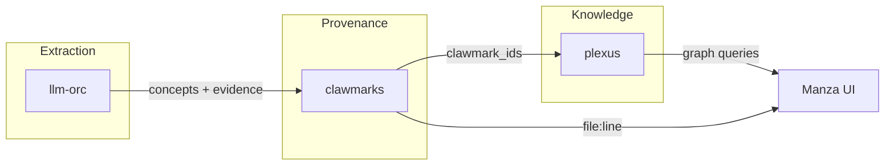

| System | Responsibility |
|--------|----------------|
| **llm-orc** | Orchestrates LLM ensembles, handles chunking and fan-out for large documents |
| **clawmarks** | Records WHERE each concept came from (file, line, evidence text) |
| **plexus** | Stores WHAT concepts exist, HOW they relate, enables graph traversal |

---

## Relationship to the Corpus

The semantic layer doesn't operate in isolation - it builds upon and enriches the existing Plexus graph. Understanding this relationship is key to the design.

### The Plexus Graph Before Semantic Analysis

When a corpus is loaded into Plexus, structural analysis creates the initial graph:

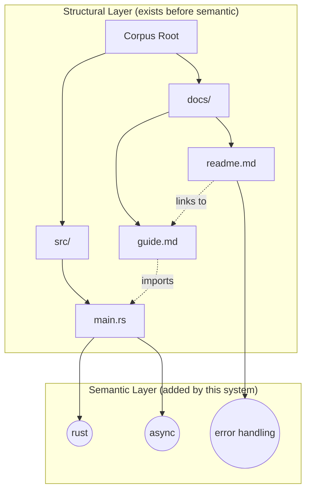

The structural layer provides:
- **File nodes** with paths, sizes, modification times
- **Directory nodes** forming the tree hierarchy
- **Link edges** from parsed references (markdown links, imports, etc.)
- **Hierarchy edges** (parent/child relationships)

### How Structure Informs Semantic Extraction

The existing graph structure influences extraction strategy:

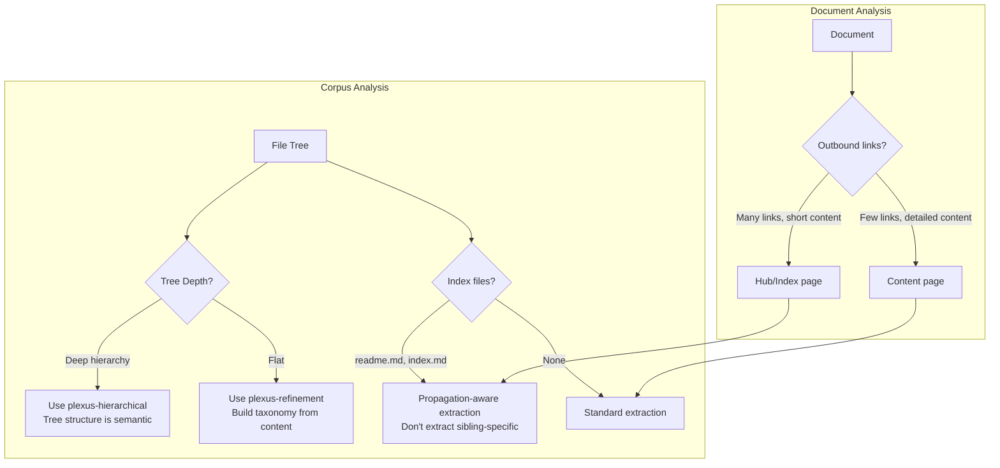

### The Semantic Dimension

Semantic analysis adds a new dimension to the graph:

| Dimension | Nodes | Edges | Source |
|-----------|-------|-------|--------|
| **Structural** | Files, Directories | parent_of, links_to | File system + parsing |
| **Semantic** | Concepts, Themes | has_concept, related_to | LLM extraction |
| **Cross-dimensional** | - | file has_concept concept | Extraction results |

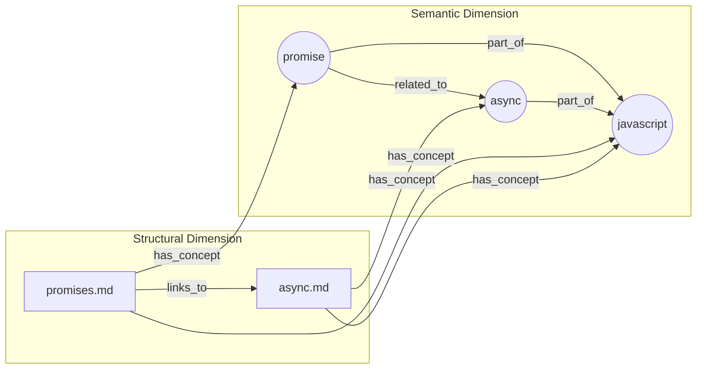

### Propagation Uses Graph Structure

Concept propagation follows existing graph edges:

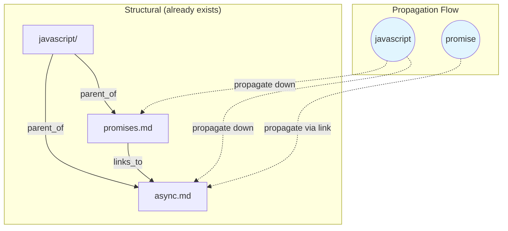

---

## Computational Goals

Semantic extraction is computationally expensive. These are our targets and constraints:

### Latency Targets

> ⚠️ **SPECULATIVE** — These targets are not validated. Experiment S1 needed.

| Operation | Target | Constraint |
|-----------|--------|------------|
| Single document (< 3000 words) | < 5s | User is waiting |
| Single document (> 3000 words) | < 30s | Background acceptable |
| Corpus initial scan (100 docs) | < 10 min | One-time cost |
| Incremental update (1 doc) | < 5s | On file save |

### Resource Constraints

> ⚠️ **SPECULATIVE** — Concurrency limit not validated. Experiment S2 needed.

| Resource | Limit | Rationale |
|----------|-------|-----------|
| Concurrent LLM calls | 5 | Ollama throughput, memory |
| Memory per extraction | < 100MB | Desktop app constraint |
| Background CPU | < 50% | Don't degrade editing |

### Cost Model

```
Extraction cost ≈ (word_count / 1000) × llm_latency_per_1k

For Ollama llama3 locally:
- ~2s per 1000 words (direct extraction)
- ~8s per 1000 words (compositional with 4 agents)

For a 10,000 word document:
- Direct: Not possible (context overflow)
- Compositional: ~80s total, but parallelized to ~30s
```

---

## Progressive Analysis Strategy

To avoid degrading user experience, semantic analysis runs progressively in the background.

### Analysis Phases

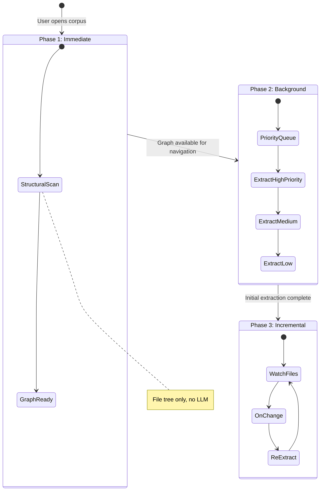

### Phase 1: Immediate (< 2 seconds)

What happens when user opens a corpus:

1. **Scan file tree** - Build structural graph (files, directories, hierarchy)
2. **Parse links** - Extract markdown links, imports (no LLM)
3. **Display graph** - User can navigate immediately
4. **Queue extraction** - Background jobs scheduled

**User sees**: Full file tree, navigable graph, "Analyzing..." indicator

### Phase 2: Background Extraction

Extraction runs in background with prioritization:

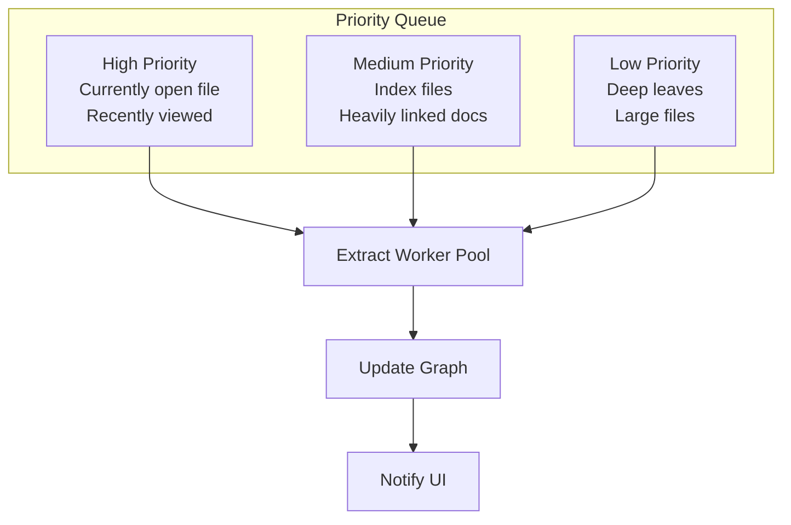

#### Priority Rules

| Priority | Criteria | Rationale |
|----------|----------|-----------|
| **High** | Currently open file | User is looking at it |
| **High** | Files viewed in last 5 min | Likely to revisit |
| **Medium** | Index/readme files | Hub pages inform structure |
| **Medium** | Files with > 5 inbound links | Important documents |
| **Low** | Files > 10000 words | Expensive, do later |
| **Low** | Deep in hierarchy (depth > 4) | Less frequently accessed |

#### Worker Pool

```rust
struct ExtractionWorkerPool {
    max_concurrent: usize,  // 5
    queue: PriorityQueue<ExtractionJob>,
    semaphore: Semaphore,
}

impl ExtractionWorkerPool {
    async fn run(&self) {
        loop {
            let job = self.queue.pop().await;
            let permit = self.semaphore.acquire().await;

            tokio::spawn(async move {
                let result = extract(job.file).await;
                update_graph(result).await;
                notify_ui(job.file_id).await;
                drop(permit);
            });
        }
    }
}
```

### Phase 3: Incremental Updates

After initial extraction, maintain freshness:

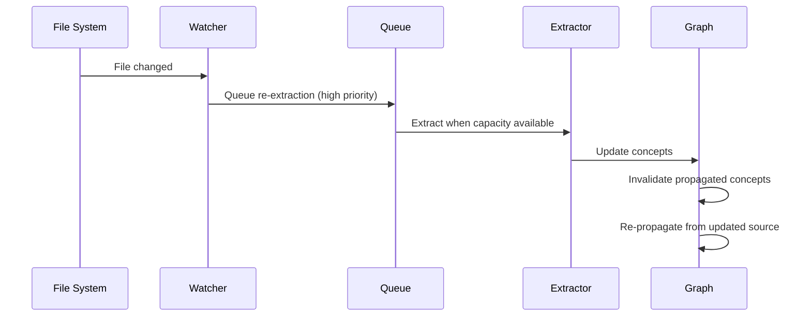

#### Invalidation Strategy

> ⚠️ **SPECULATIVE** — Invalidation not validated. All experiments were batch processing.

When a file changes:
1. **Remove** concepts where `source_file == changed_file`
2. **Keep** propagated concepts from other sources
3. **Re-extract** the changed file
4. **Re-propagate** from the new extraction

---

## User Experience During Analysis

### Visual Indicators

```
┌─────────────────────────────────────────────────────────────┐
│  Plexus Graph                              Analyzing: 23/100 │
│  ═══════════════════════════════════════════════════════════│
│                                                              │
│     ┌──────┐       ┌──────┐       ┌──────┐                  │
│     │docs/ │───────│src/  │───────│tests/│                  │
│     └──────┘       └──────┘       └──────┘                  │
│        │              │              │                       │
│     ┌──────┐       ┌──────┐       ┌──────┐                  │
│     │guide │       │main  │       │test  │                  │
│     │ .md  │       │ .rs  │       │ .rs  │                  │
│     └──────┘       └──────┘       └──────┘                  │
│        │              ◐              ○                       │
│     ┌──────┐                                                │
│     │async │  ◐ = extracting    ● = concepts ready          │
│     └──────┘  ○ = queued                                    │
│                                                              │
└─────────────────────────────────────────────────────────────┘
```

### Progressive Enhancement

| State | Graph Shows | User Can Do |
|-------|-------------|-------------|
| **Immediate** | Files, directories, links | Navigate, open files |
| **Extracting** | Above + partial concepts | See concepts as they appear |
| **Complete** | Full semantic graph | Full concept search, propagation |

### Interaction Prioritization

User actions boost extraction priority:

| Action | Effect |
|--------|--------|
| Open file | Extract immediately (skip queue) |
| Hover on node | Boost to high priority |
| Search for concept | Extract files matching query first |
| Expand directory | Boost children to medium priority |

---

## Strategies for Efficient LLM Usage

### 1. Caching

> ⚠️ **SPECULATIVE** — Caching strategy not validated. No experiments on hit rates or invalidation.

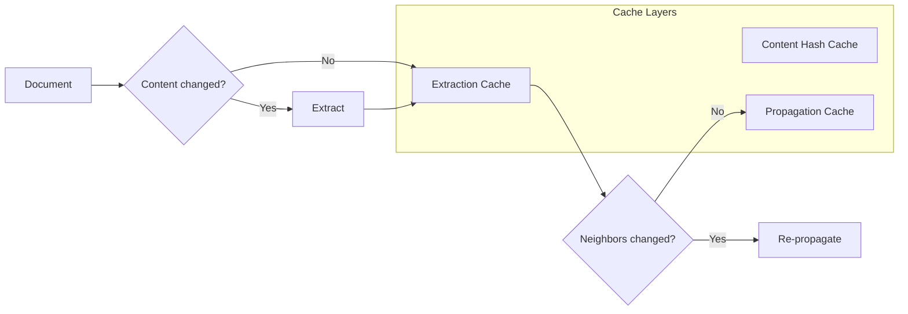

| Cache | Key | Value | Invalidation |
|-------|-----|-------|--------------|
| Content Hash | file_path | sha256(content) | On file change |
| Extraction | content_hash | ExtractionResult | Never (content-addressed) |
| Propagation | (node_id, concept) | propagated confidence | On source re-extraction |

### 2. Batching

> ⚠️ **SPECULATIVE** — Batching benefit not validated. Claims "1×5s vs 10×2s" with no evidence.

Group small files for single LLM call:

```rust
// Instead of 10 calls for 10 small files:
for file in small_files {
    extract(file).await;  // 10 × 2s = 20s
}

// Batch into one call:
let batch_content = small_files
    .iter()
    .map(|f| format!("=== {} ===\n{}", f.name, f.content))
    .collect::<Vec<_>>()
    .join("\n\n");
extract_batch(batch_content).await;  // 1 × 5s = 5s
```

### 3. Speculative Extraction

Pre-extract likely-to-be-viewed files:

```rust
fn on_file_open(file_id: FileId) {
    // Extract the opened file immediately
    queue_high_priority(file_id);

    // Speculatively extract neighbors
    for neighbor in graph.neighbors(file_id) {
        if !is_extracted(neighbor) {
            queue_medium_priority(neighbor);
        }
    }
}
```

### 4. Graceful Degradation

When resources are constrained:

| Condition | Response |
|-----------|----------|
| LLM overloaded | Increase batch sizes, reduce parallelism |
| Memory pressure | Pause background extraction |
| User actively editing | Pause extraction, resume on idle |
| Battery low (laptop) | Reduce to essential extractions only |

---

## Corpus Ingestion

The semantic layer must handle corpora in various forms:

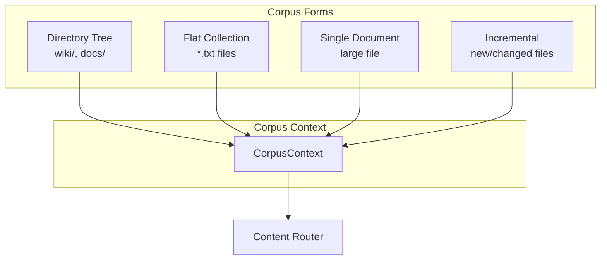

### CorpusContext

The entry point for semantic analysis. Represents what we know about the corpus before extraction.

```rust
pub struct CorpusContext {
    /// Root path(s) of the corpus
    pub roots: Vec<PathBuf>,

    /// Known structure (if any)
    pub structure: CorpusStructure,

    /// Content type hint (if known)
    pub content_hint: Option<ContentType>,

    /// Existing taxonomy (for incremental refinement)
    pub taxonomy: Option<Taxonomy>,

    /// Files to process
    pub files: Vec<FileInfo>,
}

pub enum CorpusStructure {
    /// Hierarchical directory tree (wikis, documentation)
    Tree { depth: usize, index_files: Vec<PathBuf> },

    /// Flat collection of files (plays, articles)
    Flat,

    /// Single large document
    SingleDocument,

    /// Unknown - will be detected
    Unknown,
}
```

---

## Content Routing

The router determines extraction strategy based on content characteristics:

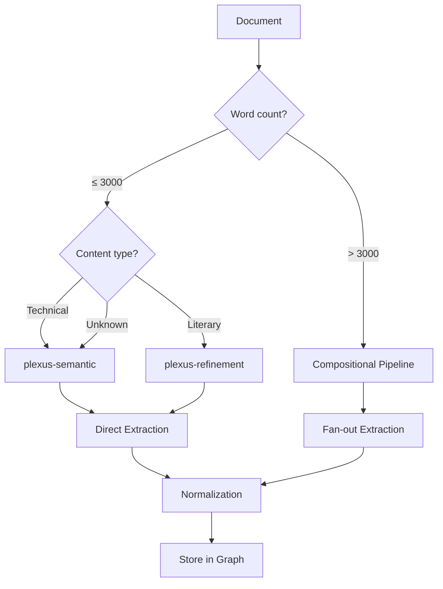

### Ensemble Selection

| Content Type | Size | Ensemble | Rationale |
|--------------|------|----------|-----------|
| Technical | < 3000 words | `plexus-semantic` | Fast, 100% grounding |
| Technical | ≥ 3000 words | `plexus-compositional` | Fan-out handles scale |
| Literary | < 3000 words | `plexus-refinement` | Better categorization |
| Literary | ≥ 3000 words | `plexus-compositional` | Scene-level chunking |
| Flat corpus | any | `plexus-refinement` | Iterative taxonomy building |

### Content Type Detection

> ⚠️ **SPECULATIVE** — Detection heuristic not validated. Experiments used manual classification.

```rust
fn detect_content_type(content: &str) -> ContentType {
    let literary_signals = ["act ", "scene ", "enter ", "exit ", "chapter "];
    let technical_signals = ["```", "function", "class ", "import ", "##"];

    let literary_score = literary_signals.iter()
        .filter(|s| content.to_lowercase().contains(*s))
        .count();

    let technical_score = technical_signals.iter()
        .filter(|s| content.to_lowercase().contains(*s))
        .count();

    match (literary_score, technical_score) {
        (l, _) if l >= 2 => ContentType::Literary,
        (_, t) if t >= 2 => ContentType::Technical,
        _ => ContentType::Unknown,
    }
}
```

---

## Extraction Pipelines

### Direct Extraction

For short documents (< 3000 words), single-pass extraction:

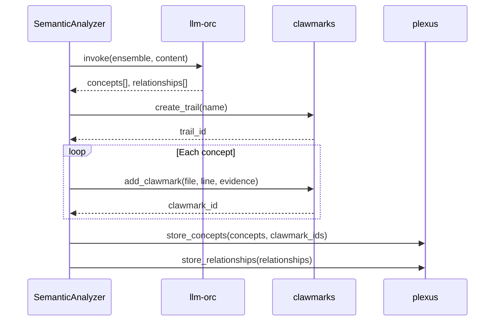

### Compositional Extraction (Fan-out)

For large documents, chunking with parallel extraction:

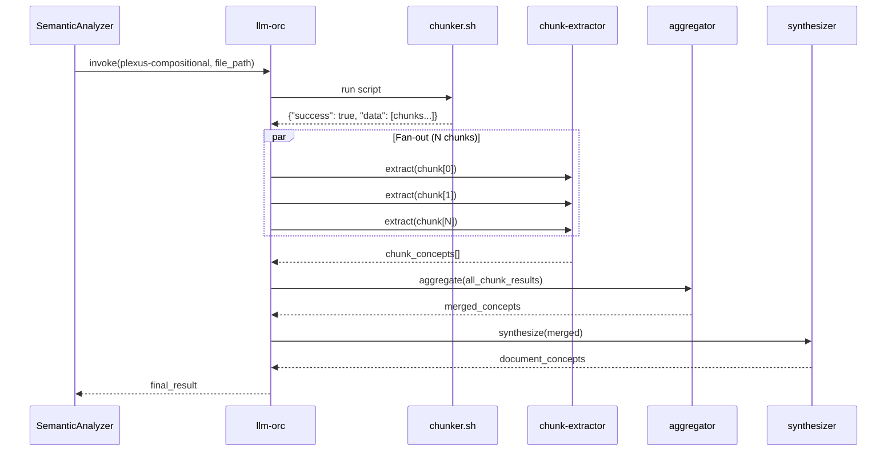

### Chunking Strategy

Fixed line-count with overlap (no format detection):

| Parameter | Value | Rationale |
|-----------|-------|-----------|
| Chunk size | 150 lines | ~2000 words, fits LLM context |
| Overlap | 20 lines | Handles boundary concepts |
| Format detection | None | LLMs handle partial sentences; aggregator reconciles |

Each chunk includes provenance:
```json
{
  "chunk_id": "lines_1-150",
  "file": "/path/to/file.txt",
  "start_line": 1,
  "end_line": 150,
  "content": "..."
}
```

---

## Three-System Integration

### Data Flow

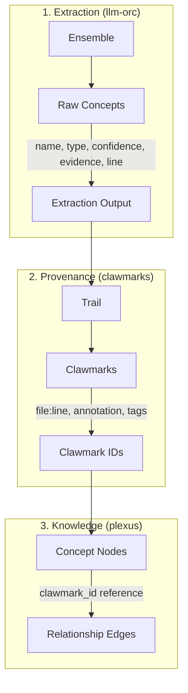

### Concept Lifecycle

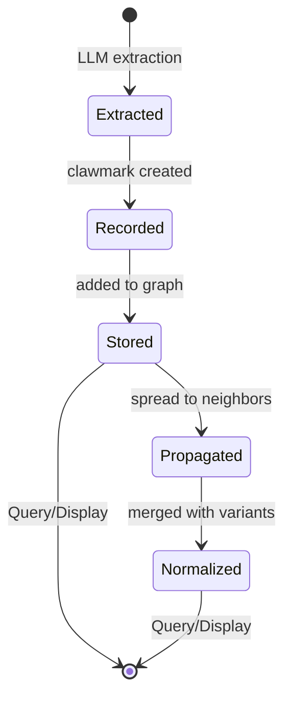

---

## Data Model

### Concept

```rust
pub struct Concept {
    /// Canonical name (lowercase, singular)
    pub name: String,

    /// Classification
    pub concept_type: ConceptType,

    /// Extraction confidence (0.0 - 1.0)
    pub confidence: f64,

    /// Evidence text from source
    pub evidence: Option<String>,

    /// Source location
    pub source_file: String,
    pub source_line: Option<usize>,

    /// Provenance link
    pub clawmark_id: Option<String>,

    /// Extraction session
    pub trail_id: Option<String>,
}

pub enum ConceptType {
    Topic,       // Broad subject areas (git, docker)
    Technology,  // Tools, languages (rust, javascript)
    Entity,      // Named things (Hamlet, Macbeth)
    Action,      // Operations (install, configure)
    Theme,       // Abstract ideas (revenge, ambition)
    Pattern,     // Techniques (async/await, dependency injection)
}
```

### Clawmark (via MCP)

```json
{
  "id": "clwk_abc123",
  "trail_id": "trail_xyz",
  "file": "hamlet.txt",
  "line": 892,
  "annotation": "revenge: 'May sweep to my revenge'",
  "type": "reference",
  "tags": ["#theme", "#central"]
}
```

### Plexus Node

```rust
Node {
    id: "concept:revenge",
    node_type: "concept",
    dimension: "semantic",
    properties: {
        "name": "revenge",
        "concept_type": "theme",
        "confidence": 0.9,
        "clawmark_id": "clwk_abc123",
        "trail_id": "trail_xyz",
    }
}
```

---

## Propagation

Concepts spread across linked documents with decay:

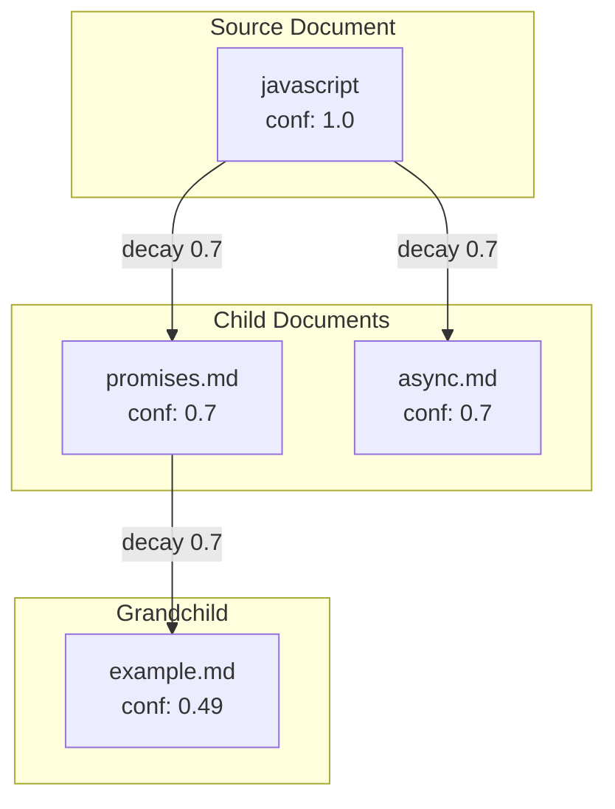

### Propagation Rules

| Rule | Direction | Example |
|------|-----------|---------|
| Broad topics propagate DOWN | parent → child | "javascript" → all JS docs |
| Technologies propagate DOWN | parent → child | "docker" → container docs |
| Implementation details DON'T propagate UP | child ✗ parent | "loadImage" stays local |
| Entity-specific concepts stay local | neither | "Hamlet" doesn't spread to "Macbeth" |

### Decay Factor

> ✅ **PARTIALLY VALIDATED** — P1 (Run 016) with real LLM extraction achieved 29.2% appropriate
> (up from 12.2% with mock). Best params: decay=0.8, threshold=0.3. Still below 67% target
> due to corpus structure (diverse unrelated siblings), not parameter choices.
> See EXPERIMENT-LOG.md Run 016 for full analysis.

- Default: **0.7** per hop (validated range: 0.7-0.8)
- After 3 hops: 0.7³ = 0.34 confidence
- Threshold for storage: **0.4** (validated range: 0.3-0.5; lower is better for diverse corpora)
- Key insight: Parameters matter less than corpus structure; real extraction 2.4× better than mock

---

## Normalization

Simple transforms only (semantic dedup too error-prone per experiments):

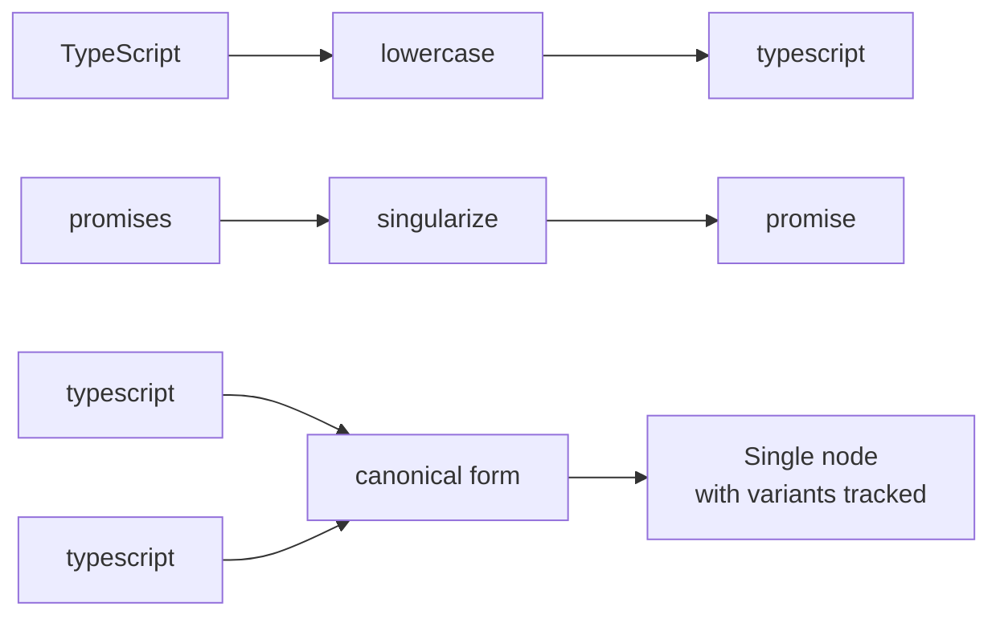

### What We Do

- ✅ Lowercase all concept names — **validated** (Experiment C)
- ⚠️ Singularize (promises → promise) — **SPECULATIVE** (Experiment P3 needed)
- ✅ Track variants in clawmarks (evidence shows original form)

### What We Don't Do

- ❌ LLM-based semantic deduplication (too error-prone)
- ❌ Similarity-based merging (false positives)
- ❌ Synonym detection (context-dependent)

---

## Ensemble Architecture

### Available Ensembles

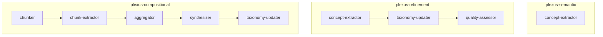

| Ensemble | Agents | Use Case |
|----------|--------|----------|
| `plexus-semantic` | 1 | Short technical docs |
| `plexus-refinement` | 3 | Literary content, taxonomy building |
| `plexus-compositional` | 5 | Large documents (fan-out) |

### Fan-Out Pattern

```yaml
agents:
  - name: chunker
    type: script
    script: scripts/plexus/chunker.sh
    args: ["150", "20"]  # lines, overlap

  - name: chunk-extractor
    depends_on: [chunker]
    fan_out: true  # Spawns N instances for N chunks

  - name: aggregator
    depends_on: [chunk-extractor]  # Receives all chunk results

  - name: synthesizer
    depends_on: [aggregator]
```

---

## UI Integration

### Concept Tooltip

When user hovers on a concept node:

```
┌────────────────────────────────────────────┐
│  revenge                           #theme  │
│  ──────────────────────────────────────── │
│  Confidence: 0.9                           │
│                                            │
│  "May sweep to my revenge"                 │
│                        — hamlet.txt:892    │
│                                            │
│  [Go to Source]  [View Trail]              │
└────────────────────────────────────────────┘
```

### Go to Source Flow

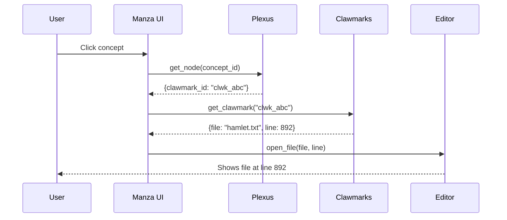

---

## Quality Metrics

| Metric | Target | Measurement |
|--------|--------|-------------|
| Grounding rate | > 90% | % concepts with valid clawmark |
| Concept count | 3-15 per doc | Average across corpus |
| Confidence mean | > 0.6 | Average confidence |
| Propagation reach | 2-3 hops | Average before threshold |
| Extraction latency | < 30s | Per document (direct) |

### Thresholds

| Metric | Warning | Error |
|--------|---------|-------|
| Grounding rate | < 80% | < 50% |
| Concept count | > 15 | > 25 |
| Confidence mean | < 0.6 | < 0.4 |

---

## Error Handling

| Scenario | Behavior |
|----------|----------|
| llm-orc unavailable | Fail extraction, queue for retry |
| clawmarks unavailable | Extract without provenance, log warning |
| Partial fan-out failure | Aggregate successful chunks, note gaps |
| Invalid LLM response | Parse what's possible, skip malformed |
| Empty document | Return empty result, no error |
| Binary file | Skip with warning |

---

## Configuration

```yaml
semantic:
  enabled: true

  # Routing
  compositional_threshold: 3000  # words

  # Extraction
  llm_orc_url: "http://localhost:8080"
  default_ensemble: "plexus-semantic"

  # Provenance
  clawmarks_enabled: true
  clawmarks_server: "clawmarks"

  # Propagation
  propagation_enabled: true
  decay_factor: 0.7
  max_hops: 3
  min_confidence: 0.5

  # Normalization
  lowercase: true
  singularize: true
```
