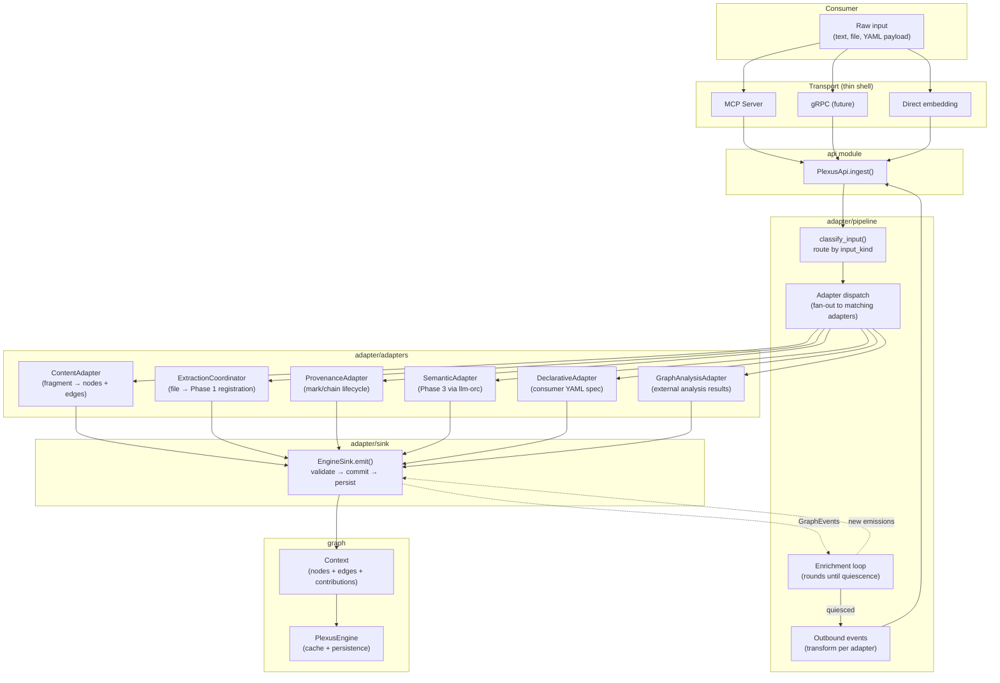
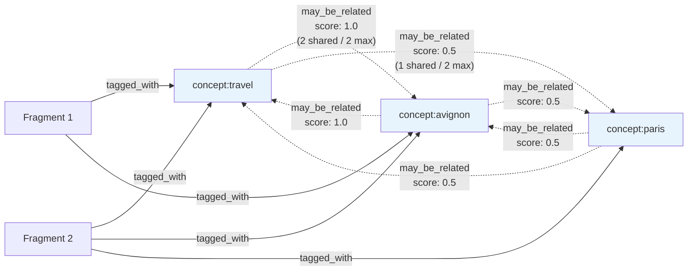
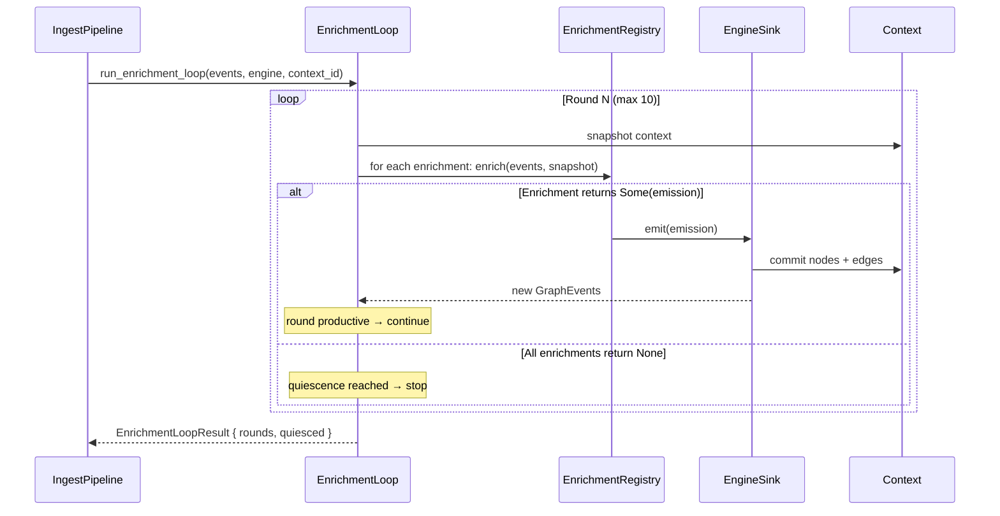
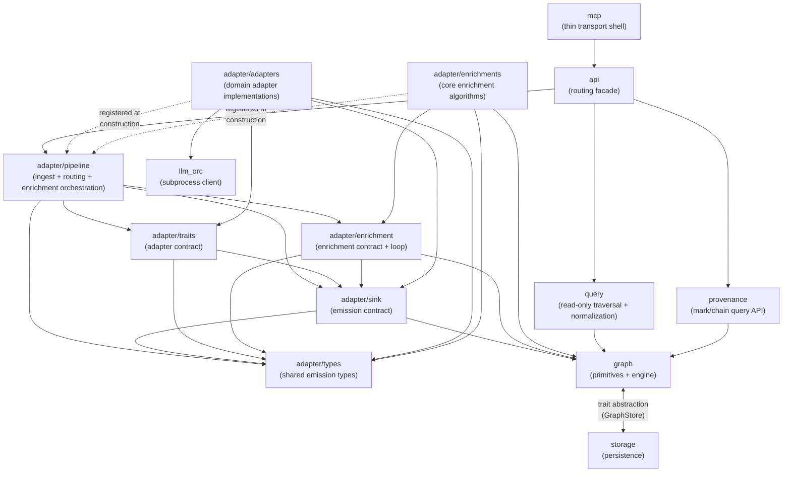

# System Design: Plexus

**Version:** 1.0
**Status:** Current (Retrofit)
**Last amended:** 2026-03-16

## Architectural Drivers

| Driver | Type | Provenance |
|--------|------|------------|
| All writes go through `ingest()` | Constraint | Invariant 34; ADR-012 |
| Transports are thin shells | Constraint | Invariant 38; ADR-014 |
| Adapters, enrichments, transports are independent extension axes | Quality Attribute (Modifiability) | Invariant 40; Essay 09 |
| Enrichment loop terminates via idempotency | Constraint | Invariant 36; ADR-010 |
| Per-adapter contribution tracking with scale normalization | Constraint | Invariants 8–12; ADR-003 |
| All knowledge carries semantic content + provenance | Constraint | Invariant 7; ADR-001 |
| Persist-per-emission | Constraint | Invariant 30 |
| Rust, single-process, in-memory DashMap cache | Constraint | ADR-006; Essay 08 |
| Embedding support behind feature flag | Constraint | ADR-026 |
| External enrichment via llm-orc subprocess | Integration | ADR-024; Essay 25 |
| Extraction phases: Rust-native (fast) then llm-orc (deep) | Constraint | ADR-022; Invariants 45–47 |
| Declarative adapters: consumer-owned YAML specs via llm-orc | Extension point | ADR-028; Essay 19 |

## Module Decomposition

### Module: graph
**Purpose:** Core graph primitives — nodes, edges, contexts, events, dimensions, and the engine that manages them.
**Provenance:** Invariants 1–4 (emission rules), 8–12 (weight rules), 30 (persist-per-emission); ADR-003, ADR-006
**Owns:** Node, Edge, Context, ContextId, ContextMetadata, PlexusEngine, GraphEvent, ContentType, Dimension, Source, PropertyValue, NodeId, EdgeId
**Depends on:** storage (for persistence)
**Depended on by:** adapter/sink, adapter/pipeline, query, provenance, api

### Module: adapter/sink
**Purpose:** The emission contract — how adapters push mutations into the engine.
**Provenance:** Invariant 1–4 (emission validation), Invariant 30 (persist-per-emission); ADR-001
**Owns:** AdapterSink (trait), EngineSink, EmitResult, Rejection, RejectionReason, AdapterError, FrameworkContext, ProvenanceEntry
**Depends on:** graph
**Depended on by:** adapter/adapters, adapter/pipeline

### Module: adapter/enrichment
**Purpose:** The enrichment contract and loop — reactive graph intelligence after each emission.
**Provenance:** Invariants 35–36, 39, 50 (enrichment rules); ADR-010
**Owns:** Enrichment (trait), EnrichmentRegistry, run_enrichment_loop, EnrichmentLoopResult, quiescence
**Depends on:** graph, adapter/sink (for EngineSink in the loop)
**Depended on by:** adapter/pipeline, adapter/enrichments (implementations)

### Module: adapter/types
**Purpose:** Shared emission types used by all adapters and enrichments.
**Provenance:** ADR-001 (emission structure)
**Owns:** Emission, AnnotatedNode, AnnotatedEdge, Annotation, Removal, EdgeRemoval, PropertyUpdate, OutboundEvent, CancellationToken, helper constructors (concept_node, file_node, mark_node, chain_node)
**Depends on:** graph
**Depended on by:** adapter/sink, adapter/enrichment, adapter/adapters, adapter/enrichments, adapter/pipeline

### Module: adapter/traits
**Purpose:** The adapter integration contract — the trait that domain adapters implement.
**Provenance:** Invariants 14–16 (adapter rules); ADR-011
**Owns:** Adapter (trait), AdapterInput
**Depends on:** graph, adapter/sink, adapter/types
**Depended on by:** adapter/adapters, adapter/pipeline

### Module: adapter/pipeline
**Purpose:** The unified ingest pipeline — routing, adapter dispatch, enrichment loop orchestration, and outbound event transformation.
**Provenance:** Invariant 34 (single write path), Invariant 17 (fan-out routing); ADR-012, ADR-028
**Owns:** IngestPipeline, classify_input, ClassifyError, input routing logic
**Depends on:** graph, adapter/sink, adapter/enrichment, adapter/traits, adapter/types
**Depended on by:** api

### Module: adapter/adapters
**Purpose:** Domain adapter implementations — each transforms a specific input kind into graph mutations.
**Provenance:** Invariants 5, 7 (provenance rules), 19–22 (fragment rules), 45–48 (extraction rules); ADR-001, ADR-022, ADR-028
**Owns:** ContentAdapter (fragment), ExtractionCoordinator (file extraction), SemanticAdapter (Phase 3 LLM), DeclarativeAdapter (YAML spec), GraphAnalysisAdapter (external enrichment), ProvenanceAdapter (mark/chain lifecycle)
**Depends on:** graph, adapter/sink, adapter/traits, adapter/types, llm_orc (SemanticAdapter, DeclarativeAdapter)
**Depended on by:** (registered into adapter/pipeline at construction time)

#### Adapter taxonomy: Rust-native vs llm-orc-backed

Adapters fall into three categories based on their execution model. This distinction matters because it determines latency characteristics, failure modes, and who owns the processing logic.

**Rust-native adapters** — fast, synchronous, no external dependencies:
- `ContentAdapter` — fragment text + tags → graph structure. The default write path.
- `ExtractionCoordinator` — Phase 1 registration (file node, metadata, YAML frontmatter). Synchronous within `ingest()`. Spawns background phases.
- `ProvenanceAdapter` — mark/chain/link lifecycle operations.
- `GraphAnalysisAdapter` — applies pre-computed analysis results (from `plexus analyze`).

**Internal llm-orc adapters** — Plexus-owned ensembles for deeper extraction:
- `SemanticAdapter` — Phase 3 semantic extraction. Invokes the `extract-semantic` ensemble (Plexus-defined, lives in `.llm-orc/ensembles/`). Parses multi-agent results (SpaCy NER, themes, concepts/relationships). Plexus owns the ensemble definition and the result parsing logic. Spawned as background work by ExtractionCoordinator.

**External declarative adapters** — consumer-owned YAML specs interpreted at runtime:
- `DeclarativeAdapter` — interprets `adapter-specs/*.yaml` files. The consumer defines both the extractor logic (llm-orc ensemble or script) and the graph mapping (adapter spec primitives). Plexus provides the interpreter; the consumer provides the spec. This is the extension point for domain-specific extraction without writing Rust.

The key architectural insight: when DeclarativeAdapter was introduced (ADR-028), it created a general mechanism that also simplified internal extraction. SemanticAdapter predates it and uses a bespoke Rust parsing path. A future convergence could express SemanticAdapter as a declarative spec, but this is deferred — the bespoke parser handles multi-agent result merging that the current spec primitives don't cover.

### Module: adapter/enrichments
**Purpose:** Core enrichment implementations — reactive graph intelligence algorithms.
**Provenance:** Invariants 27, 39, 50 (enrichment behavior); ADR-010, ADR-024, ADR-026
**Owns:** CoOccurrenceEnrichment, DiscoveryGapEnrichment, TemporalProximityEnrichment, EmbeddingSimilarityEnrichment (+ Embedder trait, VectorStore, FastEmbedEmbedder)
**Removed:** TagConceptBridger — tag bridging is domain-specific; domains needing it declare `tag_concept_bridger` in their adapter spec's `enrichments:` section.
**Depends on:** graph, adapter/enrichment (trait), adapter/types
**Depended on by:** (registered into adapter/pipeline at construction time)

### Module: query
**Purpose:** Read-only graph traversal, search, normalization, and evidence trail computation.
**Provenance:** Invariant 37 (outbound events flow through adapter); ADR-003 (normalized weight)
**Owns:** FindQuery, TraverseQuery, PathQuery, StepQuery, NormalizationStrategy, OutgoingDivisive, Softmax, evidence_trail, shared_concepts, QueryResult, TraversalResult, PathResult, EvidenceTrailResult, Direction
**Depends on:** graph
**Depended on by:** api

### Module: storage
**Purpose:** Persistence abstraction and implementations.
**Provenance:** Invariant 41 (library rule — store takes a path); ADR-006, Essay 17
**Owns:** GraphStore (trait), OpenStore (trait), SqliteStore, SqliteVecStore, StorageError, StorageResult
**Depends on:** graph (for Context type)
**Depended on by:** graph (PlexusEngine holds optional Arc\<dyn GraphStore\>)

### Module: provenance
**Purpose:** Read-only provenance query API — marks, chains, links.
**Provenance:** Invariants 24–29 (runtime architecture rules); ADR-013
**Owns:** ProvenanceApi, ChainView, MarkView, ChainStatus
**Depends on:** graph
**Depended on by:** api

### Module: api
**Purpose:** Transport-independent routing facade — single entry point for all consumer-facing operations.
**Provenance:** Invariant 34 (all writes via ingest), Invariant 38 (thin transports); ADR-014
**Owns:** PlexusApi
**Depends on:** graph, adapter/pipeline, provenance, query
**Depended on by:** mcp

### Module: mcp
**Purpose:** MCP transport — thin shell that forwards requests to PlexusApi.
**Provenance:** Invariant 38 (transports are thin shells); ADR-028
**Owns:** PlexusMcpServer, MCP tool handlers, MCP params
**Depends on:** api, adapter/pipeline (for pipeline construction — **this is a divergence being addressed**)
**Depended on by:** (binary entry point)

### Module: llm_orc
**Purpose:** Client for the llm-orc subprocess — invokes external LLM ensembles.
**Provenance:** ADR-024; Essay 25
**Owns:** LlmOrcClient (trait), SubprocessClient
**Depends on:** (external process)
**Depended on by:** adapter/adapters (SemanticAdapter, DeclarativeAdapter)

## Pipeline Flow

The ingest pipeline is the central write path. All mutations enter through `IngestPipeline::ingest()` (Invariant 34).



### Enrichment Architecture (ADR-024)

Two categories of enrichment, distinguished by where and when they run:

```mermaid
flowchart LR
    subgraph CoreEnrich["Core Enrichments (inside loop)"]
        direction TB
        cooccur["CoOccurrenceEnrichment<br>shared-source pair detection"]
        discovery["DiscoveryGapEnrichment<br>latent structural absence"]
        temporal["TemporalProximityEnrichment<br>timestamp proximity"]
        embedding["EmbeddingSimilarityEnrichment<br>cosine similarity via embeddings"]
    end
    %% TagConceptBridger removed — tag bridging is domain-specific;
    %% consumers declare it via adapter spec enrichments: section.

    subgraph ExternalEnrich["External Enrichments (outside loop)"]
        direction TB
        llmorc["llm-orc ensemble<br>(e.g., PageRank, community detection)"]
        graphadapter["GraphAnalysisAdapter<br>applies results via ingest()"]
    end

    emission["Adapter emission"] -->|"GraphEvents"| CoreEnrich
    CoreEnrich -->|"new emissions<br>(if any)"| CoreEnrich
    CoreEnrich -->|"quiesced"| done["Pipeline complete"]

    analyze["plexus analyze<br>(on-demand)"] --> llmorc
    llmorc --> graphadapter
    graphadapter -->|"ingest()"| emission
```



**Core enrichments** — Rust-native, reactive, run inside the enrichment loop after every adapter emission. Fast (microseconds to low-milliseconds, except embedding at ~15–100ms). Parameterizable. Domain-agnostic algorithms that operate on graph structure, not content. Registered globally or via adapter spec `enrichments:` declaration.

**External enrichments** — llm-orc ensembles that run outside the loop. Results re-enter via `ingest()`, which triggers core enrichments on the new data. Currently on-demand only (`plexus analyze`). Background/emission-triggered mode is designed but deferred (ADR-024).

### Core Enrichment Algorithms

Each implements the `Enrichment` trait: receives `GraphEvents` + a `Context` snapshot, returns `Option<Emission>`. Idempotent — returns `None` when no new edges are needed, allowing the loop to reach quiescence.

#### CoOccurrenceEnrichment
**Pattern:** Shared-source pair detection.
**Algorithm:** Build reverse index (source → targets via `source_relationship`). For each pair of targets sharing at least one source, count shared sources. Score = `shared_count / max_count`. Emit symmetric edge pairs with `output_relationship`.
**Default config:** `tagged_with` → `may_be_related`
**Parameterized:** Any source/output relationship pair (e.g., `exhibits` → `co_exhibited`)
**Fires on:** `NodesAdded`, `EdgesAdded`



#### DiscoveryGapEnrichment
**Pattern:** Latent structural absence detection.
**Algorithm:** When two nodes are connected by `trigger_relationship` but have NO other edges between them, emit symmetric `output_relationship` edges. Detects "these are related but nothing else connects them" — a negative structural query that co-occurrence cannot express.
**Config:** Requires `trigger_relationship` and `output_relationship` at construction
**Fires on:** `EdgesAdded`

#### TemporalProximityEnrichment
**Pattern:** Timestamp proximity.
**Algorithm:** When nodes have a configured timestamp property and their timestamps are within `threshold_ms` of each other, emit symmetric `output_relationship` edges. Binary — weight is 1.0 (within threshold) or absent.
**Config:** Requires `timestamp_property`, `threshold_ms`, `output_relationship`
**Fires on:** `NodesAdded`

#### EmbeddingSimilarityEnrichment
**Pattern:** Embedding-based semantic similarity.
**Algorithm:** Batch-embed new node labels via `Embedder` trait. Query `VectorStore` for existing vectors above `similarity_threshold`. Emit symmetric `output_relationship` edges for similar pairs. Slowest core enrichment (~15–100ms per batch) but justified by real-time reactive requirements.
**Config:** Requires `model_name`, `similarity_threshold`, `output_relationship`, and a boxed `Embedder` implementation
**Backends:** `FastEmbedEmbedder` (production, behind `embeddings` feature flag), `InMemoryVectorStore` (test/fallback)
**Fires on:** `NodesAdded`

### Enrichment Loop Mechanics



All enrichments in a round see the **same context snapshot** — they don't see each other's emissions within the same round. New emissions from round N become the events for round N+1. This prevents ordering dependencies between enrichments within a round.

### Declarative Enrichment Configuration

Consumers can declare which core enrichments to activate via their adapter spec's `enrichments:` section (ADR-025). This instantiates parameterized core enrichments without writing Rust:

```yaml
# Example adapter spec (consumer-owned)
adapter_id: my-domain-adapter
input_kind: my_domain.input
enrichments:
  - type: co_occurrence
    source_relationship: exhibits
    output_relationship: co_exhibited
  - type: discovery_gap
    trigger_relationship: co_exhibited
    output_relationship: gap_detected
emit:
  - create_node:
      id: "concept:{input.tag}"
      type: concept
      dimension: semantic
```

Declared enrichments are **global** — they fire after any adapter emission, not just the declaring adapter's (Invariant 35). The registry deduplicates by `id()` across multiple specs.

Available enrichment types for declaration: `co_occurrence`, `discovery_gap`, `temporal_proximity`, `embedding_similarity`. *(`tag_concept_bridger` was removed from the built-in set — tag bridging is domain-specific. Domains that need it can still declare it via this mechanism if a custom implementation is registered.)*

## Responsibility Matrix

| Domain Concept/Action | Owning Module | Provenance |
|----------------------|---------------|------------|
| Node, NodeId | graph | ADR-006 |
| Edge, EdgeId, contributions, raw_weight | graph | ADR-003, ADR-006 |
| Context, ContextId, ContextMetadata | graph | ADR-006 |
| PlexusEngine (cache, persistence delegation) | graph | ADR-006, Essay 08 |
| GraphEvent (5 event types) | graph | ADR-001 |
| ContentType, Dimension | graph | ADR-001 |
| Source | graph | Essay 17 |
| PropertyValue | graph | ADR-006 |
| Scale normalization (recompute_raw_weights) | graph | ADR-003 |
| AdapterSink (trait) | adapter/sink | ADR-001 |
| EngineSink | adapter/sink | ADR-001, ADR-006 |
| EmitResult, Rejection, RejectionReason | adapter/sink | ADR-001 |
| FrameworkContext, ProvenanceEntry | adapter/sink | ADR-001 |
| AdapterError | adapter/sink | ADR-001 |
| Emission | adapter/types | ADR-001 |
| AnnotatedNode, AnnotatedEdge, Annotation | adapter/types | ADR-001 |
| Removal, EdgeRemoval, PropertyUpdate | adapter/types | ADR-012 |
| OutboundEvent | adapter/types | ADR-011 |
| CancellationToken | adapter/types | ADR-001 |
| Helper constructors (concept_node, etc.) | adapter/types | Essay 25 |
| Adapter (trait), AdapterInput | adapter/traits | ADR-011 |
| Enrichment (trait) | adapter/enrichment | ADR-010 |
| EnrichmentRegistry, max_rounds | adapter/enrichment | ADR-010 |
| run_enrichment_loop, quiescence | adapter/enrichment | ADR-010 |
| IngestPipeline | adapter/pipeline | ADR-012 |
| classify_input, input routing | adapter/pipeline | ADR-012, ADR-028 |
| ContentAdapter (fragment — Rust-native) | adapter/adapters | ADR-001, ADR-028 |
| ExtractionCoordinator (Phase 1 — Rust-native) | adapter/adapters | ADR-022 |
| ProvenanceAdapter (mark/chain — Rust-native) | adapter/adapters | ADR-013, ADR-028 |
| GraphAnalysisAdapter (analysis results — Rust-native) | adapter/adapters | ADR-024 |
| SemanticAdapter (Phase 3 — internal llm-orc) | adapter/adapters | Essay 25 |
| DeclarativeAdapter (YAML spec — external llm-orc) | adapter/adapters | ADR-028 |
| CoOccurrenceEnrichment | adapter/enrichments | ADR-010 |
| DiscoveryGapEnrichment | adapter/enrichments | ADR-024 |
| TemporalProximityEnrichment | adapter/enrichments | ADR-010 |
| EmbeddingSimilarityEnrichment | adapter/enrichments | ADR-026 |
| Embedder, VectorStore, FastEmbedEmbedder | adapter/enrichments | ADR-026 |
| FindQuery | query | ADR-006 |
| TraverseQuery | query | ADR-006 |
| PathQuery | query | ADR-006 |
| StepQuery, evidence_trail | query | ADR-013 |
| NormalizationStrategy, OutgoingDivisive, Softmax | query | ADR-003 |
| shared_concepts | query | Essay 17 |
| GraphStore (trait), OpenStore (trait) | storage | ADR-006, Essay 17 |
| SqliteStore | storage | ADR-006 |
| SqliteVecStore | storage | ADR-026 |
| StorageError, StorageResult | storage | ADR-006 |
| ProvenanceApi | provenance | ADR-013 |
| ChainView, MarkView, ChainStatus | provenance | ADR-013 |
| PlexusApi | api | ADR-014 |
| PlexusMcpServer | mcp | ADR-028 |
| LlmOrcClient (trait), SubprocessClient | llm_orc | ADR-024 |

## Dependency Graph



**Layering rules:**
1. **Inner → Outer prohibited:** graph never imports adapter, query, provenance, api, or mcp
2. **Sibling isolation:** adapter/adapters and adapter/enrichments never import each other
3. **Transport thin shell:** mcp imports only api (+ pipeline construction, which is the divergence to fix)
4. **Query is read-only:** query never imports adapter or storage
5. **Enrichment contract is separate from adapter contract:** adapter/enrichment does not import adapter/traits

**Known divergence (classified as Bug, will be fixed):**
- mcp constructs the IngestPipeline directly instead of receiving it pre-built. The fix is to extract pipeline construction into a builder in adapter/pipeline and call it from the binary entry point, passing the built pipeline to both api and mcp.

**Circular dependency (graph ↔ storage):**
- graph::PlexusEngine holds `Option<Arc<dyn GraphStore>>`. GraphStore's methods accept `&Context`, `&ContextId`. Both types are defined in graph.
- This is resolved via trait abstraction: storage defines the GraphStore trait; graph depends on the trait. The concrete SqliteStore in storage depends on graph types for serialization. This is a standard dependency-inversion pattern — the trait breaks the cycle.

## Integration Contracts

### api → adapter/pipeline
**Protocol:** Direct async function calls (`IngestPipeline::ingest()`, `IngestPipeline::ingest_with_adapter()`)
**Shared types:** `AdapterInput`, `AdapterError`, `OutboundEvent`, `GraphEvent`
**Error handling:** `AdapterError` propagates to PlexusApi, which maps to `PlexusError` or transport-specific errors
**Owned by:** adapter/pipeline (defines the contract)

### api → query
**Protocol:** Direct sync function calls (`PlexusEngine::find_nodes()`, `traverse()`, `find_path()`)
**Shared types:** `FindQuery`, `TraverseQuery`, `PathQuery`, `QueryResult`, `TraversalResult`, `PathResult`
**Error handling:** `PlexusError` propagates from engine query methods
**Owned by:** query (defines query types), graph (defines engine methods)

### api → provenance
**Protocol:** Direct sync function calls (ProvenanceApi constructed transiently per call)
**Shared types:** `ChainView`, `MarkView`, `ChainStatus`
**Error handling:** `PlexusError` propagates
**Owned by:** provenance (defines view types)

### adapter/pipeline → adapter/sink
**Protocol:** Pipeline creates EngineSink per adapter dispatch, passes to `Adapter::process()`
**Shared types:** `EngineSink`, `FrameworkContext`, `EmitResult`, `GraphEvent`
**Error handling:** `AdapterError` from sink operations propagates to pipeline
**Owned by:** adapter/sink (defines the emission contract)

### adapter/pipeline → adapter/enrichment
**Protocol:** Pipeline calls `run_enrichment_loop()` with accumulated events after adapter dispatch
**Shared types:** `EnrichmentLoopResult`, `GraphEvent`, `Emission`
**Error handling:** `AdapterError` propagates from enrichment loop
**Owned by:** adapter/enrichment (defines the loop contract)

### adapter/sink → graph
**Protocol:** `EngineSink` calls `PlexusEngine::with_context_mut()` for atomic commit+persist
**Shared types:** `Context`, `ContextId`, `Node`, `Edge`, `GraphEvent`
**Error handling:** `PlexusError` mapped to `AdapterError::Internal`
**Owned by:** graph (defines the mutation contract)

### graph → storage
**Protocol:** `PlexusEngine` calls `GraphStore::save_context()`, `load_context()`, etc.
**Shared types:** `Context`, `ContextId`, `StorageError`
**Error handling:** `StorageError` mapped to `PlexusError::Storage`
**Owned by:** storage (defines the persistence contract via trait)

### mcp → api
**Protocol:** MCP tool handlers call `PlexusApi` methods
**Shared types:** `PlexusApi`, all query/write types
**Error handling:** `PlexusError`/`AdapterError` mapped to MCP `ErrorData`
**Owned by:** api (defines the consumer-facing contract)

## Fitness Criteria

| Criterion | Measure | Threshold | Derived From |
|-----------|---------|-----------|-------------|
| Module responsibility limit | Glossary entries per module | No module owns > 15 concepts/actions | Decomposition balance |
| adapter/ submodule independence | Cross-imports between adapter submodules | adapter/adapters and adapter/enrichments have 0 mutual imports | Invariant 40 |
| Transport thinness | Lines of business logic in mcp/ | 0 lines — all logic delegates to api | Invariant 38 |
| Single write path | Code paths that mutate Context bypassing IngestPipeline | 0 bypass paths (except retract_contributions, which is engine-level by design) | Invariant 34 |
| Enrichment loop convergence | All enrichments reach quiescence within max_rounds | 100% in tests | Invariant 36 |
| Persist-per-emission | `save_context()` calls per `emit()` | Exactly 1 | Invariant 30 |
| No dependency cycles | Cycle count in module dependency graph | 0 | Architectural principle |
| Contribution survival | Round-trip through save→load→compare | 100% identical | Invariant 31 |

## Test Architecture

### Boundary Integration Tests

| Dependency Edge | Integration Test | What It Verifies |
|----------------|-----------------|------------------|
| adapter/pipeline → adapter/sink | `integration_tests::content_adapter_emits_*` (multiple) | Real ContentAdapter emits through real EngineSink, nodes/edges land in Context |
| adapter/pipeline → adapter/enrichment | `integration_tests::enrichment_loop_*` | Real enrichments fire after real adapter emission, bridging/co-occurrence occurs |
| adapter/sink → graph | `engine_sink::tests::*` (57 tests) | EngineSink validates and commits through real PlexusEngine with real Context |
| graph → storage | `engine::tests::test_upsert_persists_to_store`, `test_load_all_hydrates_from_store` | Real PlexusEngine with real SqliteStore — save and reload |
| api → adapter/pipeline | `api.rs` tests (via PlexusApi::ingest) | Real PlexusApi routes through real IngestPipeline with real adapters |
| mcp → api | MCP integration tests (if present) | MCP tool handlers call real PlexusApi |
| adapter/adapters → llm_orc | `semantic::tests::*` with mock LlmOrcClient | SemanticAdapter processes with mock client (real adapter, mock external) |

### Invariant Enforcement Tests

| Invariant | Enforcement Location | Test |
|-----------|---------------------|------|
| Inv 1–4 (emission rules) | adapter/sink: EngineSink::emit_inner | `engine_sink::tests::*` — endpoint validation, upsert, partial commit |
| Inv 7 (dual obligation) | adapter/adapters: each adapter's process() | `integration_tests::content_adapter_produces_provenance_*` |
| Inv 8–12 (weight rules) | graph: Context::recompute_raw_weights | `integration_tests::contribution_*`, `scale_normalization_*` |
| Inv 19 (deterministic concept ID) | adapter/types: concept_node() | `integration_tests::content_adapter_emits_concept_nodes` |
| Inv 22 (symmetric edge pairs) | adapter/enrichments: CoOccurrenceEnrichment | `cooccurrence::tests::*` |
| Inv 30 (persist-per-emission) | adapter/sink: EngineSink::emit | `engine_sink::tests::*` with store verification |
| Inv 36 (enrichment quiescence) | adapter/enrichment: run_enrichment_loop | `integration_tests::safety_valve_aborts_after_maximum_rounds` |
| Inv 50 (structure-aware enrichments) | adapter/enrichments: CoOccurrenceEnrichment | `cooccurrence::tests::quiescence_with_heterogeneous_sources` |

### Test Layers

- **Unit:** Verify logic within a single module. Mocks acceptable for cross-module dependencies (e.g., mock LlmOrcClient in SemanticAdapter tests). Located in each module's `#[cfg(test)] mod tests`.
- **Integration:** Verify real data flow across module boundaries. Real types on both sides. Located in `adapter/integration_tests.rs` (373 tests) and individual module test blocks with real PlexusEngine.
- **Acceptance:** Verify end-to-end scenarios from `docs/scenarios.md`. Currently realized as integration tests that exercise the full pipeline (content → sink → enrichment → outbound events).

## Roadmap

See [`./docs/roadmap.md`](./docs/roadmap.md) for the current roadmap — work packages, classified dependencies, transition states, and open decision points.

## Design Amendment Log

| # | Date | What Changed | Trigger | Provenance | Status |
|---|------|-------------|---------|------------|--------|
| — | 2026-03-16 | Initial retrofit system design | /rdd-architect retroactive run | Essay 26, ADR-029, codebase audit convergence | Current |
| 1 | 2026-03-16 | Added Pipeline Flow, Enrichment Architecture, Core Enrichment Algorithms, Enrichment Loop Mechanics, Declarative Enrichment Configuration sections with mermaid diagrams | Product discovery feedback — enrichment algorithms and pipeline flow not modeled | ADR-010, ADR-024, ADR-025, ADR-026 | Current |
| 2 | 2026-03-16 | Replaced ASCII dependency graph with mermaid diagram. Fixed missing edges: adapter/adapters → sink, traits, types; adapter/enrichments → enrichment, types, graph. Shows registration-time wiring as dashed edges. | ASCII graph was incomplete and showed graph node duplicated | Module decomposition | Current |
