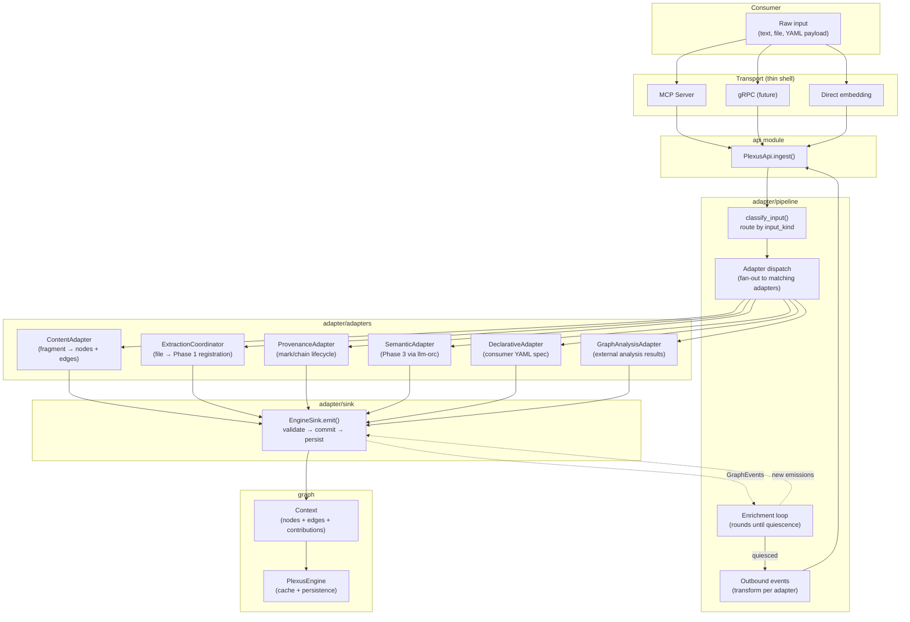
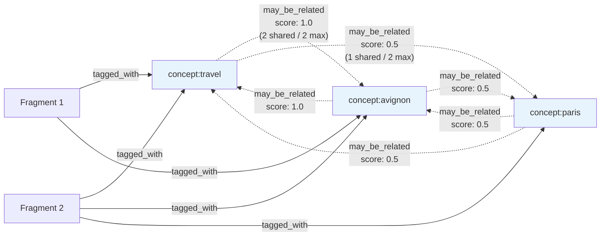
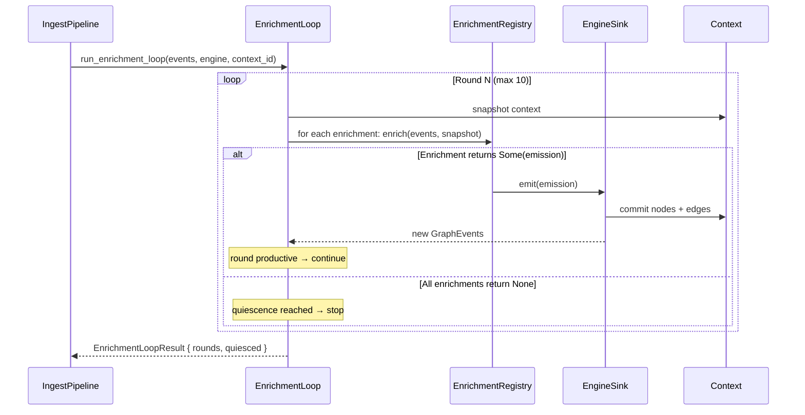
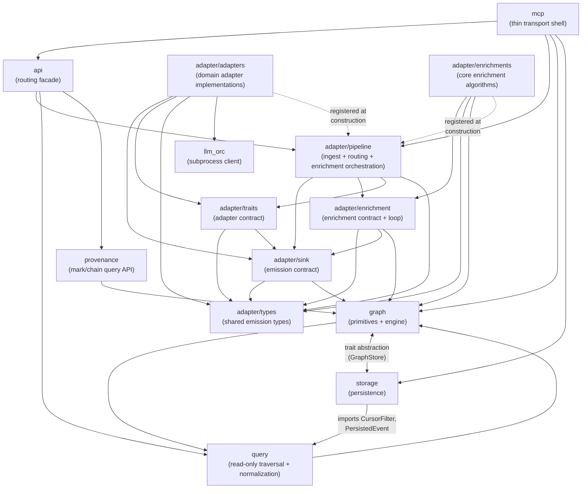

# System Design: Plexus

**Version:** 1.2
**Status:** Current (Retrofit + MCP consumer interaction amendment)
**Last amended:** 2026-04-07

## Architectural Drivers

| Driver | Type | Provenance |
|--------|------|------------|
| All writes go through `ingest()` | Constraint | Invariant 34; ADR-012 |
| Transports are thin shells | Constraint | Invariant 38; ADR-014 |
| Adapters, enrichments, transports are independent extension axes | Quality Attribute (Modifiability) | Invariant 40; Essay 09 |
| Enrichment loop terminates via idempotency | Constraint | Invariant 36; ADR-010 |
| Per-adapter contribution tracking with scale normalization | Constraint | Invariants 8–12; ADR-003 |
| All knowledge carries semantic content + provenance | Constraint | Invariant 7; ADR-001 |
| Persist-per-emission | Constraint | Invariant 30 |
| Rust, single-process, in-memory DashMap cache | Constraint | ADR-006; Essay 08 |
| Embedding support behind feature flag | Constraint | ADR-026 |
| External enrichment via llm-orc subprocess | Integration | ADR-024; Essay 25 |
| Extraction phases: Rust-native (fast) then llm-orc (deep) | Constraint | ADR-022; Invariants 45–47 |
| Structural analysis: MIME-dispatched fan-out modules | Constraint | ADR-030; Invariants 51–55 |
| Vocabulary bootstrap: structural modules → semantic extraction | Constraint | ADR-031; Invariant 54; Essay 25 |
| Declarative adapters: consumer-owned YAML specs via llm-orc | Extension point | ADR-028; Essay 19 |
| Lens is an enrichment, not a fourth axis | Constraint | Invariants 56–57; ADR-033; Essay 001 |
| Lens output is public — visible to all consumers | Constraint | Invariant 56; ADR-033 |
| Provenance-scoped filtering composable with all query primitives | Quality Attribute (Composability) | Invariant 59; ADR-034; Essay 001 |
| Event cursors preserve library rule for reads | Constraint | Invariant 58; ADR-035 |
| Push (Inv 37) and pull (Inv 58) are separate event delivery paradigms | Constraint | Invariant 37 (amended); ADR-035 |
| Spec validation gates graph work — `load_spec` is fail-fast, no partial state | Constraint | Invariant 60; ADR-037 |
| Consumer owns the spec — Plexus never generates, mutates, or derives specs | Constraint | Invariant 61; ADR-037 |
| Vocabulary layers are durable graph data; lens enrichments are durably registered on the context | Constraint | Invariant 62; ADR-037 |
| Specs table is the context's lens registry — any library instance against a context transiently runs those lenses on behalf of the context, not on behalf of the original loader | Quality Attribute (Multi-consumer cross-pollination) | Invariant 62; ADR-037; Reflection 003 |
| MCP query surface reaches parity with PlexusApi for read operations (16 tools total) | Quality Attribute (Consumability) | Invariant 38; ADR-036 |

## Module Decomposition

### Module: graph
**Purpose:** Core graph primitives — nodes, edges, contexts, events, dimensions, and the engine that manages them.
**Provenance:** Invariants 1–4 (emission rules), 8–12 (weight rules), 30 (persist-per-emission); ADR-003, ADR-006
**Owns:** Node, Edge, Context, ContextId, ContextMetadata, PlexusEngine, GraphEvent, ContentType, dimension (module of &str constants in node.rs), Source, PropertyValue, NodeId, EdgeId
**Depends on:** storage (for persistence), query (PlexusEngine delegates find_nodes/traverse/find_path)
**Depended on by:** adapter/sink, adapter/pipeline, query, provenance, api

### Module: adapter/sink
**Purpose:** The emission contract — how adapters push mutations into the engine.
**Provenance:** Invariant 1–4 (emission validation), Invariant 30 (persist-per-emission); ADR-001
**Owns:** AdapterSink (trait), EngineSink, EmitResult, Rejection, RejectionReason, AdapterError, FrameworkContext, ProvenanceEntry
**Depends on:** graph
**Depended on by:** adapter/adapters, adapter/pipeline

### Module: adapter/enrichment
**Purpose:** The enrichment contract and loop — reactive graph intelligence after each emission.
**Provenance:** Invariants 35–36, 39, 50 (enrichment rules); ADR-010
**Owns:** Enrichment (trait), EnrichmentRegistry; `run_enrichment_loop`, `EnrichmentLoopResult`, and `quiescence` are `pub(crate)` internals
**Depends on:** graph, adapter/sink (for EngineSink in the loop)
**Depended on by:** adapter/pipeline, adapter/enrichments (implementations)

### Module: adapter/types
**Purpose:** Shared emission types used by all adapters and enrichments.
**Provenance:** ADR-001 (emission structure)
**Owns:** Emission, AnnotatedNode, AnnotatedEdge, Annotation, Removal, EdgeRemoval, PropertyUpdate, OutboundEvent, CancellationToken, helper constructors (concept_node, file_node, mark_node, chain_node)
**Depends on:** graph
**Depended on by:** adapter/sink, adapter/enrichment, adapter/adapters, adapter/enrichments, adapter/pipeline

### Module: adapter/traits
**Purpose:** The adapter integration contract — the trait that domain adapters implement.
**Provenance:** Invariants 14–16 (adapter rules); ADR-011
**Owns:** Adapter (trait), AdapterInput
**Depends on:** graph, adapter/sink, adapter/types
**Depended on by:** adapter/adapters, adapter/pipeline

### Module: adapter/pipeline
**Purpose:** The unified ingest pipeline — routing, adapter dispatch, enrichment loop orchestration, outbound event transformation, transport-neutral construction, and runtime spec registration.
**Provenance:** Invariant 34 (single write path), Invariant 17 (fan-out routing), Invariant 62 (durable enrichment registration); ADR-012, ADR-028, ADR-032, ADR-037
**Owns:** IngestPipeline (adapter vector and enrichment registry behind interior mutability for runtime registration — ADR-037 §5; specific mechanism a BUILD decision), PipelineBuilder (`with_structural_module()`, `with_adapter_specs()`, `with_persisted_specs()`, `default_pipeline()`), classify_input, ClassifyError, input routing logic
**Depends on:** graph, adapter/sink, adapter/enrichment, adapter/traits, adapter/types, adapter/adapters (PipelineBuilder imports ExtractionCoordinator, ContentAdapter, MarkdownStructureModule for default wiring)
**Depended on by:** api, mcp

**Spec source precedence (all handled at builder time):** (1) code-registered adapters/enrichments via `with_adapter()`/`with_enrichment()`; (2) file-based specs via `with_adapter_specs(dir)` — deployment-time configuration; (3) DB-persisted specs via `with_persisted_specs(Vec<(ContextId, String)>)` — per-context rehydration of lens enrichments written to the `specs` table by prior `load_spec` calls. The builder takes pre-fetched spec data rather than importing storage directly — the host reads the specs table via `GraphStore::query_specs_for_context` and passes the data in. This preserves the library rule (Invariant 41): the builder takes data, not resources, and layering edges remain unchanged. Rehydration at construction time is **enrichment-only** — the lens enrichment is re-instantiated and registered so it fires on future emissions, but the original adapter is NOT re-registered for ingest routing (the originating consumer may not be present) and the lens is NOT re-run over existing content (the vocabulary edges from the original `load_spec` call already persist — Invariant 62 effect a).

### Module: adapter/adapters
**Purpose:** Domain adapter implementations — each transforms a specific input kind into graph mutations.
**Provenance:** Invariants 5, 7 (provenance rules), 19–22 (fragment rules), 45–48 (extraction rules), 51–55 (structural analysis rules); ADR-001, ADR-022, ADR-028, ADR-030, ADR-031, ADR-032
**Owns:** ContentAdapter (fragment), ExtractionCoordinator (file extraction + structural analysis dispatch), SemanticAdapter (semantic extraction via LLM), DeclarativeAdapter (YAML spec), GraphAnalysisAdapter (external enrichment), ProvenanceAdapter (mark/chain lifecycle), StructuralModule (trait), StructuralOutput, ModuleEmission, MarkdownStructureModule, SemanticInput, SectionBoundary, LensSpec, TranslationRule, NodePredicate
**Depends on:** graph, adapter/sink, adapter/traits, adapter/types, llm_orc (SemanticAdapter, DeclarativeAdapter), pulldown-cmark (MarkdownStructureModule)
**Depended on by:** (registered into adapter/pipeline at construction time)

#### Adapter taxonomy: Rust-native vs llm-orc-backed

Adapters fall into three categories based on their execution model. This distinction matters because it determines latency characteristics, failure modes, and who owns the processing logic.

**Rust-native adapters** — fast, synchronous, no external dependencies:
- `ContentAdapter` — fragment text + tags → graph structure. The default write path.
- `ExtractionCoordinator` — registration (file node, metadata, YAML frontmatter) synchronously within `ingest()`. Spawns structural analysis and semantic extraction as sequential background tasks.
- `ProvenanceAdapter` — mark/chain/link lifecycle operations.
- `GraphAnalysisAdapter` — applies pre-computed analysis results (from `plexus analyze`).

**Structural modules** — Rust-native, MIME-dispatched, run inside ExtractionCoordinator:
- `MarkdownStructureModule` — parses markdown via `pulldown-cmark`. Produces sections from heading hierarchy, vocabulary from heading text and link display text. Graph emissions determined empirically during BUILD. MIME affinity: `text/markdown`.

Structural modules use MIME-based dispatch (Invariant 55), not `IngestPipeline`'s `classify_input` routing. All matching modules execute (fan-out, Invariant 51). Whether `StructuralModule` extends `Adapter` or is its own trait is a BUILD-time decision. The coordinator reads the file once and passes content to all matching modules. Module outputs are merged: vocabulary unioned case-insensitively, sections concatenated by start_line, emissions kept per-module (Invariant 53).

**Internal llm-orc adapters** — Plexus-owned ensembles for deeper extraction:
- `SemanticAdapter` — semantic extraction. Invokes the `extract-semantic` ensemble (Plexus-defined, lives in `.llm-orc/ensembles/`). Receives `SemanticInput` with vocabulary hints and optional section boundaries from structural analysis. Parses multi-agent results (SpaCy NER, themes, concepts/relationships). Plexus owns the ensemble definition and the result parsing logic. Spawned as background work by ExtractionCoordinator.

**External declarative adapters** — consumer-owned YAML specs interpreted at runtime:
- `DeclarativeAdapter` — interprets `adapter-specs/*.yaml` files. The consumer defines both the extractor logic (llm-orc ensemble or script) and the graph mapping (adapter spec primitives). Plexus provides the interpreter; the consumer provides the spec. This is the extension point for domain-specific extraction without writing Rust.

The key architectural insight: when DeclarativeAdapter was introduced (ADR-028), it created a general mechanism that also simplified internal extraction. SemanticAdapter predates it and uses a bespoke Rust parsing path. A future convergence could express SemanticAdapter as a declarative spec, but this is deferred — the bespoke parser handles multi-agent result merging that the current spec primitives don't cover.

#### Extraction pipeline flow (ADR-030, ADR-031, ADR-032)

```
ingest("extract-file", { file_path: "doc.md" })
  │
  ├── Registration (synchronous, returns immediately)
  │     file node + MIME type + frontmatter tags + extraction status
  │
  └── Background task (tokio::spawn)
        │
        ├── Structural analysis
        │     coordinator reads file content once
        │     matching_modules("text/markdown") → fan-out
        │     each module: analyze(path, content) → StructuralOutput
        │     merge outputs → vocabulary + sections + emissions
        │     emit module emissions with each module's adapter ID
        │
        ├── Handoff
        │     SemanticInput::with_structural_context(path, sections, vocabulary)
        │
        └── Semantic extraction
              SemanticAdapter receives vocabulary hints + section boundaries
              llm-orc ensemble may add its own vocabulary (TextRank, SpaCy)
              entity-primed + unprimed agents run independently
              results emit with SemanticAdapter's adapter ID
```

### Module: adapter/enrichments
**Purpose:** Core enrichment implementations — reactive graph intelligence algorithms.
**Provenance:** Invariants 27, 39, 50 (enrichment behavior); ADR-010, ADR-024, ADR-026, ADR-033
**Owns:** CoOccurrenceEnrichment, DiscoveryGapEnrichment, TemporalProximityEnrichment, EmbeddingSimilarityEnrichment (+ Embedder trait, VectorStore, FastEmbedEmbedder), LensEnrichment
**Removed:** TagConceptBridger — tag bridging is domain-specific; domains needing it implement their own adapter.
**Depends on:** graph, adapter/enrichment (trait), adapter/types
**Depended on by:** adapter/adapters (DeclarativeAdapter::lens() constructs LensEnrichment), (registered into adapter/pipeline at construction time)

#### LensEnrichment (ADR-033)

A consumer-scoped enrichment that translates cross-domain graph content into one consumer's domain vocabulary. Implements the `Enrichment` trait — same interface as all other core enrichments, same enrichment loop participation.

**Construction:** `LensEnrichment` is constructed by `DeclarativeAdapter::lens()` from the adapter spec's `lens:` section. Not constructed directly by consumers.

**Algorithm:** On `EdgesAdded` events, scan new edges for matches against `from` relationship types. For each match, check `involving` node predicates and `min_weight` threshold. If all pass, emit a translated edge with relationship `lens:{consumer}:{to}` and contribution key `lens:{consumer}:{to}:{from}`.

**Namespace convention:**
- Edge relationship: `lens:{consumer}:{to_relationship}` (e.g., `lens:trellis:thematic_connection`)
- Contribution key: `lens:{consumer}:{to_relationship}:{from_relationship}` (e.g., `lens:trellis:thematic_connection:may_be_related`)
- Per-source-relationship keys preserve evidence diversity for many-to-one translations (ADR-033, argument audit P1-B fix)

**Idempotency:** Guard checks whether a translated edge already exists between the same endpoints with the same relationship. Returns `None` when no new translations are needed.

### Module: query
**Purpose:** Read-only graph traversal, search, normalization, evidence trail computation, and cursor-based change queries.
**Provenance:** Invariant 37 (push delivery), Invariant 58 (pull delivery), Invariant 59 (composable provenance filtering); ADR-003, ADR-034, ADR-035
**Owns:** FindQuery, TraverseQuery, PathQuery, StepQuery, NormalizationStrategy, OutgoingDivisive, Softmax, NormalizedEdge, normalized_weights, evidence_trail, shared_concepts, QueryResult, TraversalResult, PathResult, EvidenceTrailResult, Direction, QueryFilter, RankBy, ChangeSet, PersistedEvent, CursorFilter
**Depends on:** graph
**Depended on by:** api, storage (imports CursorFilter, PersistedEvent for event query methods)

### Module: storage
**Purpose:** Persistence abstraction and implementations — graph state, event log, and consumer spec persistence.
**Provenance:** Invariant 41 (library rule — store takes a path), Invariant 58 (event cursor persistence), Invariant 62 (durable enrichment registration — specs table is the context's lens registry); ADR-006, ADR-035, ADR-037, Essay 17
**Owns:** GraphStore (trait — `persist_event`/`query_events_since`/`latest_sequence` plus `persist_spec`/`query_specs_for_context`/`delete_spec`; all with default no-op implementations on the trait for non-SQLite backends), OpenStore (trait), SqliteStore (includes `events` and `specs` table migrations), SqliteVecStore, StorageError, StorageResult
**Depends on:** graph (for Context type), query (for CursorFilter, PersistedEvent types used in GraphStore trait methods)
**Depended on by:** graph (PlexusEngine holds optional Arc\<dyn GraphStore\>), adapter/sink (EngineSink calls persist_event after commit), api (PlexusApi::load_spec/unload_spec write through engine to spec methods; host code reads specs table before constructing PipelineBuilder)

### Module: provenance
**Purpose:** Read-only provenance query API — marks, chains, links.
**Provenance:** Invariants 24–29 (runtime architecture rules); ADR-013
**Owns:** ProvenanceApi, ChainView, MarkView, ChainStatus
**Depends on:** graph
**Depended on by:** api

### Module: api
**Purpose:** Transport-independent routing facade — single entry point for all consumer-facing operations, including runtime spec lifecycle.
**Provenance:** Invariant 34 (all writes via ingest), Invariant 38 (thin transports), Invariant 60 (upfront spec validation), Invariant 61 (consumer owns the spec); ADR-014, ADR-036, ADR-037
**Owns:** PlexusApi, `load_spec`/`unload_spec` methods, `SpecLoadResult`, `SpecLoadError`, `SpecUnloadError` types. Does NOT own spec generation, mutation, or derivation — consumers author and deliver specs.
**Depends on:** graph, adapter/pipeline, provenance, query
**Depended on by:** mcp

**Spec lifecycle ownership (ADR-037):** `PlexusApi::load_spec(context_id, spec_yaml)` orchestrates the three-effect model — validate → parse → register → persist → run lens over existing content. The operation is fail-fast (Invariant 60): if validation fails, no pipeline mutation, no storage write, no graph mutation. `unload_spec(context_id, adapter_id)` reverses (b) and (c) — deregister the lens enrichment and the adapter, delete the specs table row — but NOT (a): vocabulary edges remain in the graph as durable data (Invariant 62). Startup rehydration happens at `PipelineBuilder` construction time (see adapter/pipeline), NOT through an `api`-level reload method — this avoids host-side ceremony and eliminates the "forgot to call reload" failure mode.

### Module: mcp
**Purpose:** MCP transport — thin shell that forwards requests to PlexusApi. 16 tools total after ADR-036 expansion (9 prior + 7 new).
**Provenance:** Invariant 38 (transports are thin shells); ADR-028, ADR-036
**Owns:** PlexusMcpServer, 16 MCP tool handlers (prior: `set_context`, `ingest`, 6 context lifecycle, `evidence_trail`; new: `load_spec`, `find_nodes`, `traverse`, `find_path`, `changes_since`, `list_tags`, `shared_concepts`), MCP params. All 7 new tools use flat optional parameter fields (no nested objects) — LLM consumers construct flat JSON more reliably.
**Depends on:** api, adapter (PipelineBuilder, classify_input), graph (Source), storage (OpenStore, SqliteStore — initialization; host code also reads specs table before pipeline construction)
**Depended on by:** (binary entry point)

### Module: llm_orc
**Purpose:** Client for the llm-orc subprocess — invokes external LLM ensembles.
**Provenance:** ADR-024; Essay 25
**Owns:** LlmOrcClient (trait), SubprocessClient
**Depends on:** (external process)
**Depended on by:** adapter/adapters (SemanticAdapter, DeclarativeAdapter)

## Pipeline Flow

The ingest pipeline is the central write path. All mutations enter through `IngestPipeline::ingest()` (Invariant 34).



### Enrichment Architecture (ADR-024)

Two categories of enrichment, distinguished by where and when they run:

```mermaid
flowchart LR
    subgraph CoreEnrich["Core Enrichments (inside loop)"]
        direction TB
        cooccur["CoOccurrenceEnrichment<br>shared-source pair detection"]
        discovery["DiscoveryGapEnrichment<br>latent structural absence"]
        temporal["TemporalProximityEnrichment<br>timestamp proximity"]
        embedding["EmbeddingSimilarityEnrichment<br>cosine similarity via embeddings"]
    end
    %% TagConceptBridger removed — tag bridging is domain-specific;
    %% consumers declare it via adapter spec enrichments: section.

    subgraph ExternalEnrich["External Enrichments (outside loop)"]
        direction TB
        llmorc["llm-orc ensemble<br>(e.g., PageRank, community detection)"]
        graphadapter["GraphAnalysisAdapter<br>applies results via ingest()"]
    end

    emission["Adapter emission"] -->|"GraphEvents"| CoreEnrich
    CoreEnrich -->|"new emissions<br>(if any)"| CoreEnrich
    CoreEnrich -->|"quiesced"| done["Pipeline complete"]

    analyze["plexus analyze<br>(on-demand)"] --> llmorc
    llmorc --> graphadapter
    graphadapter -->|"ingest()"| emission
```



**Core enrichments** — Rust-native, reactive, run inside the enrichment loop after every adapter emission. Fast (microseconds to low-milliseconds, except embedding at ~15–100ms). Parameterizable. Domain-agnostic algorithms that operate on graph structure, not content. Registered globally or via adapter spec `enrichments:` declaration.

**External enrichments** — llm-orc ensembles that run outside the loop. Results re-enter via `ingest()`, which triggers core enrichments on the new data. Currently on-demand only (`plexus analyze`). Background/emission-triggered mode is designed but deferred (ADR-024).

### Core Enrichment Algorithms

Each implements the `Enrichment` trait: receives `GraphEvents` + a `Context` snapshot, returns `Option<Emission>`. Idempotent — returns `None` when no new edges are needed, allowing the loop to reach quiescence.

#### CoOccurrenceEnrichment
**Pattern:** Shared-source pair detection.
**Algorithm:** Build reverse index (source → targets via `source_relationship`). For each pair of targets sharing at least one source, count shared sources. Score = `shared_count / max_count`. Emit symmetric edge pairs with `output_relationship`.
**Default config:** `tagged_with` → `may_be_related`
**Parameterized:** Any source/output relationship pair (e.g., `exhibits` → `co_exhibited`)
**Fires on:** `NodesAdded`, `EdgesAdded`



#### DiscoveryGapEnrichment
**Pattern:** Latent structural absence detection.
**Algorithm:** When two nodes are connected by `trigger_relationship` but have NO other edges between them, emit symmetric `output_relationship` edges. Detects "these are related but nothing else connects them" — a negative structural query that co-occurrence cannot express.
**Config:** Requires `trigger_relationship` and `output_relationship` at construction
**Fires on:** `EdgesAdded`

#### TemporalProximityEnrichment
**Pattern:** Timestamp proximity.
**Algorithm:** When nodes have a configured timestamp property and their timestamps are within `threshold_ms` of each other, emit symmetric `output_relationship` edges. Binary — weight is 1.0 (within threshold) or absent.
**Config:** Requires `timestamp_property`, `threshold_ms`, `output_relationship`
**Fires on:** `NodesAdded`

#### EmbeddingSimilarityEnrichment
**Pattern:** Embedding-based semantic similarity.
**Algorithm:** Batch-embed new node labels via `Embedder` trait. Query `VectorStore` for existing vectors above `similarity_threshold`. Emit symmetric `output_relationship` edges for similar pairs. Slowest core enrichment (~15–100ms per batch) but justified by real-time reactive requirements.
**Config:** Requires `model_name`, `similarity_threshold`, `output_relationship`, and a boxed `Embedder` implementation
**Backends:** `FastEmbedEmbedder` (production, behind `embeddings` feature flag), `InMemoryVectorStore` (test/fallback)
**Fires on:** `NodesAdded`

### Enrichment Loop Mechanics



All enrichments in a round see the **same context snapshot** — they don't see each other's emissions within the same round. New emissions from round N become the events for round N+1. This prevents ordering dependencies between enrichments within a round.

### Declarative Enrichment Configuration

Consumers can declare which core enrichments to activate via their adapter spec's `enrichments:` section (ADR-025). This instantiates parameterized core enrichments without writing Rust:

```yaml
# Example adapter spec (consumer-owned)
adapter_id: my-domain-adapter
input_kind: my_domain.input
enrichments:
  - type: co_occurrence
    source_relationship: exhibits
    output_relationship: co_exhibited
  - type: discovery_gap
    trigger_relationship: co_exhibited
    output_relationship: gap_detected
emit:
  - create_node:
      id: "concept:{input.tag}"
      type: concept
      dimension: semantic
```

Declared enrichments are **global** — they fire after any adapter emission, not just the declaring adapter's (Invariant 35). The registry deduplicates by `id()` across multiple specs.

Available enrichment types for declaration: `co_occurrence`, `discovery_gap`, `temporal_proximity`, `embedding_similarity`. *(TagConceptBridger was fully removed — tag bridging is domain-specific; domains that need it implement their own adapter.)*

## Responsibility Matrix

| Domain Concept/Action | Owning Module | Provenance |
|----------------------|---------------|------------|
| Node, NodeId | graph | ADR-006 |
| Edge, EdgeId, contributions, raw_weight | graph | ADR-003, ADR-006 |
| Context, ContextId, ContextMetadata | graph | ADR-006 |
| PlexusEngine (cache, persistence delegation) | graph | ADR-006, Essay 08 |
| GraphEvent (6 event types) | graph | ADR-001, ADR-027 |
| ContentType, dimension (&str constants module) | graph | ADR-001 |
| Source | graph | Essay 17 |
| PropertyValue | graph | ADR-006 |
| Scale normalization (recompute_combined_weights) | graph | ADR-003 |
| AdapterSink (trait) | adapter/sink | ADR-001 |
| EngineSink | adapter/sink | ADR-001, ADR-006 |
| EmitResult, Rejection, RejectionReason | adapter/sink | ADR-001 |
| FrameworkContext, ProvenanceEntry | adapter/sink | ADR-001 |
| AdapterError | adapter/sink | ADR-001 |
| Emission | adapter/types | ADR-001 |
| AnnotatedNode, AnnotatedEdge, Annotation | adapter/types | ADR-001 |
| Removal, EdgeRemoval, PropertyUpdate | adapter/types | ADR-012 |
| OutboundEvent | adapter/types | ADR-011 |
| CancellationToken | adapter/cancel | ADR-001 |
| Helper constructors (concept_node, etc.) | adapter/types | Essay 25 |
| Adapter (trait), AdapterInput | adapter/traits | ADR-011 |
| Enrichment (trait) | adapter/enrichment | ADR-010 |
| EnrichmentRegistry, max_rounds | adapter/enrichment | ADR-010 |
| run_enrichment_loop, EnrichmentLoopResult, quiescence (`pub(crate)` internals) | adapter/enrichment | ADR-010 |
| IngestPipeline | adapter/pipeline | ADR-012 |
| classify_input, input routing | adapter/pipeline | ADR-012, ADR-028 |
| ContentAdapter (fragment — Rust-native) | adapter/adapters | ADR-001, ADR-028 |
| ExtractionCoordinator (registration + structural dispatch — Rust-native) | adapter/adapters | ADR-022, ADR-030 |
| StructuralModule (trait) | adapter/adapters | ADR-030 |
| StructuralOutput, ModuleEmission | adapter/adapters | ADR-031 |
| MarkdownStructureModule | adapter/adapters | ADR-032 |
| SemanticInput, SectionBoundary | adapter/adapters | ADR-021, ADR-031 |
| ProvenanceAdapter (mark/chain — Rust-native) | adapter/adapters | ADR-013, ADR-028 |
| GraphAnalysisAdapter (analysis results — Rust-native) | adapter/adapters | ADR-024 |
| SemanticAdapter (semantic extraction — internal llm-orc) | adapter/adapters | Essay 25 |
| DeclarativeAdapter (YAML spec — external llm-orc) | adapter/adapters | ADR-028 |
| CoOccurrenceEnrichment | adapter/enrichments | ADR-010 |
| DiscoveryGapEnrichment | adapter/enrichments | ADR-024 |
| TemporalProximityEnrichment | adapter/enrichments | ADR-010 |
| EmbeddingSimilarityEnrichment | adapter/enrichments | ADR-026 |
| Embedder, VectorStore, FastEmbedEmbedder | adapter/enrichments | ADR-026 |
| FindQuery | query | ADR-006 |
| TraverseQuery | query | ADR-006 |
| PathQuery | query | ADR-006 |
| StepQuery, evidence_trail | query | ADR-013 |
| NormalizationStrategy, OutgoingDivisive, Softmax | query | ADR-003 |
| shared_concepts | query | Essay 17 |
| GraphStore (trait), OpenStore (trait) | storage | ADR-006, Essay 17 |
| SqliteStore | storage | ADR-006 |
| SqliteVecStore | storage | ADR-026 |
| StorageError, StorageResult | storage | ADR-006 |
| ProvenanceApi | provenance | ADR-013 |
| ChainView, MarkView, ChainStatus | provenance | ADR-013 |
| PlexusApi | api | ADR-014 |
| PlexusMcpServer | mcp | ADR-028 |
| LlmOrcClient (trait), SubprocessClient | llm_orc | ADR-024 |
| LensSpec, TranslationRule, NodePredicate | adapter/adapters | ADR-033 |
| DeclarativeAdapter::lens() | adapter/adapters | ADR-033 |
| LensEnrichment | adapter/enrichments | ADR-033 |
| QueryFilter | query | ADR-034 |
| RankBy | query | ADR-034 |
| PersistedEvent, ChangeSet, CursorFilter | query | ADR-035 |
| persist_event (on GraphStore trait) | storage | ADR-035 |
| query_events_since (on GraphStore trait) | storage | ADR-035 |
| events table (SQLite schema) | storage | ADR-035 |
| Event persistence in emit_inner | adapter/sink | ADR-035 |
| PlexusApi::changes_since() | api | ADR-035 |
| PlexusApi::load_spec, PlexusApi::unload_spec | api | ADR-037 §1, §6 |
| SpecLoadResult, SpecLoadError, SpecUnloadError | api | ADR-037 §1, §6 |
| `specs` table (SQLite schema, migration) | storage | ADR-037 §2 |
| persist_spec, query_specs_for_context, delete_spec (on GraphStore trait, default no-ops) | storage | ADR-037 §2 |
| IngestPipeline interior mutability (adapter vector + enrichment registry) | adapter/pipeline | ADR-037 §5 |
| Runtime adapter/enrichment registration (`&self` path via interior mutability) | adapter/pipeline | ADR-037 §1, §5 |
| PipelineBuilder::with_persisted_specs — rehydration at construction (enrichment-only, skip effect a) | adapter/pipeline | ADR-037 §2; Reflection 003 |
| register_specs_from_dir full-spec wiring (extract enrichments + lens, not just adapter) | adapter/pipeline | ADR-037 §4 (conformance debt fix) |
| evidence_trail accepts optional QueryFilter (piped through StepQuery) | api, query | ADR-036 §5, Invariant 59 |
| MCP tool: load_spec | mcp | ADR-036 §1, §2 |
| MCP tool: find_nodes (flat optional filter fields) | mcp | ADR-036 §1, §2 |
| MCP tool: traverse (flat optional filter + rank_by + direction fields) | mcp | ADR-036 §1, §2 |
| MCP tool: find_path (flat optional filter + direction fields) | mcp | ADR-036 §1, §2 |
| MCP tool: changes_since (flat optional CursorFilter fields) | mcp | ADR-036 §1, §2, §4 |
| MCP tool: list_tags | mcp | ADR-036 §1 |
| MCP tool: shared_concepts | mcp | ADR-036 §1 |
| RankBy::NormalizedWeight(Box<dyn NormalizationStrategy>) variant wiring | query | ADR-034 (third variant, deferred in WP-C, slated for cycle-2 WP-G.2) |

## Dependency Graph



**Layering rules:**
1. **Inner → Outer prohibited:** graph never imports adapter, provenance, api, or mcp. Exception: graph imports query (PlexusEngine provides find/traverse/path as facade methods).
2. **Sibling isolation:** adapter/adapters and adapter/enrichments never import each other
3. **Transport wiring shell:** mcp imports api for routing, adapter for pipeline construction (PipelineBuilder, classify_input), and graph/storage for initialization. Pipeline construction happens inside mcp's `with_project_dir()`.
4. **Query is read-only:** query never imports adapter or storage
5. **Enrichment contract is separate from adapter contract:** adapter/enrichment does not import adapter/traits

**Circular dependency (graph ↔ storage):**
- graph::PlexusEngine holds `Option<Arc<dyn GraphStore>>`. GraphStore's methods accept `&Context`, `&ContextId`. Both types are defined in graph.
- This is resolved via trait abstraction: storage defines the GraphStore trait; graph depends on the trait. The concrete SqliteStore in storage depends on graph types for serialization. This is a standard dependency-inversion pattern — the trait breaks the cycle.

## Integration Contracts

### api → adapter/pipeline
**Protocol:** Direct async function calls (`IngestPipeline::ingest()`, `IngestPipeline::ingest_with_adapter()`)
**Shared types:** `AdapterInput`, `AdapterError`, `OutboundEvent`, `GraphEvent`
**Error handling:** `AdapterError` propagates to PlexusApi, which maps to `PlexusError` or transport-specific errors
**Owned by:** adapter/pipeline (defines the contract)

### api → query
**Protocol:** Direct sync function calls (`PlexusEngine::find_nodes()`, `traverse()`, `find_path()`)
**Shared types:** `FindQuery`, `TraverseQuery`, `PathQuery`, `QueryResult`, `TraversalResult`, `PathResult`
**Error handling:** `PlexusError` propagates from engine query methods
**Owned by:** query (defines query types), graph (defines engine methods)

### api → provenance
**Protocol:** Direct sync function calls (ProvenanceApi constructed transiently per call)
**Shared types:** `ChainView`, `MarkView`, `ChainStatus`
**Error handling:** `PlexusError` propagates
**Owned by:** provenance (defines view types)

### adapter/pipeline → adapter/sink
**Protocol:** Pipeline creates EngineSink per adapter dispatch, passes to `Adapter::process()`
**Shared types:** `EngineSink`, `FrameworkContext`, `EmitResult`, `GraphEvent`
**Error handling:** `AdapterError` from sink operations propagates to pipeline
**Owned by:** adapter/sink (defines the emission contract)

### adapter/pipeline → adapter/enrichment
**Protocol:** Pipeline calls `run_enrichment_loop()` with accumulated events after adapter dispatch
**Shared types:** `EnrichmentLoopResult`, `GraphEvent`, `Emission`
**Error handling:** `AdapterError` propagates from enrichment loop
**Owned by:** adapter/enrichment (defines the loop contract)

### ExtractionCoordinator → StructuralModule (within adapter/adapters)
**Protocol:** Coordinator calls `module.analyze(file_path, content)` for each matching module. Fan-out: all modules whose MIME affinity matches execute (Invariant 51). Coordinator reads file content once.
**Shared types:** `StructuralOutput` (returned by module), `SectionBoundary`, `ModuleEmission`
**Error handling:** Module panic treated as empty output; other modules still run; semantic extraction proceeds with whatever output was collected (scenario: structural analysis failure does not block semantic extraction)
**Owned by:** adapter/adapters (both sides live in the same module; the `StructuralModule` trait defines the contract)

### ExtractionCoordinator → SemanticAdapter (within adapter/adapters)
**Protocol:** Coordinator constructs `SemanticInput::with_structural_context(path, sections, vocabulary)` from merged structural output and passes to SemanticAdapter via `AdapterInput`. Vocabulary bootstrap: entity names from structural modules forwarded as glossary hints (Invariant 54 — no relationships).
**Shared types:** `SemanticInput`, `SectionBoundary`, `AdapterInput`
**Error handling:** SemanticAdapter returns `AdapterError::Skipped` when llm-orc unavailable (Invariant 47)
**Owned by:** adapter/adapters (SemanticInput defines the contract)

### adapter/sink → graph
**Protocol:** `EngineSink` calls `PlexusEngine::with_context_mut()` for atomic commit+persist
**Shared types:** `Context`, `ContextId`, `Node`, `Edge`, `GraphEvent`
**Error handling:** `PlexusError` mapped to `AdapterError::Internal`
**Owned by:** graph (defines the mutation contract)

### graph → storage
**Protocol:** `PlexusEngine` calls `GraphStore::save_context()`, `load_context()`, etc.
**Shared types:** `Context`, `ContextId`, `StorageError`
**Error handling:** `StorageError` mapped to `PlexusError::Storage`
**Owned by:** storage (defines the persistence contract via trait)

### adapter/sink → storage (event persistence, ADR-035)
**Protocol:** `EngineSink::emit_inner()` calls `GraphStore::persist_event()` after commit succeeds, before returning to enrichment loop
**Shared types:** `PersistedEvent` (from query), event type string, node/edge IDs
**Error handling:** `StorageError` logged but does not fail the emission — event persistence is best-effort to avoid blocking the write path. Missing events degrade the cursor but not the graph.
**Owned by:** storage (defines persist_event contract via GraphStore trait)

### api → query (cursor queries, ADR-035)
**Protocol:** `PlexusApi::changes_since()` calls `GraphStore::query_events_since()` through engine
**Shared types:** `CursorFilter`, `ChangeSet`, `PersistedEvent` (all defined in query)
**Error handling:** `PlexusError` propagates; stale cursor returns a specific error variant
**Owned by:** query (defines cursor types), storage (implements query)

### adapter/adapters → adapter/enrichments (lens construction, ADR-033)
**Protocol:** `DeclarativeAdapter::lens()` constructs `LensEnrichment` from `LensSpec` parsed from YAML
**Shared types:** `LensEnrichment` (from adapter/enrichments), `LensSpec`/`TranslationRule` (from adapter/adapters)
**Error handling:** Invalid lens spec returns `AdapterError` at YAML parse time
**Owned by:** adapter/enrichments (defines LensEnrichment), adapter/adapters (defines spec types)

### mcp → api
**Protocol:** MCP tool handlers call `PlexusApi` methods. After ADR-036, 16 tools total — 14 are pure thin wrappers, plus `ingest` (which wraps a thicker pipeline call) and `load_spec` (which wraps the new spec lifecycle orchestration). Tool parameters use flat optional fields throughout.
**Shared types:** `PlexusApi`, all query/write types, `QueryFilter` fields flattened, `CursorFilter` fields flattened, `RankBy` and `Direction` as optional strings, `SpecLoadResult`/`SpecLoadError`
**Error handling:** `PlexusError`/`AdapterError`/`SpecLoadError` mapped to MCP `ErrorData`
**Owned by:** api (defines the consumer-facing contract)

### api → graph (spec persistence, ADR-037)
**Protocol:** `PlexusApi::load_spec` and `unload_spec` call `PlexusEngine` spec methods (`persist_spec`, `delete_spec`); engine delegates to `GraphStore` trait. Same pattern as event persistence (WP-A) — engine wraps store. Spec persistence happens AFTER pipeline registration succeeds, ensuring atomicity at the API level.
**Shared types:** `ContextId`, adapter ID string, spec YAML string, `SpecLoadError`
**Error handling:** `StorageError` from GraphStore mapped to `SpecLoadError::Persistence`. Validation errors mapped to `SpecLoadError::Validation` BEFORE any store call (Invariant 60).
**Owned by:** graph (defines engine spec methods), storage (defines GraphStore trait contract)

### api → adapter/pipeline (runtime registration, ADR-037)
**Protocol:** `PlexusApi::load_spec` parses spec YAML into a `DeclarativeAdapter`, extracts adapter + enrichments + lens, then calls pipeline registration methods that mutate via interior mutability on `&self`. The interior-mutable cells are scoped to the adapter vector and enrichment registry only — core routing logic (`classify_input`, dispatch, enrichment loop orchestration) remains non-mutable. Specific concurrency mechanism (RwLock vs DashMap vs ArcSwap) deferred to BUILD.
**Shared types:** `Arc<dyn Adapter>`, `Arc<dyn Enrichment>`, `DeclarativeAdapter`
**Error handling:** Parse failures mapped to `SpecLoadError::Validation`. Registration failures mapped to `SpecLoadError::Registration`. The operation is all-or-nothing at the API level — partial registration (e.g., adapter registered but lens fails) must roll back via the API method's error path.
**Owned by:** adapter/pipeline (defines runtime registration contract)

### host → storage → adapter/pipeline (rehydration at construction, ADR-037)
**Protocol:** The host (mcp binary, embedded consumer) opens a store, calls `GraphStore::query_specs_for_context(context_id)` to fetch persisted spec rows, then passes the resulting `Vec<PersistedSpec>` to `PipelineBuilder::with_persisted_specs(specs)`. The builder parses each spec, extracts the lens enrichment, and registers it on the pipeline being constructed. The original adapter is NOT registered (the loading consumer may not be present); the lens is NOT re-run over existing content (effect a is durable). **The host does not filter — every spec in the table for the context is rehydrated.** Runtime selectivity is forbidden by design: the specs table is the context's lens registry, and any library instance holding the context is bound to run every lens registered on it. Curation happens via `unload_spec` (durable, public) — not via startup filtering (transient, silent).
**Shared types:** `PersistedSpec` struct (fields: `context_id`, `adapter_id`, `spec_yaml`, `loaded_at`; struct type rather than tuple to support non-breaking schema evolution)
**Error handling:** A persisted spec that fails to **parse** or extract its lens is logged but does NOT block pipeline construction — the host gets a working pipeline minus the broken spec's lens. The broken spec remains in the table for diagnosis. This is the only place in the cycle where spec failures are non-fatal; at runtime via `load_spec`, validation errors abort the operation. **Caveat — grammar mismatch is a different failure class:** if a grammar change breaks every spec in the table, silent non-fatal behavior would cause every consumer to silently lose all vocabulary layers. This is why the "spec YAML grammar versioning" open decision point (see roadmap.md) matters — when versioning is introduced, unknown-version errors must be fail-loud, not logged-and-continue.
**Owned by:** adapter/pipeline (defines `with_persisted_specs` builder API), storage (defines `query_specs_for_context` trait method and `PersistedSpec` struct)

## Fitness Criteria

| Criterion | Measure | Threshold | Derived From |
|-----------|---------|-----------|-------------|
| Module responsibility limit | Glossary entries per module | No module owns > 15 concepts/actions | Decomposition balance |
| adapter/ submodule independence | Cross-imports between adapter submodules | adapter/adapters and adapter/enrichments have 0 mutual imports | Invariant 40 |
| Transport thinness | Lines of business logic in mcp/ | 0 lines — all logic delegates to api | Invariant 38 |
| Single write path | Code paths that mutate Context bypassing IngestPipeline | 0 bypass paths (except retract_contributions, which is engine-level by design) | Invariant 34 |
| Enrichment loop convergence | All enrichments reach quiescence within max_rounds | 100% in tests | Invariant 36 |
| Persist-per-emission | `save_context()` calls per `emit()` | Exactly 1 | Invariant 30 |
| No dependency cycles | Cycle count in module dependency graph | 0 | Architectural principle |
| Contribution survival | Round-trip through save→load→compare | 100% identical | Invariant 31 |
| Lens is an enrichment | LensEnrichment implements Enrichment trait; no new extension axis | 0 new public traits for lens | Invariant 57 |
| Query filter composability | QueryFilter field present on all query structs (Find, Traverse, Path, Step, evidence_trail) | 5/5 query primitives support filter | Invariant 59 |
| Event persistence consistency | Events in `events` table correspond to committed graph state | 100% consistency on save→reload→query | Invariant 58 |
| Cursor type ownership | CursorFilter, PersistedEvent, ChangeSet defined in query module, not storage | 0 consumer-facing cursor types in storage | Layering rule: query is read-only |
| Spec validation gates graph work | Malformed YAML passed to `load_spec` → 0 store mutations, 0 pipeline mutations, 0 graph mutations | 100% in tests with malformed spec fixtures | Invariant 60 |
| Consumer ownership of spec | No `PlexusApi` method generates, mutates, or derives a spec | 0 spec-mutation methods (only `load_spec`/`unload_spec`) | Invariant 61 |
| Vocabulary layers durable | `unload_spec` leaves `lens:*` edges queryable | 100% in tests | Invariant 62 (effect a) |
| Enrichment registration durable | Persisted lens fires on post-restart ingest by a different adapter (verified by construct → save → drop → reconstruct via builder → ingest → assert) | 100% in tests | Invariant 62 (effect b) |
| Fail-fast atomicity of load_spec | Partial spec load states (e.g., adapter registered but lens failed) | 0 partial states — load_spec is all-or-nothing | Invariant 60 |
| Interior mutability scope | Interior-mutable cells in `IngestPipeline` wrap only the adapter vector and enrichment registry. **Adapter storage remains a `Vec` indexed by registration order; restructuring to a keyed collection (e.g., `DashMap`) is out of scope for this cycle and would require a separate architectural decision.** Core routing logic (`classify_input`, dispatch, loop orchestration) remains non-mutable on `&self`; no lock held across an `ingest()` call. Tier 1 decision (`RwLock` vs `ArcSwap`) is local to BUILD; Tier 2 (restructure to keyed storage) requires a new ADR. | Inspection + no new public locking types exposed | ADR-037 §5 |
| MCP tool count | `PlexusMcpServer` exposes exactly 16 `#[tool]` handlers | 16 (9 prior + 7 new) | ADR-036 §1 |
| Transport thinness (still holds) | Lines of business logic in new MCP tool handlers | 0 — all new handlers delegate to `PlexusApi` | Invariant 38 |
| No new module dependency edges | Edges added to the module dependency graph for this cycle | 0 — all new work uses existing edges (`api → graph → storage`, `api → adapter/pipeline`, `mcp → api`, host orchestration) | Amendment 5 design constraint |

## Test Architecture

### Boundary Integration Tests

| Dependency Edge | Integration Test | What It Verifies |
|----------------|-----------------|------------------|
| adapter/pipeline → adapter/sink | `integration_tests::content_adapter_emits_*` (multiple) | Real ContentAdapter emits through real EngineSink, nodes/edges land in Context |
| adapter/pipeline → adapter/enrichment | `integration_tests::enrichment_loop_*` | Real enrichments fire after real adapter emission, bridging/co-occurrence occurs |
| adapter/sink → graph | `engine_sink::tests::*` (~43 test functions) | EngineSink validates and commits through real PlexusEngine with real Context |
| graph → storage | `engine::tests::test_upsert_persists_to_store`, `test_load_all_hydrates_from_store` | Real PlexusEngine with real SqliteStore — save and reload |
| api → adapter/pipeline | `api.rs` tests (via PlexusApi::ingest) | Real PlexusApi routes through real IngestPipeline with real adapters |
| mcp → api | MCP integration tests (if present) | MCP tool handlers call real PlexusApi |
| adapter/adapters → llm_orc | `semantic::tests::*` with mock LlmOrcClient | SemanticAdapter processes with mock client (real adapter, mock external) |
| ExtractionCoordinator → StructuralModule | `extraction::tests::structural_*` | Real coordinator dispatches to real MarkdownStructureModule, output contains sections and vocabulary |
| ExtractionCoordinator → SemanticAdapter | `extraction::tests::phase3_receives_structural_context` | Real coordinator passes vocabulary and sections to real SemanticAdapter (mock llm-orc) |
| PipelineBuilder → MarkdownStructureModule | `builder::tests::default_pipeline_registers_markdown_module` | Default pipeline has markdown module registered; markdown files trigger structural analysis |
| adapter/adapters → adapter/enrichments (lens) | `declarative::tests::lens_construction_from_yaml` | DeclarativeAdapter::lens() constructs real LensEnrichment from parsed YAML spec |
| adapter/enrichments (lens) → enrichment loop | `integration_tests::lens_creates_translated_edges` | LensEnrichment runs in real enrichment loop, creates edges with `lens:` namespace |
| adapter/sink → storage (event persistence) | `engine_sink::tests::emit_persists_events_to_store` | Real EngineSink writes events to real SqliteStore after commit |
| api → storage (cursor query) | `api::tests::changes_since_returns_events_after_cursor` | PlexusApi::changes_since() queries real SqliteStore event log |
| query (filter) → graph | `traverse::tests::traverse_with_query_filter` | Real TraverseQuery with QueryFilter filters edges by contributor_ids/prefix/corroboration |
| api → adapter/pipeline (runtime registration, ADR-037) | `api::tests::load_spec_registers_adapter_enrichments_and_lens_atomically` | Real PlexusApi loads spec YAML; real IngestPipeline receives real adapter + enrichments + lens via interior-mutable registration; adapter available for ingest routing after the call |
| api → graph → storage (spec persistence, ADR-037) | `api::tests::load_spec_persists_to_specs_table`, `unload_spec_deletes_from_specs_table` | Real PlexusApi writes to / deletes from real SqliteStore via real PlexusEngine |
| adapter/pipeline → storage via host (rehydration at construction, ADR-037) | `acceptance::persisted_spec_rehydrates_across_restart` | Load spec via PlexusApi, drop pipeline, query specs table, construct new pipeline via `PipelineBuilder::with_persisted_specs`, ingest via different adapter, assert persisted lens enrichment fires |
| api → query (evidence_trail filter, ADR-036 §5) | `api::tests::evidence_trail_accepts_filter` | Real PlexusApi::evidence_trail with QueryFilter parameter filters the provenance trail by contributor_ids |
| mcp → api (each new tool) | `mcp::tests::{load_spec, find_nodes, traverse, find_path, changes_since, list_tags, shared_concepts}_delegates_to_api` | Each new MCP tool handler calls the corresponding PlexusApi method with flat parameters correctly mapped to structured types |
| query (RankBy::NormalizedWeight → normalize) | `traverse::tests::rank_by_normalized_weight_uses_outgoing_divisive` | Real traversal ranks edges by normalized weight using an injected `OutgoingDivisive` strategy (closes ADR-034 Violation 1) |

### Invariant Enforcement Tests

| Invariant | Enforcement Location | Test |
|-----------|---------------------|------|
| Inv 1–4 (emission rules) | adapter/sink: EngineSink::emit_inner | `engine_sink::tests::*` — endpoint validation, upsert, partial commit |
| Inv 7 (dual obligation) | adapter/adapters: each adapter's process() | `integration_tests::content_adapter_produces_provenance_*` |
| Inv 8–12 (weight rules) | graph: Context::recompute_combined_weights | `integration_tests::contribution_*`, `scale_normalization_*` |
| Inv 19 (deterministic concept ID) | adapter/types: concept_node() | `integration_tests::content_adapter_emits_concept_nodes` |
| Inv 22 (symmetric edge pairs) | adapter/enrichments: CoOccurrenceEnrichment | `cooccurrence::tests::*` |
| Inv 30 (persist-per-emission) | adapter/sink: EngineSink::emit | `engine_sink::tests::*` with store verification |
| Inv 36 (enrichment quiescence) | adapter/enrichment: run_enrichment_loop | `integration_tests::safety_valve_aborts_after_maximum_rounds` |
| Inv 50 (structure-aware enrichments) | adapter/enrichments: CoOccurrenceEnrichment | `cooccurrence::tests::quiescence_with_heterogeneous_sources` |
| Inv 51 (MIME fan-out) | adapter/adapters: ExtractionCoordinator::matching_modules | `extraction::tests::mime_dispatch_fan_out` — two modules match, both execute |
| Inv 52 (empty registry passthrough) | adapter/adapters: ExtractionCoordinator | `extraction::tests::empty_registry_passthrough` — no modules, semantic extraction still runs |
| Inv 53 (merge not select) | adapter/adapters: ExtractionCoordinator | `extraction::tests::structural_outputs_merged` — vocabulary unioned, sections concatenated |
| Inv 54 (entity not relationship) | adapter/adapters: ExtractionCoordinator | `extraction::tests::vocabulary_contains_entities_not_relationships` |
| Inv 55 (MIME dispatch, not input-kind) | adapter/adapters: ExtractionCoordinator | `extraction::tests::structural_module_uses_mime_dispatch` — module dispatched by MIME, not registered on IngestPipeline |
| Inv 56 (lens output public) | adapter/enrichments: LensEnrichment | `lens::tests::lens_output_visible_to_all_consumers` — lens edges traversable without lens prefix filter |
| Inv 57 (lens is enrichment, not new axis) | adapter/enrichments: LensEnrichment | `lens::tests::implements_enrichment_trait` — LensEnrichment compiles as `dyn Enrichment` |
| Inv 58 (cursors preserve library rule) | storage: SqliteStore | `sqlite::tests::events_persist_and_query_without_runtime` — write events, stop, reload, query cursor |
| Inv 59 (provenance filter composable) | query: all query structs | `traverse::tests::filter_by_contributor`, `find::tests::filter_by_corroboration`, `step::tests::filter_composes_with_step_relationship`, `api::tests::evidence_trail_accepts_filter` (closes the last hole after WP-G.1) |
| Inv 60 (spec validation upfront) | api: `PlexusApi::load_spec` | `api::tests::load_spec_invalid_yaml_leaves_no_mutations` — malformed YAML → error, no specs row, no adapter registered, no edges added |
| Inv 61 (consumer owns spec) | api: static verification | Compile-time: no `update_spec`/`generate_spec`/`derive_spec` methods on PlexusApi — verified by inspection |
| Inv 62 (effect a: durable vocabulary) | api: `PlexusApi::unload_spec` | `api::tests::unload_spec_preserves_lens_edges` — load, ingest, unload, assert `lens:*` edges still present and queryable |
| Inv 62 (effect b: durable enrichment registration) | adapter/pipeline: `PipelineBuilder::with_persisted_specs` | `acceptance::persisted_spec_rehydrates_across_restart` — load spec, close, reopen store, reconstruct pipeline via builder, ingest via different adapter, assert lens fires |

### Test Layers

- **Unit:** Verify logic within a single module. Mocks acceptable for cross-module dependencies (e.g., mock LlmOrcClient in SemanticAdapter tests). Located in each module's `#[cfg(test)] mod tests`.
- **Integration:** Verify real data flow across module boundaries. Real types on both sides. Located in `adapter/integration_tests.rs` (~55 test functions) and individual module test blocks with real PlexusEngine.
- **Acceptance:** Verify end-to-end scenarios from `docs/scenarios.md`. Located in `tests/acceptance/` (25 tests across 8 contract areas: ingest, extraction, enrichment, provenance, contribution, persistence, degradation, query). Use `PlexusApi` public surface with in-memory SQLite.

## Roadmap

See [`./docs/roadmap.md`](./docs/roadmap.md) for the current roadmap — work packages, classified dependencies, transition states, and open decision points.

## Design Amendment Log

| # | Date | What Changed | Trigger | Provenance | Status |
|---|------|-------------|---------|------------|--------|
| — | 2026-03-16 | Initial retrofit system design | /rdd-architect retroactive run | Essay 26, ADR-029, codebase audit convergence | Current |
| 1 | 2026-03-16 | Added Pipeline Flow, Enrichment Architecture, Core Enrichment Algorithms, Enrichment Loop Mechanics, Declarative Enrichment Configuration sections with mermaid diagrams | Product discovery feedback — enrichment algorithms and pipeline flow not modeled | ADR-010, ADR-024, ADR-025, ADR-026 | Current |
| 2 | 2026-03-16 | Replaced ASCII dependency graph with mermaid diagram. Fixed missing edges: adapter/adapters → sink, traits, types; adapter/enrichments → enrichment, types, graph. Shows registration-time wiring as dashed edges. | ASCII graph was incomplete and showed graph node duplicated | Module decomposition | Current |
| 3 | 2026-03-18 | Added structural module system to adapter/adapters: StructuralModule trait, StructuralOutput/ModuleEmission types, MarkdownStructureModule, vocabulary handoff to SemanticInput. Updated adapter taxonomy, extraction pipeline flow, responsibility matrix, integration contracts, test architecture, invariant enforcement. PipelineBuilder gains `with_structural_module()`. New dependency: `pulldown-cmark`. | Track A RDD cycle: ADR-030 (structural module trait), ADR-031 (structural output + handoff), ADR-032 (markdown module) | ADR-030, ADR-031, ADR-032; Invariants 51–55 | Current |
| 4 | 2026-03-26 | Query surface cycle: (1) LensEnrichment added to adapter/enrichments with namespace convention; LensSpec/TranslationRule/NodePredicate added to adapter/adapters. (2) QueryFilter and RankBy added to query; optional filter field on all query structs. (3) Event cursor types (PersistedEvent, ChangeSet, CursorFilter) added to query; events table and persist_event/query_events_since added to storage; emit_inner gains event persistence; PlexusApi gains changes_since(). New dependency: storage → query (cursor types). New integration contracts: sink→storage (events), api→query (cursor), adapters→enrichments (lens). | Query surface RDD cycle: ADR-033 (lens), ADR-034 (query filters), ADR-035 (event cursors) | ADR-033, ADR-034, ADR-035; Invariants 56–59; Essays 001, 002 | Current |
| 5 | 2026-04-07 | MCP consumer interaction surface cycle. (1) `api` gains `load_spec`/`unload_spec` methods and `SpecLoadResult`/`SpecLoadError`/`SpecUnloadError` types — transport-independent, fail-fast, all-or-nothing. (2) `storage` gains `specs` table (composite PK on `(context_id, adapter_id)`) and `persist_spec`/`query_specs_for_context`/`delete_spec` methods on `GraphStore` trait (default no-ops for non-SQLite backends). (3) `adapter/pipeline` gains interior mutability on the adapter vector and enrichment registry for runtime registration; `register_specs_from_dir` bug fix (extracts enrichments + lens, not just adapter); `PipelineBuilder::with_persisted_specs(Vec<(ContextId, String)>)` rehydrates persisted lens enrichments at construction time (enrichment-only, skips effect a and adapter wiring). (4) `mcp` gains 7 new `#[tool]` handlers (`load_spec`, `find_nodes`, `traverse`, `find_path`, `changes_since`, `list_tags`, `shared_concepts`), bringing tool count from 9 to 16; all use flat optional parameter fields. (5) `api` + `query` + `mcp` — `evidence_trail` gains optional `QueryFilter` parameter piped through `StepQuery`, closing the last Invariant 59 gap. (6) `query` gains `RankBy::NormalizedWeight(Box<dyn NormalizationStrategy>)` variant wired to existing normalization strategies, closing ADR-034 conformance debt. (7) Architectural drivers expanded for Invariants 60–62. (8) Fitness criteria added: spec validation gates graph work, consumer ownership of spec, durable vocabulary, durable enrichment registration, fail-fast atomicity, interior mutability scope, MCP tool count = 16. (9) 7 new boundary integration tests and 4 new invariant enforcement tests. **No new module-level dependency edges** — all new work flows through existing seams (`api → graph → storage`, `api → adapter/pipeline`, `mcp → api`, host orchestrates rehydration at builder time). The specs table is the context's lens registry; any library instance against that context transiently runs those lenses on behalf of the context, not on behalf of the originally-loading consumer. | MCP consumer interaction surface RDD cycle: DISCOVER (update), MODEL (amendment), DECIDE (ADR-036, ADR-037), audits complete. Triggered by Reflection 003 surfacing the single-consumer assumption in the query surface cycle and product discovery (2026-04-02) formalizing multi-consumer interaction model with fail-fast validation as the e2e acceptance criterion. | ADR-036 (MCP query surface), ADR-037 (consumer spec loading); Invariants 60–62; Reflection 003 (multi-consumer lens interaction); product-discovery.md (2026-04-02); domain-model.md amendment 7 (2026-04-02) | Current |
